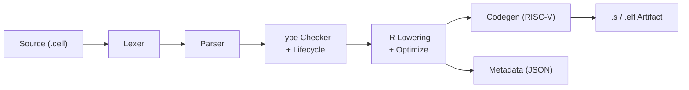
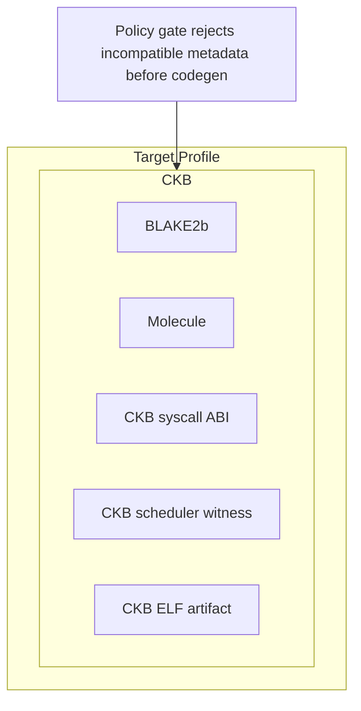

# CellScript

<p align="center">
  
</p>

[](https://github.com/tsukifune-kosei/CellScript/actions/workflows/ci.yml)
[](LICENSE-MIT)
[](Cargo.toml)
[](#target-profiles)
[](#package-workflow)
[](#editor-support)
[](https://github.com/tsukifune-kosei/CellScript/wiki)

[English](README.md) | [Chinese](README_CH.md)

**Write Cell contracts the way you think about them — not the way the wire format does.**

CellScript is a domain-specific language for Cell-based smart contracts on
CKB. It compiles `.cell` source into ckb-vm RISC-V assembly or ELF
artifacts, together with typed metadata for auditing, policy checks, schema
binding, and scheduler-aware execution.

The language is intentionally narrow: it is not a new VM, and it is not an
account-storage contract language. CellScript gives protocol authors a typed
way to describe assets, shared Cell state, receipts, lifecycle transitions,
locks, and transaction-shaped effects — while still mapping directly to the
Cell model used by CKB.

---

## Why CellScript

CKB exposes powerful Cell-oriented execution, but hand-written
scripts force authors to work close to the wire format:

- parse witness bytes manually
- track inputs, CellDeps, outputs, and output data by index
- encode typed state into raw byte arrays
- write RISC-V C or assembly against syscall numbers
- preserve linear asset semantics by convention rather than by the compiler

CellScript raises that programming model to explicit language constructs:
`resource`, `shared`, `receipt`, `action`, `lock`, `consume`, `create`,
`read_ref`, `transfer`, `destroy`, `claim`, and `settle`. These constructs are
not metaphors — they lower directly to the Cell transaction shape that the
target chain already executes.

## Quick Start

Install from this repository:

```bash
cd cellscript
cargo install --path .
```

Compile your first contract:

```bash
# Just type-check
cellc examples/token.cell

# Emit a RISC-V ELF for CKB
cellc examples/token.cell --target riscv64-elf --target-profile ckb

# Emit a RISC-V ELF for CKB, with a specific entry action
cellc examples/nft.cell --target riscv64-elf --target-profile ckb --entry-action transfer
```

Start a package:

```bash
cellc init token-package
cd token-package
cellc add shared-types --path ../shared-types
cellc build --target riscv64-elf --target-profile ckb
```

Run a CKB profile check:

```bash
cellc check --target-profile ckb
```

> **Next:** Read on for the [language model](#core-model), [full examples](#example),
> or dive into the [architecture](#architecture).

---

## Target Profiles

CellScript now supports CKB as its only target profile:

| Profile | When to use | What you get |
|---|---|---|
| `ckb` | CKB mainnet artifacts | BLAKE2b/Molecule conventions, CKB syscall profile |

> The `ckb` profile is production-gated for the bundled CellScript suite. It
> emits raw CKB ckb-vm artifacts, uses CKB syscall
> and Molecule/BLAKE2b conventions, and rejects unsupported shapes through
> normal target-profile policy.

```bash
cellc examples/token.cell --target riscv64-elf --target-profile ckb
cellc check --target-profile ckb
```

## Core Model

CellScript programs are written in terms of Cell lifecycle operations:

| Concept | What it compiles to |
|---|---|
| `resource T { ... }` | A linear Cell-backed asset (`CellOutput` + `outputs_data[i]`) |
| `shared T { ... }` | Shared state Cell, read via `CellDep` or updated by consume + create |
| `receipt T { ... }` | A single-use proof Cell (deposits, vesting, votes, liquidity) |
| `consume value` | Spend a transaction input |
| `create T { ... }` | Create a new output Cell with typed data |
| `read_ref T` | Load a read-only CellDep-backed value |
| `action` | Type-script transition logic → compiled to RISC-V |
| `lock` | Lock-script authorization logic → compiled to RISC-V |
| Local `let` values | Transaction-local computation; never persistent storage |

> **Key rule:** only `create` materializes persistent state. Ordinary local
> values do not become Cells unless explicitly created as `resource`,
> `shared`, or `receipt`.

## Language Features

- **Cell-native resources** — `resource` values are linear. They cannot be
  copied, silently dropped, or hidden inside ordinary values. Every resource
  must be consumed, transferred, returned, claimed, settled, or destroyed.
- **Explicit shared state** — `shared` marks contention-sensitive protocol
  state (pools, registries, configuration Cells). Reads and writes stay
  visible to metadata and tooling.
- **Receipts as stateful proofs** — `receipt` is a single-use Cell that proves
  an operation happened and can later be claimed or settled.
- **Capability gates** — `has store, transfer, destroy` makes asset permissions
  explicit instead of implicit.
- **Lifecycle rules** — `#[lifecycle(...)]` lets a Cell-backed value describe a
  state machine, e.g. `Granted -> Claimable -> FullyClaimed`.
- **Effect inference** — `action` bodies are classified as `Pure`, `ReadOnly`,
  `Mutating`, `Creating`, or `Destroying` based on their Cell operations.
- **Scheduler-aware metadata** — CKB-targeted builds expose access summaries
  and shared touch domains so block builders can reason about independent work.
- **Typed schema metadata** — Cell data layout, type identity, source hashes,
  runtime accesses, and verifier obligations are emitted as machine-readable
  metadata.
- **RISC-V output** — the executable target is ckb-vm-compatible RISC-V
  assembly or ELF. CellScript does not introduce a separate VM.
- **Package-aware compilation** — packages use `Cell.toml`, local modules,
  source roots, and local path dependencies.
- **Policy gates** — build, check, metadata, and artifact verification can
  reject outputs that violate the selected target or deployment policy.

## Example

A module contains schema declarations and executable entries. Persistent values
are declared as `resource`, `shared`, or `receipt`; executable logic as `action`
or `lock`; effects are written with explicit lifecycle operations.

**Declarations:**

```cellscript
module ckb::example

struct Config {
    threshold: u64
}

resource Token has store, transfer, destroy {
    amount: u64
    symbol: [u8; 8]
}

shared Pool has store {
    token_reserve: u64
    ckb_reserve: u64
}

receipt VestingGrant has store, claim {
    beneficiary: Address
    amount: u64
    unlock_epoch: u64
}

struct Wallet {
    owner: Address
}

lock owner_only(wallet: &Wallet, signer: Address) -> bool {
    wallet.owner == signer
}
```

**Effects:**

```cellscript
action move_token(token: Token, to: Address) -> Token {
    assert_invariant(token.amount > 0, "empty token")

    consume token

    create Token {
        amount: token.amount,
        symbol: token.symbol
    } with_lock(to)
}
```

The compiler treats `consume`, `create`, `transfer`, `destroy`, `claim`,
`settle`, and `read_ref` as **Cell effects**, not ordinary function calls. Those
effects are reflected in metadata so CKB admission policy,
schema decoding, and artifact verification can audit the generated script.

**Complete fungible-token example:**

```cellscript
module ckb::fungible_token

resource Token has store, transfer, destroy {
    amount: u64
    symbol: [u8; 8]
}

resource MintAuthority has store {
    token_symbol: [u8; 8]
    max_supply: u64
    minted: u64
}

action mint(auth: &mut MintAuthority, to: Address, amount: u64) -> Token {
    assert_invariant(auth.minted + amount <= auth.max_supply, "exceeds max supply")

    auth.minted = auth.minted + amount

    create Token {
        amount: amount,
        symbol: auth.token_symbol
    } with_lock(to)
}

action transfer_token(token: Token, to: Address) -> Token {
    consume token

    create Token {
        amount: token.amount,
        symbol: token.symbol
    } with_lock(to)
}

action burn(token: Token) {
    assert_invariant(token.amount > 0, "cannot burn zero")
    destroy token
}
```

**Bundled protocol examples:**

| Example | What it shows |
|---|---|
| `examples/token.cell` | Mint, transfer, burn, guarded same-symbol merge |
| `examples/timelock.cell` | Time-gated state transitions, delayed claim paths |
| `examples/multisig.cell` | Authorization thresholds, signature-oriented locks |
| `examples/nft.cell` | Unique assets, metadata, ownership transfer |
| `examples/vesting.cell` | Receipt-style grants and claim lifecycle |
| `examples/amm_pool.cell` | Shared pool state, swap/liquidity effects |
| `examples/launch.cell` | Launch/pool composition patterns |

## Comparison

Why CellScript is shaped around typed Cells, linear resources, explicit
transaction effects, and ckb-vm artifacts — instead of account storage or a
chain-specific VM:

| Dimension | CellScript | Solidity | Move | Sway |
|---|---|---|---|---|
| Execution target | RISC-V ELF / asm on ckb-vm | EVM bytecode | Move bytecode | FuelVM bytecode |
| State model | Typed Cells, explicit inputs/deps/outputs | Account storage slots | Resources in global storage | UTXO + native assets |
| Asset model | Native `resource`, lifecycle, receipts, shared Cells | Manual token contracts | Native resources | Native assets |
| Linear ownership | Compiler-enforced | No | Yes (abilities) | No general user-defined |
| Shared state | Explicit `shared` Cells | Implicit contract storage | Shared objects (some chains) | No shared Cell analogue |
| Reentrancy | No callback-style reentrancy | Common risk surface | Lower by design | Lower predicate risk |
| Scheduler metadata | Native for CKB | None | Not GhostDAG-oriented | Predicate-level |
| CKB compatibility | Production-gated CKB ckb-vm artifact profile for the bundled Cell suite | Requires different VM | Requires different VM | Requires FuelVM |

Compared with hand-written CKB scripts, CellScript keeps the same
runtime substrate but replaces raw byte and syscall programming with typed Cell
operations, linear checking, schema metadata, and policy-verifiable artifacts.

---

## Editor Support

CellScript includes production-grade local language tooling:

- **In-process LSP** — diagnostics, completions, hover, go-to-definition,
  references, rename, formatting, and metadata-oriented code actions. The
  compiler crate exposes an `LspServer`; `cellc --lsp` provides a full
  `tower-lsp` JSON-RPC transport over stdio.
- **VS Code extension** — syntax highlighting, snippets, on-save diagnostics,
  compiler-backed formatting, scratch compilation, metadata/constraints/production
  reports, CKB target-profile arguments, and status-bar feedback. It shells out to
  `cellc` (or a `cargo run` fallback), so behavior stays identical to CLI and
  CI gates.

- [VS Code extension](https://github.com/tsukifune-kosei/CellScript/tree/main/editors/vscode-cellscript)
- [Runtime error codes](https://github.com/tsukifune-kosei/CellScript/blob/main/docs/CELLSCRIPT_RUNTIME_ERROR_CODES.md)
- [Entry witness ABI](https://github.com/tsukifune-kosei/CellScript/blob/main/docs/CELLSCRIPT_ENTRY_WITNESS_ABI.md)
- [Collections support matrix](https://github.com/tsukifune-kosei/CellScript/blob/main/docs/CELLSCRIPT_COLLECTIONS_SUPPORT_MATRIX.md)
- [Mutate and replacement outputs](https://github.com/tsukifune-kosei/CellScript/blob/main/docs/CELLSCRIPT_MUTATE_AND_REPLACEMENT_OUTPUTS.md)
- [CKB target profile tutorial](https://github.com/tsukifune-kosei/CellScript/blob/main/docs/wiki/Tutorial-05-CKB-Target-Profiles.md)
- [CKB deployment manifest](https://github.com/tsukifune-kosei/CellScript/blob/main/docs/CELLSCRIPT_CKB_DEPLOYMENT_MANIFEST.md)
- [Capacity and builder contract](https://github.com/tsukifune-kosei/CellScript/blob/main/docs/CELLSCRIPT_CAPACITY_AND_BUILDER_CONTRACT.md)
- [Linear ownership](https://github.com/tsukifune-kosei/CellScript/blob/main/docs/CELLSCRIPT_LINEAR_OWNERSHIP.md)
- [Scheduler hints](https://github.com/tsukifune-kosei/CellScript/blob/main/docs/CELLSCRIPT_SCHEDULER_HINTS.md)
- [Metadata verification and production gates](https://github.com/tsukifune-kosei/CellScript/blob/main/docs/wiki/Tutorial-06-Metadata-Verification-and-Production-Gates.md)
- [CKB hashing workflow example](https://github.com/tsukifune-kosei/CellScript/blob/main/docs/examples/ckb_hashing.md)
- [Collections matrix example](https://github.com/tsukifune-kosei/CellScript/blob/main/docs/examples/collections_matrix.md)
- [Deployment manifest example](https://github.com/tsukifune-kosei/CellScript/blob/main/docs/examples/deployment_manifest.md)
- [Mutate append example](https://github.com/tsukifune-kosei/CellScript/blob/main/docs/examples/mutate_append.md)
- [Roadmap overview](https://github.com/tsukifune-kosei/CellScript/blob/main/docs/CELLSCRIPT_ROADMAP.md)
- [0.13 roadmap](https://github.com/tsukifune-kosei/CellScript/blob/main/docs/CELLSCRIPT_0_13_ROADMAP.md)

---

## Architecture

CellScript is a multi-pass compiler that lowers `.cell` source through five
well-defined stages, then emits RISC-V artifacts, typed metadata, and
profile-aware policy checks. Every module listed below lives in a single Rust
crate (`cellscript`) with its own `mod.rs` entry point under `src/`.



### Compilation Pipeline

**1. Lexical analysis** (`lexer/`)
Scans `.cell` source into a typed token stream. Handles CellScript keywords,
operators, literals, and string interpolation. Every token carries a
line/column span for diagnostics.

**2. Parsing** (`parser/`)
Builds an AST from the token stream. The AST models the full surface:
`resource`, `shared`, `receipt`, `struct`, `enum`, `action`, `lock`,
`function`, `use`, `const`, capability gates, lifecycle annotations, and all
statement/expression forms.

**3. Semantic analysis** (`types/` + `lifecycle/`)
- *Type checking* — enforces linear resource semantics: every
  `resource`/`receipt` value must be consumed, transferred, destroyed, claimed,
  or settled before the action body exits. Also validates shared-state
  mutability rules, capability gates, effect classification (`Pure` /
  `ReadOnly` / `Mutating` / `Creating` / `Destroying`), and call signatures.
- *Lifecycle checking* — validates `#[lifecycle(...)]` state machines on
  receipts: legal state transitions, integer state-field types, and static
  create-site checks.

**4. IR lowering** (`ir/` + `optimize/` + `resolve/`)
- *`resolve/`* — builds per-module symbol tables and resolves `use` imports
  across packages.
- *`ir/`* — lowers the typed AST into a flat, RISC-V-oriented intermediate
  representation (`IrAction`, `IrLock`, `IrPureFn`, `IrTypeDef`) with explicit
  Cell-effect instructions (`IrConsume`, `IrCreate`, `IrReadRef`,
  `IrTransfer`, `IrDestroy`, `IrClaim`, `IrSettle`), witness/layout slot
  assignments, and verifier obligations.
- *`optimize/`* — syntax-local constant folding and dead-branch pruning when
  `-O1+` is set. Intentionally conservative to preserve resource semantics.

**5. Code generation** (`codegen/`)
Emits ckb-vm-compatible RISC-V assembly (`.s`) or ELF (`.elf`):
- Syscall wrappers: `ckb_load_cell_data`, `ckb_load_witness`,
  `ckb_load_header_by_field`, `ckb_load_input_by_field`, and CKB extension
  syscalls (`secp256k1_verify`, `load_ecdsa_signature_hash`).
- Cell input/output/dep index mapping, witness ABI frames, runtime scratch
  buffers, and per-entrypoint trampolines.
- CKB syscall ABI with proper syscall number tables and source-flag conventions.

### Metadata & Policy

The compiler emits a single JSON metadata sidecar (`.elf.meta.json` /
`.s.meta.json`) that captures everything the chain scheduler, audit tools, and
policy gates need — without re-parsing source:

| What | Produced by | Consumed by |
|---|---|---|
| Schema layout, type IDs, field offsets | `ir/` | Schema decoder, indexer |
| Effect classification, resource summaries | `types/` | Scheduler, audit tools |
| Scheduler witness ABI & access domains | `codegen/` | CKB block builder, parallel scheduler |
| Source hashes, artifact CKB Blake2b | `lib.rs` | `cellc verify-artifact`, CI gates |
| Verifier obligations, pool invariants | `ir/` | On-chain verifier, policy checker |
| Target-profile policy violations | `lib.rs` | `cellc check`, CI gates |

`cellc constraints` produces a human-readable subset focused on production
readiness: ABI slot usage, register/stack-spill placement, witness byte bounds,
CKB cycle/capacity estimates.

### Runtime & Stdlib

| Module | What it does |
|---|---|
| **Stdlib** (`stdlib/`) | Built-in functions that lower to ckb-vm syscalls and small runtime helpers: `syscall_load_tx_hash`, `syscall_load_script_hash`, `syscall_load_cell`, `syscall_load_header`, cycle/time helpers, and math helpers. Module-injected, not linked separately. |
| **Collections** (`stdlib/collections.rs`) | Vector-like ops (push, length, get) that lower to Cell output data region writes/reads with bounds checks. |

### Tooling Surface

| Tool | Module | How it works |
|---|---|---|
| **CLI** | `cli/` + `main.rs` | `cellc` binary with all subcommands |
| **LSP** | `lsp/` + `lsp/server.rs` | In-process `LspServer` + `tower-lsp` JSON-RPC over stdio (`cellc --lsp`) |
| **VS Code** | `editors/vscode-cellscript/` | Shells out to `cellc` for highlighting, diagnostics, reports |
| **Formatter** | `fmt/` | Idempotent formatter for `cellc fmt` and LSP |
| **Doc generator** | `docgen/` | HTML/Markdown/JSON docs from AST + metadata |
| **Simulator** | `simulate.rs` | Simulated evaluator — emits `TraceEvent` logs without ckb-vm |
| **REPL** | `repl.rs` | Interactive read-eval-print loop |

### Package & Build System

| Module | What it does |
|---|---|
| **Package workflow** (`package/`) | `Cell.toml` parsing, local path dependency resolution, transitive `Cell.lock` reproducibility, `cellc init`/`add`/`remove`/`install --path`/`update`/`info`. Registry publishing and registry dependency resolution are shaped but fail-closed. |
| **Incremental compiler** (`incremental/`) | Dependency-graph-aware build cache — skips recompilation when inputs are unchanged. |
| **Build integration** (`lib.rs`) | Resolves `Cell.toml` → `CellBuildConfig`, merges CLI + manifest options, selects entry scope, runs policy gates, writes artifacts + metadata. |

### CKB Target Profile

The compiler applies the CKB profile from type checking through code generation:



### Wasm Gate

`wasm/` is a **fail-closed** audit scaffold: it compiles and is tested, but
explicitly rejects executable CellScript entries because CellScript has no
production Wasm backend. Type-only IR modules emit an audit report; all other
entries return `WasmSupportStatus::UnsupportedProgram`. The module exists to
prevent a hidden, stale backend from drifting away from the current IR.

---

## Reference

### Manifest

`Cell.toml` sets the package entry point, source roots, target profile, and
policy defaults:

```toml
[package]
name = "token"
version = "0.12.0"
entry = "src/main.cell"
source_roots = ["src"]

[build]
target = "riscv64-elf"
target_profile = "ckb"

[policy]
production = true
deny_fail_closed = true
deny_ckb_runtime = false
deny_runtime_obligations = false
```

Command-line flags can tighten policy checks for a build or CI job.

### Package Workflow

CellScript ships a local-first package workflow in `cellc`. Local packages,
source roots, path dependencies, lockfile refresh, and package
build/check/doc/fmt flows are production-style. Registry publishing and
registry dependency resolution remain experimental and fail-closed.

**Supported today:**

- `cellc init` — create an application or library package with `Cell.toml`
- `cellc build` / `check` / `doc` / `fmt` — operate on the current package
- top-level `cellc <input>` and report commands accept `.cell` files, package
  directories, or `Cell.toml` manifests where the command supports an input
- `cellc add --path` — records local path dependencies in `Cell.toml`
- `cellc install --path` and `cellc update` — resolve local path dependency
  graphs and refresh `Cell.lock`
- Local path dependencies are resolved recursively and included in module
  loading, source hashing, and metadata
- `Cell.lock` — captures direct and transitive resolved dependency identity
  for reproducible checks
- `cellc info --json` — exposes package metadata for CI and tooling

**Experimental / fail-closed:**

- Registry `publish`, registry package installation/resolution, and `login`
  are command-shaped but fail-closed until the registry backend and trust model
  are finalized
- Git dependencies are explicit remote source fetches; treat them as
  review-required inputs, not the registry production path

### CLI Commands

| Command | Purpose |
|---|---|
| `cellc <input>` | Compile a `.cell` file, package directory, or `Cell.toml` |
| `cellc build` | Compile the package, write artifacts + metadata |
| `cellc check` | Type-check and lower without writing artifacts |
| `cellc metadata` | Emit lowering, runtime, scheduler, source, and schema metadata |
| `cellc constraints` | Emit profile-aware production constraints |
| `cellc abi` | Explain `_cellscript_entry` witness ABI layout for an action or lock |
| `cellc entry-witness` | Encode `_cellscript_entry` witness bytes |
| `cellc scheduler-plan` | Consume scheduler hints and report serial/conflict policy |
| `cellc ckb-hash` | Compute CKB default Blake2b-256 hashes for builders and release evidence |
| `cellc opt-report` | Compare O0..O3 artifact size and constraints status |
| `cellc verify-artifact` | Verify an artifact against its metadata sidecar |
| `cellc test` | Run compiler and policy tests (no trusted runtime execution) |
| `cellc doc` | Generate API and audit documentation |
| `cellc fmt` | Format `.cell` sources or check formatting |
| `cellc init` | Create a package skeleton |
| `cellc add` / `remove` | Mutate local package dependencies |
| `cellc install --path` / `update` | Resolve local path dependencies and refresh `Cell.lock` |
| `cellc info` | Print manifest and package information |
| `cellc repl` | Start the interactive REPL |
| `cellc run` | Run ELF entrypoints via VM runner or simulator |
| `cellc publish` / registry `install` / registry-backed `update` / `login` | Experimental registry flows, fail-closed |

### CLI Options

| Option | Purpose |
|---|---|
| `--target riscv64-asm` | Emit RISC-V assembly |
| `--target riscv64-elf` | Emit a RISC-V ELF artifact |

| `--target-profile ckb` | Use the CKB profile |
| `--entry-action <ACTION>` | Compile a single action as the artifact entrypoint |
| `--entry-lock <LOCK>` | Compile a single lock as the artifact entrypoint |
| `--json` | Emit machine-readable summaries where supported |
| `--production` | Apply production-oriented metadata policy checks |
| `--deny-fail-closed` | Reject fail-closed runtime features or obligations |
| `--deny-ckb-runtime` | Reject CKB transaction/syscall runtime requirements |
| `--deny-runtime-obligations` | Reject runtime-required verifier obligations |

---

## Project Layout

```text
cellscript/
├── src/                 # compiler, parser, type checker, lowering, codegen, CLI
├── examples/            # example contracts and protocol patterns
├── tests/               # compiler and CLI tests
└── editors/
    └── vscode-cellscript/
```

## License

License metadata is declared in [`Cargo.toml`](Cargo.toml). The repository
includes [`LICENSE-MIT`](LICENSE-MIT).
