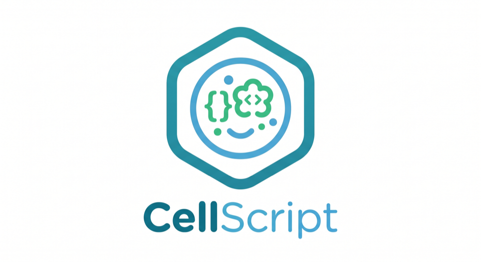

# CellScript

<p align="center">
  
</p>

[](https://github.com/tsukifune-kosei/CellScript/actions/workflows/ci.yml)
[](LICENSE-MIT)
[](Cargo.toml)
[](#target-profiles)
[](#package-manager-beta)
[](#editor-support)
[](docs/wiki/Home.md)

[English](README.md) | [中文](README_CH.md)

CellScript is a domain-specific language for Cell-based smart contracts on
Spora and CKB. It compiles `.cell` source into ckb-vm RISC-V assembly or ELF
artifacts, together with typed metadata for auditing, policy checks, schema
binding, and scheduler-aware execution.

The language is intentionally narrow. It is not a new VM and it is not an
account-storage contract language. CellScript gives protocol authors a typed
way to describe assets, shared Cell state, receipts, lifecycle transitions,
locks, and transaction-shaped effects while still mapping directly to the Cell
model used by Spora and CKB.

## Why CellScript

Spora and CKB both expose powerful Cell-oriented execution, but hand-written
scripts force authors to work close to the wire format:

- parse witness bytes manually;
- track inputs, CellDeps, outputs, and output data by index;
- encode typed state into raw byte arrays;
- write RISC-V C or assembly against syscall numbers;
- preserve linear asset semantics by convention rather than by the compiler.

CellScript raises that programming model to explicit language constructs:
`resource`, `shared`, `receipt`, `action`, `lock`, `consume`, `create`,
`read_ref`, `transfer`, `destroy`, `claim`, and `settle`. These constructs are
not metaphors; they lower to the Cell transaction shape that the target chain
already executes.

## Target Profiles

CellScript supports multiple Cell-compatible target profiles through
`--target-profile`.

| Profile | Use it for | Target shape |
|---|---|---|
| `spora` | Spora-native artifacts | Spora CellTx conventions, domain-separated BLAKE3 metadata, Spora DAG header ABI, Spora scheduler witness metadata, and Spora ABI trailer for ELF artifacts. |
| `ckb` | CKB artifacts for the admitted pure subset | CKB mainnet syscall profile, CKB Molecule/BLAKE2b conventions, CKB header ABI, no Spora ABI trailer, and no Spora scheduler witness ABI. |
| `portable-cell` | Source portability checks | A shared Cell-language subset for code that should remain portable across Spora and CKB. Compile artifacts with `spora` or `ckb`. |

The `ckb` profile is intentionally bounded in v1. It is an artifact profile for
source that passes the CKB portability gate; it is not a promise that arbitrary
stateful CellScript programs or arbitrary hand-written CKB contracts are fully
interchangeable. Unsupported CKB/runtime/stateful shapes are rejected by policy
or kept as post-v1 work.

Examples:

```bash
cellc examples/token.cell --target riscv64-elf --target-profile spora
cellc examples/token.cell --target riscv64-elf --target-profile ckb
cellc check --target-profile portable-cell
```

## Core Model

CellScript programs are written in terms of Cell lifecycle operations.

| CellScript concept | Cell transaction mapping |
|---|---|
| `resource T { ... }` | A linear Cell-backed asset, represented by `CellOutput` plus `outputs_data[i]`. |
| `shared T { ... }` | A shared state Cell read through `CellDep` or updated by consuming an input and creating a replacement output. |
| `receipt T { ... }` | A single-use proof Cell for operations such as deposits, vesting grants, votes, or liquidity positions. |
| `consume value` | A transaction input is spent and the linear value is no longer available. |
| `create T { ... }` | A new output Cell and typed output data are created. |
| `read_ref T` | A read-only CellDep-backed value is loaded. |
| `action` | Type-script style transition logic compiled to RISC-V. |
| `lock` | Lock-script style authorization logic compiled to RISC-V. |
| Local `let` values | Transaction-local computation or witness-derived values; they are never persistent storage by themselves. |

Only `create` materializes persistent state. Ordinary local values do not
become Cells unless they are explicitly created as `resource`, `shared`, or
`receipt` values.

## Language Features

- **Cell-native resources**: `resource` values are linear. They cannot be
  copied, silently dropped, or hidden inside ordinary values. Every resource
  must be consumed, transferred, returned, claimed, settled, or destroyed.
- **Explicit shared state**: `shared` marks contention-sensitive protocol
  state such as pools, registries, and configuration Cells. Reads and writes
  stay visible to metadata and tooling.
- **Receipts as stateful proofs**: `receipt` represents a single-use Cell that
  proves an operation happened and can later be claimed or settled.
- **Capability gates**: declarations such as `has store, transfer, destroy`
  make asset permissions explicit instead of implicit.
- **Lifecycle rules**: `#[lifecycle(...)]` lets a Cell-backed value describe a
  state machine, such as `Granted -> Claimable -> FullyClaimed`.
- **Effect inference**: `action` bodies are classified as `Pure`, `ReadOnly`,
  `Mutating`, `Creating`, or `Destroying` based on their Cell operations.
- **Scheduler-aware metadata**: Spora-targeted builds can expose access
  summaries and shared touch domains so block builders and execution pipelines
  can reason about independent work.
- **Typed schema metadata**: Cell data layout, type identity, output field
  provenance, source hashes, runtime accesses, and verifier obligations are
  emitted as machine-readable metadata.
- **RISC-V output**: the executable target is ckb-vm-compatible RISC-V
  assembly or ELF. CellScript does not introduce a separate VM.
- **Package-aware compilation**: packages can use `Cell.toml`, local modules,
  configured source roots, and local path dependencies.
- **Policy gates**: build, check, metadata, and artifact verification commands
  can reject outputs that violate the selected target or deployment policy.

## Example

CellScript syntax is deliberately close to the Cell transaction shape. A module
contains schema declarations and executable entries. Persistent values are
declared as `resource`, `shared`, or `receipt`; executable logic is declared as
`action` or `lock`; transaction effects are written with explicit lifecycle
operations.

Common declaration forms:

```cellscript
module spora::example

struct Config {
    threshold: u64
}

resource Token has store, transfer, destroy {
    amount: u64
    symbol: [u8; 8]
}

shared Pool has store {
    token_reserve: u64
    spora_reserve: u64
}

receipt VestingGrant has store, claim {
    beneficiary: Address
    amount: u64
    unlock_epoch: u64
}

lock owner_only(owner: Address, signature: Signature) {
    assert_invariant(verify_signature(owner, signature), "invalid signature")
}
```

Common statement and effect forms:

```cellscript
action move_token(token: Token, to: Address) -> Token {
    assert_invariant(token.amount > 0, "empty token")

    consume token

    create Token {
        amount: token.amount,
        symbol: token.symbol
    } with_lock(to)
}
```

The compiler treats `consume`, `create`, `transfer`, `destroy`, `claim`,
`settle`, and `read_ref` as Cell effects, not ordinary function calls. Those
effects are reflected in metadata so Spora scheduling, CKB admission policy,
schema decoding, and artifact verification can audit the generated script.

A complete fungible-token example:

```cellscript
module spora::fungible_token

resource Token has store, transfer, destroy {
    amount: u64
    symbol: [u8; 8]
}

resource MintAuthority has store {
    token_symbol: [u8; 8]
    max_supply: u64
    minted: u64
}

action mint(auth: &mut MintAuthority, to: Address, amount: u64) -> Token {
    assert_invariant(auth.minted + amount <= auth.max_supply, "exceeds max supply")

    auth.minted = auth.minted + amount

    create Token {
        amount: amount,
        symbol: auth.token_symbol
    } with_lock(to)
}

action transfer_token(token: Token, to: Address) -> Token {
    consume token

    create Token {
        amount: token.amount,
        symbol: token.symbol
    } with_lock(to)
}

action burn(token: Token) {
    assert_invariant(token.amount > 0, "cannot burn zero")
    destroy token
}
```

The repository also includes bundled protocol examples:

| Example | Demonstrates |
|---|---|
| `examples/token.cell` | Mint, transfer, burn, and guarded same-symbol token merge. |
| `examples/timelock.cell` | Time-gated state transitions and delayed claim paths. |
| `examples/multisig.cell` | Authorization thresholds and signature-oriented lock logic. |
| `examples/nft.cell` | Unique assets, metadata, and ownership transfer. |
| `examples/vesting.cell` | Receipt-style grants and claim lifecycle. |
| `examples/amm_pool.cell` | Shared pool state and swap/liquidity effects. |
| `examples/launch.cell` | Launch/pool composition patterns. |

## Comparison

The comparison below summarizes why CellScript is shaped around typed Cells,
linear resources, explicit transaction effects, and ckb-vm artifacts instead
of account storage or a chain-specific VM.

| Dimension | CellScript | Solidity | Move | Sway |
|---|---|---|---|---|
| Execution target | RISC-V ELF or assembly on ckb-vm | EVM bytecode | Move bytecode | FuelVM bytecode |
| State model | Typed Cells, explicit inputs/deps/outputs | Account storage slots | Resources in global storage | UTXO plus native assets |
| Asset model | Native `resource`, lifecycle, receipts, and shared Cell patterns | Manual token contracts | Native resources | Native assets, fewer type-script concepts |
| Linear ownership | Compiler-enforced for Cell-backed values | No | Yes, through abilities | No general user-defined linear resources |
| Shared state | Explicit `shared` Cells | Implicit contract storage | Shared objects in some Move chains | No general shared Cell analogue |
| Reentrancy shape | No callback-style account storage reentrancy | Common risk surface | Lower by design | Lower predicate risk |
| Scheduler metadata | Native for Spora target profile | None | Not GhostDAG-oriented | Predicate-level independence |
| CKB compatibility | Bounded ckb-vm artifact profile for the admitted Cell subset | Requires a different VM | Requires a different VM | Requires FuelVM |

Compared with hand-written CKB or Spora scripts, CellScript keeps the same
runtime substrate but replaces raw byte and syscall programming with typed Cell
operations, linear checking, schema metadata, and policy-verifiable artifacts.

## Quick Start

Install from this repository:

```bash
cd cellscript
cargo install --path .
```

Compile a single file:

```bash
cellc examples/token.cell
cellc examples/token.cell --target riscv64-elf
cellc examples/token.cell --target riscv64-elf --target-profile ckb
cellc examples/nft.cell --target riscv64-elf --target-profile ckb --entry-action transfer
cellc examples/nft.cell --target riscv64-elf --target-profile ckb --entry-lock nft_ownership
```

Compile or check a package:

```bash
cellc build --target-profile spora
cellc check --target-profile ckb
cellc check --target-profile portable-cell
```

Initialize and maintain a package:

```bash
cellc init token-package
cd token-package
cellc add shared-types --path ../shared-types
cellc info
cellc build --target riscv64-elf --target-profile spora
```

Emit metadata:

```bash
cellc metadata examples/token.cell --target riscv64-elf --target-profile spora
cellc constraints examples/token.cell --target-profile ckb --entry-action mint
cellc examples/token.cell --target riscv64-elf --target-profile spora
cellc verify-artifact examples/token.elf --metadata examples/token.elf.meta.json
```

`cellc constraints` emits the production constraints report that is also stored
inside compile metadata. It is target-profile aware and reports entry ABI slot
usage, register and stack-spill placement, witness byte bounds, artifact and
backend-shape metrics, CKB cycle/block limit configuration, CKB code-cell
capacity lower bounds, and Spora v0 mass estimates. CKB dry-run cycles,
serialized transaction size, full occupied capacity, and measured Spora mass
remain builder or acceptance responsibilities; the compiler marks those fields
explicitly when they are not measured locally.

## Manifest

`Cell.toml` can set the package entry point, source roots, target profile, and
policy defaults.

```toml
[package]
name = "token"
version = "0.11.0"
entry = "src/main.cell"
source_roots = ["src"]

[build]
target = "riscv64-elf"
target_profile = "spora"

[policy]
production = true
deny_fail_closed = true
deny_symbolic_runtime = false
deny_ckb_runtime = false
deny_runtime_obligations = false
```

Command-line flags can tighten policy checks for a build or CI job.

## Package Manager Beta

CellScript ships a beta package manager in `cellc`. It is intentionally local
and fail-closed while the registry protocol is still post-v1 work.

Supported today:

- `cellc init` creates an application or library package with `Cell.toml`.
- `cellc build`, `cellc check`, `cellc metadata`, and `cellc test` accept a
  package directory or manifest as input.
- `cellc add --path` and `cellc add --git` record dependencies in `Cell.toml`.
- Local path dependencies are resolved recursively and included in module
  loading, source hashing, and metadata.
- `Cell.lock` captures resolved dependency identity for reproducible checks.
- `cellc info --json` exposes package metadata for CI and tooling.

Still beta:

- Registry `publish`, `install`, `update`, and `login` are command-shaped but
  fail closed until the registry backend and trust model are finalized.
- Package names, lockfile fields, and registry authentication are not stable
  production interfaces yet.

## CLI Reference

| Command | Purpose |
|---|---|
| `cellc <input>` | Compile a `.cell` file, package directory, or `Cell.toml`. |
| `cellc build` | Compile the package and write artifacts plus metadata. |
| `cellc check` | Type-check and lower without writing artifacts. |
| `cellc metadata` | Emit lowering, runtime, scheduler, source, and schema metadata. |
| `cellc constraints` | Emit profile-aware ABI, artifact, CKB, and Spora production constraints. |
| `cellc verify-artifact` | Verify an artifact against its metadata sidecar and optional source hashes. |
| `cellc test` | Run compiler and policy tests for `.cell` sources and directive-driven diagnostics; it does not provide trusted runtime execution. |
| `cellc doc` | Generate API and audit documentation. |
| `cellc fmt` | Format `.cell` sources or check formatting. |
| `cellc init` | Create a package skeleton. |
| `cellc add` / `cellc remove` | Mutate local package dependencies. |
| `cellc publish` / `cellc install` / `cellc update` / `cellc login` | Beta registry-shaped commands; registry-backed operation still fails closed. |
| `cellc info` | Print manifest and package information. |
| `cellc repl` | Start the interactive REPL. |
| `cellc run` | Run supported ELF entrypoints through the optional VM runner or simulator path. |

Common options:

| Option | Purpose |
|---|---|
| `--target riscv64-asm` | Emit RISC-V assembly. |
| `--target riscv64-elf` | Emit a RISC-V ELF artifact. |
| `--target-profile spora` | Use the Spora profile. |
| `--target-profile ckb` | Use the CKB profile. |
| `--target-profile portable-cell` | Check source portability across Cell profiles. |
| `--entry-action <ACTION>` | Compile a single action as the artifact entrypoint. Useful for CKB artifacts when other module entries are intentionally fail-closed. |
| `--entry-lock <LOCK>` | Compile a single lock as the artifact entrypoint. Mutually exclusive with `--entry-action`. |
| `--json` | Emit machine-readable summaries where supported. |
| `--production` | Apply production-oriented metadata policy checks. |
| `--deny-fail-closed` | Reject fail-closed runtime features or obligations. |
| `--deny-symbolic-runtime` | Reject symbolic Cell/runtime requirements. |
| `--deny-ckb-runtime` | Reject CKB transaction/syscall runtime requirements. |
| `--deny-runtime-obligations` | Reject runtime-required verifier obligations. |

## Editor Support

CellScript includes production-grade local language tooling:

- The compiler crate exposes an in-process LSP service for diagnostics,
  completions, hover, definition, references, rename, formatting, and
  metadata-oriented code actions.
- The repository includes a VS Code extension for `.cell` syntax highlighting,
  language configuration, snippets, edit/open/save diagnostics,
  compiler-backed formatting, scratch compilation, metadata reports,
  constraints reports, production reports, target-profile selection, and
  status-bar feedback.
- The extension is a stable local tooling surface. It shells out to `cellc` or
  a workspace `cargo run -q -p cellscript --` fallback, so compiler behavior
  stays identical to CLI and CI gates.
- Boundary: the current VS Code extension is not a standalone JSON-RPC/stdin
  language-server transport. The compiler crate has an in-process LSP service;
  a future `cellc lsp --stdio` plus VS Code `LanguageClient` is a separate
  transport project.

- [`editors/vscode-cellscript`](editors/vscode-cellscript)
- [Dual-chain production plan](docs/CELLSCRIPT_DUAL_CHAIN_PRODUCTION_PLAN.md)
- [Dual-chain package registry design](docs/CELLSCRIPT_DUAL_CHAIN_PACKAGE_REGISTRY_DESIGN.md)

## Project Layout

```text
cellscript/
├── src/                 # compiler, parser, type checker, lowering, codegen, CLI
├── examples/            # example contracts and protocol patterns
├── tests/               # compiler and CLI tests
└── editors/
    └── vscode-cellscript/
```

## License

License metadata is declared in [`Cargo.toml`](Cargo.toml). The repository
includes [`LICENSE-MIT`](LICENSE-MIT).
