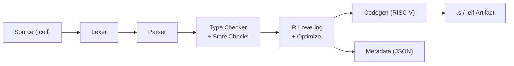
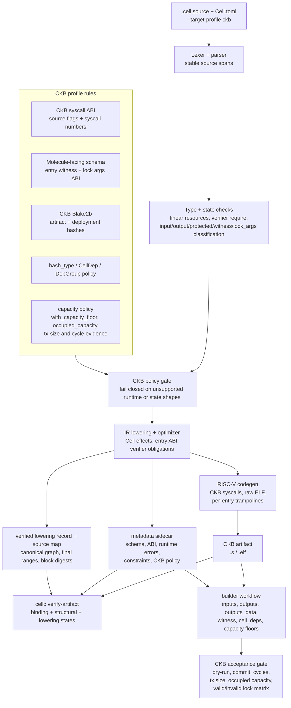

<p align="center">
  
</p>

[](https://github.com/CellScript-Labs/CellScript/actions/workflows/ci.yml)
[](https://github.com/CellScript-Labs/CellScript/releases/tag/v0.24.0)
[](LICENSE-MIT)
[](Cargo.toml)
[](#target-profiles)
[](#package-workflow)
[](#editor-support)
[](https://github.com/CellScript-Labs/CellScript/wiki)

**Write Cell contracts the way you think about them — not the way the wire format does.**

CellScript is a domain-specific language for Cell-based smart contracts on
CKB. It compiles `.cell` source into ckb-vm RISC-V assembly or ELF
artifacts, together with typed metadata for auditing, policy checks, schema
binding, and scheduler-aware execution.

The current stable release is
[CellScript v0.24.0](https://github.com/CellScript-Labs/CellScript/releases/tag/v0.24.0).
The [0.24 release notes](docs/releases/CELLSCRIPT_0_24_RELEASE_NOTES.md)
describe its verified-artifact, executable-test, integration, and explicitly
deferred ecosystem boundaries.

In this README, metadata means machine-readable semantic facts emitted by the
compiler: schema layout, Cell effects, access summaries, source hashes,
verifier obligations, runtime requirements, and target-profile policy flags.

The language is intentionally narrow: it is not a new VM, and it is not an
account-storage contract language. CellScript gives protocol authors a typed
way to describe assets, shared Cell state, receipts, explicit state transitions,
locks, and transaction-shaped effects — while still mapping directly to the
Cell model used by CKB.

---

## Why CellScript

CKB exposes powerful Cell-oriented execution, but hand-written
scripts force authors to work close to the wire format:

- parse witness bytes manually
- track inputs, CellDeps, outputs, and output data by index
- encode typed state into raw byte arrays
- write RISC-V C or assembly against syscall numbers
- preserve linear asset semantics by convention rather than by the compiler

CellScript raises that programming model to explicit language constructs:
`resource`, `shared`, `receipt`, `action`, `lock`, source qualifiers such as
`read`, `protected`, `witness`, and `lock_args`, and Cell effects such as
`consume`, `create`, and `destroy`. Higher-level lifecycle patterns such as
`std::lifecycle::transfer`, `std::receipt::claim`, and
`std::lifecycle::settle` expand into those explicit effects instead of living
as compiler-core verbs.

## Current Status

CellScript is currently in a CKB-focused alpha / stabilisation phase.

It is suitable for:
- experimenting with CKB Cell-contract authoring;
- compiling and inspecting the bundled examples;
- exploring schema-backed CKB Cell effects, metadata, constraints, and CKB target-profile
  checks;
- statically checking the experimental no-profile Fiber-compatible fungible
  invariant entry and running its local CKB-VM matrix;
- using bounded resolved-CellDep identity checks, fixed-width SHA-256/SHA256d,
  depth-16 Merkle verification, and an explicit BIP340 verifier-CellDep ABI;
- extending the non-production Spore and RGB++ identity-adapter cookbook
  packages without moving either protocol into the core namespace;
- trying the local VS Code extension and LSP tooling.

It is not yet recommended for unaudited mainnet deployment without manual
review. The current focus is developer-readiness, diagnostics, ProofPlan /
metadata assurance, and CKB target-profile stability.

The Fiber adapter is a bounded workspace integration, not a claim that Fiber
understands arbitrary CellScript contracts. From a source checkout, run:

```bash
cargo run --locked -p cellscript-fiber-adapter --bin cellscript-fiber -- check token.cell
./scripts/cellscript_fiber_acceptance.sh --static
```

When one package contains multiple structurally eligible assets, selection is
explicit and fail-closed:

```bash
cargo run --locked -p cellscript-fiber-adapter --bin cellscript-fiber -- \
  check examples/fiber/multi_asset.cell --asset FiberUsd
```

The supported policy compositions and deliberate protocol non-goals are
documented in [the Fiber example guide](examples/fiber/README.md); runnable
source examples live in the same directory.

`check` does not modify Fiber or CKB. `enable` can resolve a live deployment and
asset Cell, while `materialize-config` replaces only `ckb.udt_whitelist` in an
existing native Fiber YAML file; the operator still controls the required node
restart. The exact v1 artifact has passed bounded local-devnet runs of Fiber's
official multi-hop UDT payment and pending-TLC watchtower force-close suites.
Production and general-support claims still require the clean pinned full
matrix described in [the Fiber example guide](examples/fiber/README.md) and
[gate policy](docs/CELLSCRIPT_GATE_POLICY.md).

## Quick Start

Install the current stable release (one line, four platform binaries):

```bash
curl -fsSL https://raw.githubusercontent.com/CellScript-Labs/CellScript/main/scripts/install.sh | sh
```

Or pin a specific version:

```bash
CELLSCRIPT_VERSION=0.24.0 curl -fsSL https://raw.githubusercontent.com/CellScript-Labs/CellScript/main/scripts/install.sh | sh
```

The release page publishes `SHA256SUMS` alongside all four platform archives.

Build the exact published source instead:

```bash
git clone --branch v0.24.0 --depth 1 https://github.com/CellScript-Labs/CellScript.git
cd CellScript
cargo install --locked --path .
```

For active development and maintenance lines, see [BRANCHES.md](BRANCHES.md).

Compile your first contract:

```bash
# Just type-check
cellc examples/token.cell

# Emit a RISC-V ELF for CKB
cellc examples/nft.cell --target riscv64-elf --target-profile ckb --primitive-strict 0.16

# Emit a RISC-V ELF for CKB, with a specific entry action
cellc examples/nft.cell --target riscv64-elf --target-profile ckb --primitive-strict 0.16 --entry-action transfer
```

Start a package:

```bash
cellc init token-package
cd token-package
cellc add shared-types --path ../shared-types
cellc build --target riscv64-elf --target-profile ckb
```

Run a CKB profile check:

```bash
cellc examples/nft.cell --target-profile ckb
```

Inspect what the compiler can explain about the NFT example:

```bash
cellc metadata examples/nft.cell --target-profile ckb
cellc expand examples/nft.cell --target-profile ckb
cellc constraints examples/nft.cell --target-profile ckb
cellc scheduler-plan examples/nft.cell --target-profile ckb
cellc explain assumptions examples/nft.cell --target-profile ckb --json
cellc tx solve examples/nft.cell --target-profile ckb --json
cellc deploy plan examples/nft.cell --target-profile ckb --json
cellc profile examples/nft.cell --target-profile ckb --json
cellc audit-bundle examples/nft.cell --target-profile ckb --json
```

These commands show what the compiler believes the protocol reads, writes,
creates, consumes, assumes, and exposes to CKB-facing policy tooling.

On `0.26b`, the bounded Edition 2027 migration preview is review-only:

```bash
cellc migrate path/to/edition-2026-package --to 2027
cellc --json migrate path/to/edition-2026-package --to 2027
```

It never edits the package. A candidate is emitted only for the exact
self-contained Type/Lock subset after matching `CoreSemanticId` and generated
RISC-V ELF bytes; update `Cell.toml` only after reviewing the output.

The experimental `0.26b` branch also includes a locked
[`examples/semantic-foundation-2027`](examples/semantic-foundation-2027/README.md)
package for the bounded native `type_script` preview and a locked
[`examples/lock-script-2027`](examples/lock-script-2027/README.md) package for
the bounded native `lock_script` preview. Their exact grammar, lowering, issue
conflicts, and deferred forms are documented in
[`CELLSCRIPT_2027_PREVIEW_GRAMMAR.md`](docs/CELLSCRIPT_2027_PREVIEW_GRAMMAR.md).
Edition 2026 remains the stable language boundary.

> **Next:** Read on for the [language model](#core-model), [full examples](#example),
> or dive into the [architecture](#architecture).

---

## Target Profiles

CellScript now supports CKB as its only target profile:

| Profile | When to use | What you get |
|---|---|---|
| `ckb` | CKB ckb-vm RISC-V artifacts | BLAKE2b/Molecule conventions, CKB syscall profile |

> The `ckb` profile is production-gated for the bundled CellScript suite. It
> emits raw CKB ckb-vm artifacts, uses CKB syscall
> and Molecule/BLAKE2b conventions, and rejects unsupported shapes through
> normal target-profile policy.

```bash
cellc examples/nft.cell --target riscv64-elf --target-profile ckb --primitive-strict 0.16
cellc examples/nft.cell --target-profile ckb
```

The current assurance gate is `--primitive-strict 0.16`. It includes the earlier
kernel-effect migration checks and adds mandatory ProofPlan soundness checks.

## Core Model

CellScript programs are written as verifier constraints over proposed Cell
transformations:

| Concept | What it compiles to |
|---|---|
| `resource T { ... }` | A linear Cell-backed asset (`CellOutput` + `outputs_data[i]`) |
| `shared T { ... }` | Shared state Cell, read via `CellDep` or updated by consume + create |
| `receipt T { ... }` | A single-use proof Cell (deposits, vesting, votes, liquidity) |
| `consume value` | Spend a transaction input |
| `create output = T { ... }` | Constrain a named proposed output Cell with typed data |
| `read param: T` / `read_ref<T>()` | Load a read-only CellDep-backed value |
| `action` | Type-script transition logic → compiled to RISC-V |
| `lock` | Lock-script authorization logic → compiled to RISC-V |
| Local `let` values | Transaction-local computation; never persistent storage |

> **Key rule:** only `create` materializes persistent state. Ordinary local
> values do not become Cells unless explicitly created as `resource`,
> `shared`, or `receipt`.

## Language Features

- **Cell-native resources** — `resource` values are linear. They cannot be
  copied, silently dropped, or hidden inside ordinary values. Every resource
  must reach an explicit lifecycle or output-binding role: for example
  `consume`, `destroy`, a declared successor output, or a compiler-recognized
  stdlib lifecycle pattern that expands to `consume` plus output constraints.
- **Explicit shared state** — `shared` marks contention-sensitive protocol
  state (pools, registries, configuration Cells). Reads and writes stay
  visible to metadata and tooling.
- **Receipts as stateful proofs** — `receipt` is a single-use Cell that proves
  an operation happened and can later be consumed directly or through an explicit
  stdlib claim/settlement pattern.
- **Capability gates** — `has store, create, consume, replace, burn, relock`
  makes asset permissions explicit in kernel-effect terms instead of protocol
  verbs.
- **Declarative flows** — state remains explicit schema data, while
  `flow Name for Type.field { A -> B by action; }` or compact
  `flow Type.field { A -> B; }` declares allowed edges. The canonical verifier
  shape separates topology, state edge, and proof obligations:
  `action(old: T) -> new: T { transition old -> new; verification ... }`.
  Field-level edges such as `transition old.field: A -> new.field: B` remain
  available when a declared flow graph needs explicit state values. Explicit
  `output` parameters and `consume`/`create` actions remain accepted, but the
  signature direction is the normal input-to-output surface. Multiple state
  edges are written as repeated action-level `transition` lines.
  Each state field has exactly one flow declaration; split/partial flow merging
  is not supported.
- **Scoped verification sections** — action and lock proof logic lives under
  `verification`. `transition` is an action-level Cell lifecycle declaration
  before `verification`, not a statement inside conditional proof logic. The
  type checker rejects asymmetric branch constraints when an output field is
  required in one proof branch but not its siblings.
- **Effect inference** — `action` bodies are classified as `Pure`, `ReadOnly`,
  `Mutating`, `Creating`, or `Destroying` based on their Cell operations.
- **Scheduler-aware metadata** — CKB-targeted builds expose access summaries
  and shared touch domains so block builders can reason about independent work.
- **Typed schema metadata** — Cell data layout, type identity, source hashes,
  runtime accesses, TemplateLayout records, and verifier obligations are emitted
  as machine-readable metadata.
- **RISC-V output** — the executable target is ckb-vm-compatible RISC-V
  assembly or ELF. CellScript does not introduce a separate VM.
- **Package-aware compilation** — packages use `Cell.toml`, local modules,
  source roots, and local path dependencies.
- **Policy gates** — build, check, metadata, and artifact verification can
  reject outputs that violate the selected target or deployment policy.
- **Bounded CKB primitives** — exact/bounded resolved-CellDep data-hash checks,
  fixed 32-byte SHA-256/SHA256d and 64-byte pair hashing, and depth-16 SHA256d
  Merkle paths lower to executable CKB-VM helpers with stable failures.
- **Explicit external signature verification** —
  `verifier::btc::bip340::require_signature_from_cell_dep` spawns a pinned
  verifier dependency through a fixed VM2 IPC ABI.
  `env::sighash_all_zero_lock` supplies one bounded current-group message
  domain for complete zero-filled lock placeholders and returns the distinct
  `SighashAllDigest` type. Multisig layouts, authority binding, deployment
  identity, and replay policy remain explicit application responsibilities.

## Example

A module contains schema declarations and executable entries. Persistent values
are declared as `resource`, `shared`, or `receipt`; executable logic as `action`
or `lock`; effects are written with explicit Cell operations and state
transition clauses.

**Declarations:**

```cellscript
module ckb::example

struct Config {
    threshold: u64
}

resource Token has store, create, consume, replace, burn, relock {
    amount: u64
    symbol: [u8; 8]
}

shared Pool has store {
    token_reserve: u64
    ckb_reserve: u64
}

receipt VestingGrant has store, create, consume {
    beneficiary: Address
    amount: u64
    unlock_epoch: u64
}

struct Wallet {
    owner: Address
}

lock owner_only(protected wallet: Wallet, witness claimed_owner: Address) -> bool {
    verification
        require wallet.owner == claimed_owner
}
```

**Effects:**

```cellscript
action transfer_token(token: Token, to: Address) -> next_token: Token {
    verification
        require token.amount > 0, "empty token"

        consume token

        create next_token = Token {
            amount: token.amount,
            symbol: token.symbol
        } with_lock(to)
}
```

The compiler treats `consume`, `create`, `destroy`, action-boundary source
parameters, expression-level `read_ref<T>()`, and compiler-recognized stdlib
lifecycle patterns as **Cell effects**, not ordinary opaque function calls.
Those effects are reflected in metadata so CKB admission policy, schema
decoding, and artifact verification can audit the generated script.

**Scoped invariants and ProofPlan metadata:**

```cellscript
invariant token_conservation {
    trigger: type_group
    scope: group
    reads: group_inputs<Token>.amount, group_outputs<Token>.amount

    assert_conserved(Token.amount, scope = group)
}
```

Declared invariants must state their CKB trigger and scope explicitly. They are
emitted into Covenant ProofPlan metadata with trigger/scope/read coverage and
aggregate primitive relation checks. Most aggregate declarations remain
`gap:metadata-only` or `gap:runtime-helper-required` until executable verifier
lowering is available; recognised xUDT group amount conservation equality is
auto-lowered into action-prelude runtime helper calls only for matching
one-input/one-output amount-preserving actions, while xUDT `assert_delta`
records are marked `covered` only when generated action code emits the matching
runtime helper and the corresponding ProofPlan record is rebuilt with generated
helper coverage. ProofPlan records also carry macro expansion provenance for
selected protocol flows and warnings for risky coverage assumptions such as
`lock_group` verifiers that scan transaction-wide views.

**Complete fungible-token example:**

```cellscript
module ckb::fungible_token

resource Token has store, create, consume, replace, burn, relock {
    amount: u64
    symbol: [u8; 8]
}

resource MintAuthority has store, create, replace {
    token_symbol: [u8; 8]
    max_supply: u64
    minted: u64
}

action mint_with_authority(auth_before: MintAuthority, to: Address, amount: u64) -> (auth_after: MintAuthority, token: Token) {
    transition auth_before -> auth_after

    verification
        require auth_before.minted + amount <= auth_before.max_supply, "exceeds max supply"
        require auth_after.token_symbol == auth_before.token_symbol
        require auth_after.max_supply == auth_before.max_supply
        require auth_after.minted == auth_before.minted + amount

        create token = Token {
            amount: amount,
            symbol: auth_before.token_symbol
        } with_lock(to)
}

action transfer_token(token: Token, to: Address) -> next_token: Token {
    verification
        consume token

        create next_token = Token {
            amount: token.amount,
            symbol: token.symbol
        } with_lock(to)
}

action burn(token: Token) {
    verification
        require token.amount > 0, "cannot burn zero"
        destroy token
}
```

**Bundled protocol examples:**

| Example | What it shows |
|---|---|
| `examples/token.cell` | Mint, transfer, burn, guarded same-symbol merge |
| `examples/timelock.cell` | HeaderDep timepoints and Token-backed normal/emergency release paths |
| `examples/multisig.cell` | Non-cryptographic threshold approvals; real custody remains the surrounding Lock Script's responsibility |
| `examples/nft.cell` | Collection-bound assets, ownership transfer, and typed Token settlement |
| `examples/vesting.cell` | Receipt-style grants, repeatable partial claims, and terminal full claims |
| `examples/amm_pool.cell` | TypeHash-bound shared pool state and swap/liquidity effects |
| `examples/launch.cell` | Mint-authority bootstrap and launch/pool composition patterns |

Non-production language examples are classified by behavior under
[`examples/language/`](examples/language/README.md). They compile and exercise
compiler/tooling surfaces, but they are not part of the seven-file CKB
production acceptance matrix. `collections/registry.cell` covers bounded local
`Vec<Address>` / `Vec<Hash>` helpers; `examples/registry.cell` keeps that
surface available from the top-level examples directory.
`examples/language/collections/order_book.cell` is a local stack-backed
order-vector sketch and does not claim persistent order-book semantics. The
`ckb/` examples cover source/witness, capacity/time, TYPE_ID, Spawn/IPC, and
dynamic BLAKE2b surfaces. `.cell` filenames describe semantics and never encode
a release version.

## Comparison

Why CellScript is shaped around schema-backed CKB Cell state, linear resources, explicit
transaction effects, and ckb-vm artifacts — instead of account storage or a
chain-specific VM:

| Dimension | CellScript | Solidity | Move | Sway |
|---|---|---|---|---|
| Execution target | RISC-V ELF / asm on ckb-vm | EVM bytecode | Move bytecode | FuelVM bytecode |
| State model | Schema-backed views over CKB Cells, explicit inputs/deps/outputs | Account storage slots | Resources in global storage | UTXO + native assets |
| Asset model | Native `resource`, state transitions, receipts, shared Cells | Manual token contracts | Native resources | Native assets |
| Linear ownership | Compiler-enforced | No | Yes (abilities) | No general user-defined |
| Shared state | Explicit `shared` Cells | Implicit contract storage | Shared objects (some chains) | No shared Cell analogue |
| Reentrancy | No callback-style reentrancy | Common risk surface | Lower by design | Lower predicate risk |
| Scheduler metadata | Native for CKB | None | Not GhostDAG-oriented | Predicate-level |
| CKB compatibility | Production-gated CKB ckb-vm artifact profile for the bundled Cell suite | Requires different VM | Requires different VM | Requires FuelVM |

Compared with hand-written CKB scripts, CellScript keeps the same
runtime substrate but replaces raw byte and syscall programming with schema-backed CKB Cell
operations, linear checking, schema metadata, and policy-verifiable artifacts.

---

## Editor Support

CellScript includes production-style local language tooling for early users:

- **In-process LSP** — diagnostics, completions, hover, go-to-definition,
  references, formatting, and metadata-oriented code actions. The
  compiler crate exposes an `LspServer`; `cellc --lsp` provides a full
  `tower-lsp` JSON-RPC transport over stdio. Completions include flow
  states after `Type::`.
- **VS Code extension** — syntax highlighting, snippets, on-save diagnostics,
  compiler-backed formatting, scratch compilation, metadata/constraints/production
  reports, entry-witness ABI selection, action build plans, TypeScript builder
  generation, package/registry verification, active-file builder assumptions,
  transaction template, deploy plan, profile, audit-bundle reports,
  CKB target-profile arguments, and
  status-bar feedback. It shells out to `cellc` (or a `cargo run` fallback), so
  behavior stays identical to CLI and CI gates.

The extension is a Git submodule. A source checkout that will build or package
it must initialize the pinned, release-reviewed commit first:

```bash
git submodule update --init editors/vscode-cellscript
```

The 0.19 ecosystem-reuse work adds a formal headless
`cellscript-ckb-adapter` crate. The compiler emits semantic action plans and
ABI evidence; the adapter uses `ckb-sdk-rust` to materialize CKB transaction
shape and local-node acceptance evidence. It is not a wallet UI, frontend kit,
or CellFabric intent engine.

- [VS Code extension](editors/vscode-cellscript)
- [Runtime error codes](docs/CELLSCRIPT_RUNTIME_ERROR_CODES.md)
- [Edition policy](docs/CELLSCRIPT_EDITION_POLICY.md)
- [Entry witness ABI](docs/CELLSCRIPT_ENTRY_WITNESS_ABI.md)
- [BIP340 verifier CellDep ABI](docs/CELLSCRIPT_SIGNATURE_VERIFIER_ABI.md)
- [Collections support matrix](docs/CELLSCRIPT_COLLECTIONS_SUPPORT_MATRIX.md)
- [Output bindings](docs/CELLSCRIPT_OUTPUT_BINDINGS.md)
- [CKB target profile tutorial](docs/wiki/Tutorial-05-CKB-Target-Profiles.md)
- [CKB deployment manifest](docs/CELLSCRIPT_CKB_DEPLOYMENT_MANIFEST.md)
- [Spore and RGB++ interoperability boundaries](docs/wiki/Spore-and-RGBPP-Interop-Boundaries.md)
- [Spore identity adapter](examples/ecosystem/spore-identity-adapter)
- [RGB++ identity adapter](examples/ecosystem/rgbpp-identity-adapter)
- [Capacity and builder contract](docs/CELLSCRIPT_CAPACITY_AND_BUILDER_CONTRACT.md)
- [CKB adapter boundary](docs/CELLSCRIPT_CKB_ADAPTER.md)
- [ckb-std compatibility](docs/CELLSCRIPT_CKB_STD_COMPAT.md)
- [Token and AMM bootstrap builder path](docs/examples/token_amm_bootstrap.md)
- [Linear ownership](docs/CELLSCRIPT_LINEAR_OWNERSHIP.md)
- [Scheduler hints](docs/CELLSCRIPT_SCHEDULER_HINTS.md)
- [Metadata verification and production gates](docs/wiki/Tutorial-06-Metadata-Verification-and-Production-Gates.md)
- [Unified gate policy](docs/CELLSCRIPT_GATE_POLICY.md)
- [Standard library](docs/wiki/Tutorial-10-Standard-Library.md)
- [Operational semantics](docs/spec/CELLSCRIPT_OPERATIONAL_SEMANTICS.md)
- [CKB hashing workflow example](docs/examples/ckb_hashing.md)
- [Collections matrix example](docs/examples/collections_matrix.md)
- [Deployment manifest example](docs/examples/deployment_manifest.md)
- [Output append example](docs/examples/output_append.md)
- [0.13 release scope](docs/releases/CELLSCRIPT_0_13_RELEASE_SCOPE.md)
- [0.14 release notes](docs/releases/CELLSCRIPT_0_14_RELEASE_NOTES.md)
- [0.15 release notes](docs/releases/CELLSCRIPT_0_15_RELEASE_NOTES.md)
- [0.16 release notes](docs/releases/CELLSCRIPT_0_16_RELEASE_NOTES.md)
- [0.20 release notes](docs/releases/CELLSCRIPT_0_20_RELEASE_NOTES.md)
- [0.21 release notes](docs/releases/CELLSCRIPT_0_21_RELEASE_NOTES.md)
- [0.22 release notes](docs/releases/CELLSCRIPT_0_22_RELEASE_NOTES.md)
- [0.23 release notes](docs/releases/CELLSCRIPT_0_23_RELEASE_NOTES.md)
- [0.24 release notes](docs/releases/CELLSCRIPT_0_24_RELEASE_NOTES.md)
- [0.22 bounded Fiber interoperability guide](examples/fiber/README.md)
- [Agentic Loops and cellscript-mcp tutorial](docs/wiki/Tutorial-13-Agentic-Loops-and-cellscript-mcp.md)
- [LS-IDL for CKB Lock Scripts tutorial](docs/wiki/Tutorial-15-LS-IDL-for-CKB-Lock-Scripts.md)

---

## Architecture

CellScript is a multi-pass compiler that lowers `.cell` source through five
well-defined stages, then emits RISC-V artifacts, typed metadata, and
profile-aware policy checks. Every module listed below lives in a single Rust
crate (`cellscript`) with its own `mod.rs` entry point under `src/`.


```mermaid
graph LR
    Source["Source (.cell)"] --> Lexer
    Lexer --> Parser
    Parser --> TypeCheck["Type Checker\n+ State Checks"]
    TypeCheck --> IRLower["IR Lowering\n+ Optimize"]
    IRLower --> Codegen["Codegen (RISC-V)"]
    IRLower --> Metadata["Metadata (JSON)"]
    Codegen --> Artifact[".s / .elf Artifact"]
```

### Compilation Pipeline

**1. Lexical analysis** (`lexer/`)
Scans `.cell` source into a typed token stream. Handles CellScript keywords,
operators, literals, and string interpolation. Every token carries a
line/column span for diagnostics.

**2. Parsing** (`parser/`)
Builds an AST from the token stream. The AST models the full surface:
`resource`, `shared`, `receipt`, `struct`, `enum`, `action`, `lock`,
`function`, `use`, `const`, capability gates, declarative flows,
action `transition` clauses, and all statement/expression forms.

**3. Semantic analysis** (`types/` + state-transition checks)
- *Type checking* — enforces linear resource semantics: every
  `resource`/`receipt` value must reach an explicit lifecycle or
  output-binding role before the action body exits. Also validates shared-state
  mutability rules, capability gates, effect classification (`Pure` /
  `ReadOnly` / `Mutating` / `Creating` / `Destroying`), and call signatures.
- *State transition checking* — validates explicit state fields,
  `flow` transition graphs, action `transition` clauses, legal state
  transitions, and static create-site checks.

**4. IR lowering** (`ir/` + `optimize/` + `resolve/`)
- *`resolve/`* — builds per-module symbol tables and resolves `use` imports
  across packages.
- *`ir/`* — lowers the typed AST into a flat, RISC-V-oriented intermediate
  representation (`IrAction`, `IrLock`, `IrPureFn`, `IrTypeDef`) with explicit
  Cell-effect instructions (`IrConsume`, `IrCreate`, `IrReadRef`,
  `IrDestroy`), cell-metadata equality checks, witness/layout slot assignments,
  and verifier obligations.
- *`optimize/`* — syntax-local constant folding and dead-branch pruning when
  `-O1+` is set. Intentionally conservative to preserve resource semantics.

**5. Code generation** (`codegen/`)
Emits ckb-vm-compatible RISC-V assembly (`.s`) or ELF (`.elf`):
- Syscall wrappers: `ckb_load_cell_data`, `ckb_load_witness`,
  `ckb_load_header_by_field`, and `ckb_load_input_by_field`. Signature
  verification is not a CKB-VM syscall and remains an explicit Lock Script or
  pinned verifier-package responsibility.
- Cell input/output/dep index mapping, witness ABI frames, runtime scratch
  buffers, and per-entrypoint trampolines.
- CKB syscall ABI with proper syscall number tables and source-flag conventions.

### Metadata, Lowering Evidence & Policy

The compiler emits a JSON metadata sidecar (`.elf.meta.json` / `.s.meta.json`).
CKB ELF builds additionally emit canonical `.elf.lowering.json` and
`.elf.sourcemap.json` sidecars. The standalone artifact checker consumes all
four identities without calling the compiler front end or code generator:

| What | Produced by | Consumed by |
|---|---|---|
| Schema layout, type IDs, field offsets | `ir/` | Schema decoder, indexer |
| Effect classification, resource summaries | `types/` | Scheduler, audit tools |
| Scheduler witness ABI & access domains | `codegen/` | CKB block builder, parallel scheduler |
| Source hashes, artifact CKB Blake2b | `lib.rs` | `cellc verify-artifact`, CI gates |
| Stable lowering graph, ABI/frame/ProofPlan/syscall contracts, block digests | `verified_artifact.rs` | standalone checker, Registry artifact worker |
| Source spans to final ELF instruction ranges | `verified_artifact.rs` | checker, executable-test coverage, audit tools |
| Verifier obligations, pool invariants | `ir/` | On-chain verifier, policy checker |
| Covenant ProofPlan trigger/scope/read coverage, risk diagnostics, macro provenance | `proof_plan/` | `cellc explain proof`, auditors |
| Target-profile policy violations | `lib.rs` | `cellc check`, CI gates |

`cellc constraints` produces a human-readable subset focused on production
readiness: ABI slot usage, register/stack-spill placement, witness byte bounds,
CKB cycle/capacity estimates.

### Runtime & Stdlib

| Module | What it does |
|---|---|
| **Stdlib** (`stdlib/`) | Built-in functions and compiler-recognized patterns that lower to explicit verifier effects: lifecycle helpers such as `std::lifecycle::transfer`, `std::receipt::claim`, and `std::lifecycle::settle`; cell metadata helpers such as `std::cell::preserve_type`, `std::cell::preserve_lock`, and `std::cell::preserve_capacity`; plus ckb-vm syscall/runtime helpers. Module-injected, not linked separately. |
| **Collections** (`stdlib/collections.rs`) | Compiler-recognized stack-backed `Vec<T: FixedWidth>` lowering supports verifier-local values. The 0.26 bounded Cell runtime additionally supports fixed-width `BoundedCellSet<T, N>` over the exact current Type Script `GroupInput` and `BoundedList<P, N>` through the versioned plan-to-`GroupOutput` verifier; see the [support matrix](docs/CELLSCRIPT_COLLECTIONS_SUPPORT_MATRIX.md). Dynamic element layouts, other Cell sources, and generated allocation-backed helpers remain fail-closed. |

### Tooling Surface

| Tool | Module | How it works |
|---|---|---|
| **CLI** | `cli/` + `main.rs` | `cellc` binary with all subcommands |
| **LSP** | `lsp/` + `lsp/server.rs` | In-process `LspServer` + `tower-lsp` JSON-RPC over stdio (`cellc --lsp`) |
| **VS Code** | `editors/vscode-cellscript/` | Shells out to `cellc` for LSP startup, reports, action-builder generation, package/registry verification, and LS-IDL validate/bind/fetch flows |
| **MCP server** | `cellscript-mcp` (separate bin) | Read-only Model Context Protocol JSON-RPC server that exposes compiler reports and explain commands to MCP-aware agents (Claude Code, Cursor, Aider, Codex, etc.) |
| **Formatter** | `fmt/` | Idempotent formatter for `cellc fmt` and LSP |
| **Doc generator** | `docgen/` | HTML/Markdown/JSON docs from AST + metadata |
| **Executable test runner** | `simulate.rs` + `cli/test_runner.rs` | Versioned scenarios under the non-consensus simulator and local authoritative CKB-VM backend, with exact runtime errors and conservative coverage |
| **REPL** | `repl.rs` | Interactive read-eval-print loop |
| **Generated builder package** | `cellc gen-builder --target typescript` | Emits a registry-bound TypeScript action-builder package with runtime adapter contracts and self-tests |

### Package & Build System

| Module | What it does |
|---|---|
| **Package workflow** (`package/`) | `Cell.toml` parsing, enforced compiler SemVer requirements, single-instance package-coordinate unification, path/git/registry source resolution, manifest-bound `Cell.lock` v5 graphs, aliases, features/dev modes, genesis-bound environments, and bounded update-time resolvers; `cellc init`/`add`/`remove`/`lock`/`install`/`update`/`info`. Builds consume exact immutable Git/Registry pins and verified source hashes without mutable discovery; the Registry profile catalog keeps non-CellScript artifacts non-resolving. |
| **Incremental compiler** (`incremental/`) | Dependency-graph-aware build cache — skips recompilation when inputs are unchanged and retains the 32 most recently used identities per cache root. |
| **Build integration** (`lib.rs`) | Resolves `Cell.toml` → `CellBuildConfig`, merges CLI + manifest options, selects entry scope, runs policy gates, writes artifacts + metadata. |

Set `CELLSCRIPT_INCREMENTAL_CACHE_MAX_ENTRIES` to an integer from `0` through
`4096` to override the per-root cache bound; `0` disables persistent cache use.
`cellc clean --cache` removes every `.cell/build/cache` below the current
workspace while skipping Git metadata, `target`, and `node_modules` trees.

### CKB Target Profile

The CKB profile is not a final packaging switch. It is a policy layer that runs
from semantic analysis through code generation, metadata emission, and release
evidence. The goal is to make CKB assumptions visible before an artifact is
treated as deployable.


```mermaid
flowchart TB
    Source[".cell source + Cell.toml\n--target-profile ckb"] --> Frontend["Lexer + parser\nstable source spans"]
    Frontend --> Semantics["Type + state checks\nlinear resources, verifier require,\ninput/output/protected/witness/lock_args classification"]
    Semantics --> Policy["CKB policy gate\nfail closed on unsupported runtime or state shapes"]

    subgraph Rules["CKB profile rules"]
        R1["CKB syscall ABI\nsource flags + syscall numbers"]
        R2["Molecule-facing schema\nentry witness + lock args ABI"]
        R3["CKB Blake2b\nartifact + deployment hashes"]
        R4["hash_type / CellDep / DepGroup policy"]
        R5["capacity policy\nwith_capacity_floor, occupied_capacity,\ntx-size and cycle evidence"]
    end

    Rules --> Policy
    Policy --> IR["IR lowering + optimizer\nCell effects, entry ABI,\nverifier obligations"]
    IR --> Metadata["metadata sidecar\nschema, ABI, runtime errors,\nconstraints, CKB policy"]
    IR --> Lowering["verified lowering record + source map\ncanonical graph, final ranges, block digests"]
    IR --> Codegen["RISC-V codegen\nCKB syscalls, raw ELF,\nper-entry trampolines"]
    Codegen --> Artifact["CKB artifact\n.s / .elf"]

    Artifact --> Verify["cellc verify-artifact\nbinding + structural + lowering states"]
    Metadata --> Verify
    Lowering --> Verify

    Artifact --> Builder["builder workflow\ninputs, outputs, outputs_data,\nwitness, cell_deps, capacity floors"]
    Metadata --> Builder
    Builder --> Acceptance["CKB acceptance gate\ndry-run, commit, cycles,\ntx size, occupied capacity,\nvalid/invalid lock matrix"]
```

This separates three boundaries:

- **compiler boundary** — parse, type/state checks, CKB policy rejection, IR,
  codegen, and metadata;
- **artifact boundary** — `cellc verify-artifact` uses the independent checker
  to prove binding, static ELF structure, lowering-record, source-map, target
  profile, and selected policy agreement; it does not claim complete semantic
  equivalence or VM execution;
- **chain-evidence boundary** — builders and acceptance scripts prove concrete
  CKB transaction shape, capacity, cycles, tx size, and lock/action behavior.

Capacity in this profile has two layers. `with_capacity_floor(shannons)`
declares a type-level output floor that is visible in metadata and constraints.
`occupied_capacity("TypeName")` keeps runtime-visible capacity checks available.
Neither replaces builder evidence: the final transaction still has to measure
occupied capacity, provide enough output capacity, and record tx-size evidence.

### Wasm Gate

`wasm/` is a **fail-closed** audit scaffold: it compiles and is tested, but
explicitly rejects executable CellScript entries because CellScript has no
production Wasm backend. Type-only IR modules emit an audit report; all other
entries return `WasmSupportStatus::UnsupportedProgram`. The module exists to
prevent a hidden, stale backend from drifting away from the current IR.

---

## Reference

### Manifest

`Cell.toml` sets the package entry point, source roots, target profile, and
policy defaults:

```toml
[package]
edition = "2026"
name = "token"
version = "0.26.0"
entry = "src/main.cell"
source_roots = ["src"]

[build]
target = "riscv64-elf"
target_profile = "ckb"

[policy]
production = true
deny_fail_closed = true
deny_ckb_runtime = false
deny_runtime_obligations = false
```

`edition = "2026"` is mandatory and is the only supported source-semantics
edition. The year is a long-lived epoch label, not an annual release cadence.
Target profile, primitive assurance, metadata schemas, and entry/witness ABIs
remain independently versioned; the resolved compatibility profile combines
those axes with the edition and is bound into lock, deployment, receipt,
registry, and builder identities. Older or missing persisted identities are
rejected rather than migrated. Command-line flags can tighten policy checks
for a build or CI job. The full contract is in the
[edition policy](docs/CELLSCRIPT_EDITION_POLICY.md).

### Package Workflow

CellScript ships a local-first package workflow in `cellc`. Local packages,
source roots, path/git/registry source-package dependencies, explicit lock refresh,
and package build/check/doc/fmt flows are production-style. Registry resolution
is deliberately narrow: `cellc lock`, `cellc install`, and `cellc update`
query the public API for an accepted CellScript source-package version, while
`build`, `check`, and `test` consume only the pinned graph. Resolution commands
download its immutable Registry source snapshot, reject unsafe paths or opaque
archive formats, and verify snapshot SHA-256, every file's BLAKE2b, `Cell.toml`
identity, Edition/profile identity, and the whole-tree `source_hash`.
Non-CellScript artifact profiles still fail closed.

**Supported today:**

- `cellc init` — create an application or library package with `Cell.toml`
- `cellc build` / `check` / `doc` / `fmt` — operate on the current package
- `cellc test --backend simulator|ckb-vm|all` — execute versioned
  `*.scenario.json` fixtures; `--no-run` is the explicit compile-only mode
- top-level `cellc <input>` and report commands accept `.cell` files, package
  directories, or `Cell.toml` manifests where the command supports an input
- `cellc add --path` — records local path dependencies in `Cell.toml`
- `cellc lock` — explicitly resolve the complete runtime/test/feature and CKB
  environment graph and write `Cell.lock` v5
- `cellc install --path` and `cellc update` — resolve local path dependency
  graphs and refresh `Cell.lock`
- `cellc install cellscript/pkg@1.2.0` — resolve a registry source-package
  dependency through the production public API, accepted-status selection,
  immutable snapshot materialisation, Edition/profile checks, and layered hash
  verification
- Local path dependencies are resolved recursively and included in module
  loading, source hashing, and metadata
- `Cell.lock` v5 — declares `single-package-coordinate-v1` and binds the root manifest digest, root/dependency compiler
  requirements, resolving compiler releases, canonical dependency nodes,
  outgoing alias edges, dependency manifests, whole-tree hashes, exact Git or
  Registry pins, feature/test modes, and genesis-bound CKB environments
- Commit `Cell.lock` to version control. It is reviewed build input, not a local
  cache; only `cellc lock`, `cellc update`, or dependency-editing commands may
  repin its dependency graph
- `build`/`check`/`test --locked` — explicitly assert the existing dependency
  graph; the graph is authoritative even without the flag
- `--frozen` — imply offline mode and suppress all lockfile writes;
  `--offline` permits only materialized exact sources
- `[features]`, optional `dep:<alias>`, `[dev_dependencies]`, local
  `package = "..."` aliases, and environment overrides are lock-graph inputs.
  Transitive environments are selected by exact `chain_id` plus genesis hash;
  dependency edges can use `use_environment = "local-name"` or
  `environment_independent = true`, and equal display names carry no authority;
  `[build.dependencies]` remains fail-closed pending isolated execution
- A package coordinate is `(declared namespace, declared package name)`.
  Every selected graph has one version/source/feature/environment instance per
  coordinate. Aliases reuse that instance, distinct namespaces remain distinct,
  and incompatible incoming edges fail with `E2601`; features are not silently
  unioned and path/Git sources do not silently replace Registry sources
- `[resolvers.<name>]` — optional absolute-path/SHA-256-bound, time/output
  bounded update-time resolver; its versioned response must normalize to an
  exact Registry version or Git commit and is never executed by locked builds
- `examples/package_graph` — runnable frozen/offline alias, SemVer, feature,
  test-only dependency, and explicit CKB-environment graph
- `examples/scenario_basics` — runnable positive and exact-negative scenarios
  under both simulator and CKB-VM, plus a four-file artifact walkthrough
- `examples/registry_ls_idl` — runnable LS-IDL validation, executable binding,
  Registry bundle scaffolding, exact-byte fetch, and compatibility vectors
- `cellc info --json` — exposes package metadata for CI and tooling
- `cellc package verify --json` — fails closed when `Cell.toml`, source hash,
  dependency resolution, or build identity disagree with `Cell.lock`; run an
  ordinary locked build first when a tracked example lock is graph-only
- `cellc registry verify --json` — checks off-chain deployment facts against
  `Cell.lock` and `Deployed.toml`
- `cellc registry verify --live --rpc-url ... --json` — adds CKB RPC
  `get_live_cell` liveness plus `get_transaction.tx_status` commit and
  confirmation checks for deployment records when RPC evidence is available
- `cellc publish --authorise` — recommended interactive first-publish path;
  opens an exact-coordinate 15-minute browser authorisation session, keeps the
  pending delegated key recoverable, and resumes publishing after the Registry
  returns the matching key ID (`--no-open` supports remote terminals)
- `cellc publish` — public registry publish path once a delegated publisher
  credential is active; `cellc publish --offline`
  computes the package source hash and mirrors the version entry into
  `registry.json` for local fixtures, audit, and offline fallback
- `cellc registry add` — write a discovery-index entry into the local/offline
  cloned discovery repository
- `cellc registry edit --yank <version>` — mark an existing package version as
  yanked, with optional reason and replacement metadata

**Public registry boundary / fail-closed:**

For interactive first use, run `cellc publish --authorise`. The explicit
`auth capability create/submit` and `auth namespace claim` sequence below is
the manual, CI, recovery, and external-wallet path.

- Public registry publishing uses typed wallet-rooted publisher identities:
  CCC is the browser connection layer, `joyid_ckb` accepts JoyID passkeys, and
  `ckb_secp256k1` accepts standard CKB wallets that expose a compressed public
  key and recoverable CKB message signature. Delegated publisher credentials
  are stored in the OS keychain for daily `cellc publish`; see
  [`docs/CELLSCRIPT_REGISTRY_PRODUCTION_BOUNDARY_ADR.md`](docs/CELLSCRIPT_REGISTRY_PRODUCTION_BOUNDARY_ADR.md)
- `cellc auth capability create --principal-type <principal_type>
  --principal-id <principal_id>
  --scope publish:<namespace>/<package> --expires 90d --json >
  capability-payload.json` creates the local P-256 capability key when
  `--capability-pubkey` is not supplied, stores the private key in the OS
  keychain, and prints the wallet-bound authorisation payload. The
  `principal_id` is the normalized binding derived from the connected signer,
  not the display address. After the same payload is signed through CCC,
  `cellc auth capability submit --payload capability-payload.json
  --wallet-signature wallet-signature.json` registers the delegated key with
  the write API.
  `cellc auth namespace claim --namespace <namespace> --payload
  capability-payload.json --wallet-signature wallet-signature.json` then
  establishes the required namespace ownership. Bare
  `cellc publish` then signs the concrete publish payload and submits the
  source snapshot to the public registry.
- These scopes are deliberately independent: `publish` admits immutable
  releases, `deployment` attaches chain-checked deployment evidence, and
  `availability` deprecates, yanks, or restores a release. A publish-only
  capability cannot perform the other two operations. When the command runs
  inside a package directory without explicit `--scope` flags, `cellc` infers
  only the exact-coordinate `publish` scope. Deployment and availability access
  must be granted explicitly.
- The Registry chooser includes Neuron, JoyID, imToken, CKBull, SafePal,
  Ledger, imKey, OneKey, UTXO Global, Rei Wallet, Gate, and QuantumPurse.
  Compatible CCC signers connect directly; the remaining directory entries use
  the same verified `wallet-signature.json` handoff without exposing mnemonic
  words to the site.
- `cellc auth capability revoke --principal-id <principal_id>
  --capability-key-id <capability_key_id> --json > revoke-payload.json`
  generates a wallet-bound revocation challenge; after signing that challenge,
  `cellc auth capability revoke --payload revoke-payload.json
  --wallet-signature wallet-signature.json` revokes the delegated key without
  creating a separate registry account.
- CI can avoid interactive keychain access by using
  `cellc publish --print-payload --json`, signing the `canonical_payload`
  externally, then submitting with `--payload <file> --capability-signature
  <signature>`, or by setting `CELLSCRIPT_CAPABILITY_PRIVATE_KEY_PKCS8_B64`.
- The production write API lives under
  [`services/registry-api`](services/registry-api/README.md). The deployed slice
  uses Node 22, Postgres 17, a bounded real-compiler verification worker, a
  persistent filesystem object store, and a separate read-only nginx static
  path behind trusted TLS. Publish transactionally queues source/build
  verification; default search/list visibility begins at `verified_build`, and
  direct URLs preserve admitted `source_published` history. The same typed app
  retains a Cloudflare Worker/Hyperdrive/R2 deployment option. Both paths share
  typed wallet capability authorisation, namespace ACLs, quota hooks, ordered evidence
  promotion, and audit events.
- Public version responses bind a content-addressed source snapshot URL. The
  read-only service exposes `/source-snapshots/*` independently of Postgres and
  the API; the lockfile records that URL plus its `sha256:` revision so Registry
  installs do not silently depend on Git availability.
- The versioned `cellscript-registry-profile-catalog-v1` keeps only
  `cellscript_source` dependency-resolving; non-CellScript artifact profiles
  remain discoverable through explicit artifact commands and fail closed in
  package resolution
- Deployable CKB Lock Scripts may attach the versioned
  `cellscript-registry-ls-idl-interface-v1` profile. Registry admission binds
  `SHA-256` of the exact IDL bytes to the executable's final 32 bytes, and
  public reads resolve those bytes by chain-verified Script identity. This is
  an interface-identity check, not proof of implementation correctness or a
  security audit. See the
  [LS-IDL Registry profile](docs/CELLSCRIPT_LS_IDL_REGISTRY_PROFILE.md).
- Git dependencies are explicit remote source fetches; treat them as
  review-required inputs, not the registry production path

**Registry resolver boundary:**

- The default source-package authority is
  `https://api.registry.cellscript.dev`; only publicly accepted statuses enter
  ordinary version selection. `CELLSCRIPT_REGISTRY_API_URL` changes that API
  origin, while `CELLSCRIPT_REGISTRY_URL` explicitly selects the legacy
  Git/offline discovery authority. An unavailable production API does not
  silently downgrade to Git discovery.
- Registry discovery may grow to include CellScript packages, verifier
  artifacts, deployed artifact records, reproducible artifacts, and external
  CKB tooling artifacts. Dependency resolution stays narrower than discovery.
- Anything reachable by `cellc add` must be safe to participate in the build,
  verification, deployment, or declared TCB identity chain.
- Source libraries, runtime verifier packages, deployable script packages, and
  deployed or reproducible artifact records may become resolver-safe only when
  their source, build, ABI, artifact, and deployment identities can be checked
  fail-closed.
- Templates, cookbook examples, protocol skeletons, and scaffold-only projects
  are copy-only material for `cellc new --template` or cookbook tooling; they
  must not be dependency-resolved through `cellc add`.
- Runtime verifier packages are allowed to have no business parameters, but
  production use must still pin `verifier_id`, `ipc_abi`, artifact identity,
  build profile, TCB/security status, and deployment CellDep facts.

### CLI Commands

| Command | Purpose |
|---|---|
| `cellc <input>` | Compile a `.cell` file, package directory, or `Cell.toml` |
| `cellc build` | Compile the package, write artifacts + metadata |
| `cellc check` | Type-check and lower without writing artifacts |
| `cellc clean --cache` | Remove build artifacts and every nested workspace incremental cache |
| `cellc metadata` | Emit lowering, runtime, scheduler, source, and schema metadata |
| `cellc expand` | Inspect the canonical semantic foundation (`--json` for the checked schema) |
| `cellc migrate --to 2027` | Generate a non-mutating Edition 2027 candidate after semantic-ID and ELF differential checks |
| `cellc constraints` | Emit profile-aware production constraints |
| `cellc abi` | Explain `_cellscript_entry` witness ABI layout for an action or lock |
| `cellc entry-witness` | Encode `_cellscript_entry` witness bytes |
| `cellc action build` | Emit a semantic action-builder contract, transaction draft, and compile-only action scan selectors |
| `cellc gen-builder --target typescript` | Generate a TypeScript action-builder package with exact artifact-handle identity, ProtocolBundle v1 state-machine types, resumable external signing, and runtime adapter contracts |
| `cellc scheduler-plan` | Consume scheduler hints and report serial/conflict policy |
| `cellc ckb-hash` | Compute CKB default Blake2b-256 hashes for builders and release evidence |
| `cellc explain assumptions` | Emit v0.16 builder-assumption evidence from ProofPlan metadata |
| `cellc explain graph` | Derive a cyclic ProtocolGraph audit view from compile metadata |
| `cellc tx validate` | Validate transaction JSON shape against builder assumptions before signing |
| `cellc tx solve` | Emit a deterministic transaction template from metadata |
| `cellc protocol bundle check` | Independently admit multiple ELF artifacts and action-builder manifests, validate one shared offline skeleton against every artifact's metadata assumptions, and reject composition conflicts before signing |
| `cellc deploy plan` | Emit a reproducible deployment plan |
| `cellc deploy verify` / `deploy diff` / `deploy lock-deps` | Verify, compare, and lock deployment metadata |
| `cellc proof-diff` / `profile` / `tx trace` / `audit-bundle` | Emit v0.16 audit and debug reports |
| `cellc opt-report` | Compare O0..O3 artifact size and constraints status |
| `cellc receipt` / `sign-receipt` / `verify-receipt` | Emit, sign, and verify compile receipts over metadata/artifact hashes |
| `cellc verify-artifact` | Independently check an ELF, metadata, lowering record, and source map; report VM/chain evidence separately; optionally bind a receipt |
| `cellc artifact ls-idl validate\|bind\|fetch\|bundle` | Validate byte-exact LS-IDL, bind its SHA-256 to a CKB executable, resolve it by deployed Script identity, or scaffold a publish-ready Registry bundle |
| `cellc test --backend simulator\|ckb-vm\|all` | Execute fail-closed package scenarios with exact outcomes and evidence tiers (`--no-run` is compile-only) |
| `cellc doc` | Generate API and audit documentation |
| `cellc fmt` | Format `.cell` sources or check formatting |
| `cellc init` | Create a package skeleton |
| `cellc add` / `remove` | Mutate local package dependencies |
| `cellc lock` / `install --path` / `install namespace/pkg@version` / `update` | Explicitly resolve local, git, or registry CellScript source-package dependencies and refresh `Cell.lock` v4 |
| `cellc info` | Print manifest and package information |
| `cellc package verify` | Verify package/source/build identity against `Cell.lock` |
| `cellc registry verify` | Verify deployment identity against `Cell.lock` and `Deployed.toml`; `--live` adds CKB RPC evidence |
| `cellc certify --plugin novaseal-profile-v0` | Run the deterministic compiler-hosted NovaSeal profile certification (consumes `target/novaseal-*.json` and the local certifier source) |
| `cellc repl` | Start the interactive REPL |
| `cellc run` | Run no-argument standalone ELF entrypoints via CKB-VM, or use explicit `--simulate`; parameter/transaction contexts fail closed instead of silently falling back |

The versioned ProtocolBundle schema, ownership rules, conflict codes, evidence
tiers, offline checker, and adapter materialization boundary are specified in
[CellScript ProtocolBundle v1](docs/CELLSCRIPT_PROTOCOL_BUNDLE.md).
Successful reports with concrete input, output-data, and witness fields can be
materialized by `cellscript-ckb-adapter` into one packed transaction with
byte-identical per-group attribution. A node `estimate_cycles` result can then
bind aggregate acceptance to every direct group without inventing unavailable
per-group cycle counts. Exact-chain live input resolution separately verifies
that each OutPoint, CellOutput, data payload, capacity, and resulting fee still
matches the materialized bundle. Live dependency resolution then verifies each
artifact's code Cell or complete dep-group membership, admitted ELF data hash,
and data-hash or type-hash Script identity against the same transaction. The
adapter can then run supplied CKB SDK unlockers, preserve entry-witness fields,
dry-run the signed bytes, require tx-pool acceptance, and submit with a hash-bound
uncommitted receipt. A reorg-aware confirmation poll can then bind canonical
block inclusion and a caller-selected minimum depth to the same bundle and
transaction identities; the receipt remains a bounded observation rather than
an absolute-finality claim. Closed cross-Script Cell and witness roles can bind
one provider and one or more consumers through an exact Molecule schema,
interface, ELF, and deployment identity; open/runtime-selected roles remain a
separate Script-handle boundary. Each admitted artifact also carries a
recomputable exact receipt plus an ordinary `CSHDLv1-fixed-202` value binding
its entry, role, interface, typed semantics, ELF, profile, ABI, verified
bundle, complete Script, code CellDep, and chain. Generated TypeScript packages
expose the same ordered states, an artifact binding, and a checked exact-handle
binder tied to those identities; signing requests carry no private keys.
Registry verified-build evidence exposes the same bundle schema, binding
schema, and `cellscript-ckb-adapter` identity only after a CKB ELF's metadata,
lowering record, and source map pass the independent artifact checker.
| `cellc publish` / `cellc publish --offline` / `cellc registry add` / `cellc registry edit --yank` | Public publish plus explicit local/offline registry metadata flow; public registry policy makes bare `cellc publish` an authenticated registry write, with Git/static metadata retained for audit and fallback |
| `cellc auth capability create/submit/revoke` / public registry write API / non-CellScript artifact install | Typed wallet-rooted publication policy and future-facing artifact profiles; fail-closed where unsupported |

### CLI Options

| Option | Purpose |
|---|---|
| `--target riscv64-asm` | Emit RISC-V assembly |
| `--target riscv64-elf` | Emit a RISC-V ELF artifact |
| `--target-profile ckb` | Use the CKB profile |
| `--entry-action <ACTION>` | Compile a single action as the artifact entrypoint |
| `--entry-lock <LOCK>` | Compile a single lock as the artifact entrypoint |
| `--json` | Emit one machine-readable result on stdout for success or failure; the flag is global and may appear before or after a subcommand |
| `--color=auto\|always\|never` | Control ANSI colour output. `auto` is the default; `NO_COLOR=1` forces `never` |
| `--production` | Apply production-oriented metadata policy checks |
| `--deny-fail-closed` | Reject fail-closed runtime features or obligations |
| `--deny-ckb-runtime` | Reject CKB transaction/syscall runtime requirements |
| `--deny-runtime-obligations` | Reject runtime-required verifier obligations |

Results selected by `--json` are written to stdout for both success and
failure, so `cellc build --json | jq` cannot lose an error document. Failure
results include `status`, `category`, `exit_code`, stable diagnostic codes when
available, source ranges, and cause chains. The hidden
`--message-format=json` spelling remains a deprecated compatibility alias.
Usage errors exit with `2`; compilation errors use `1`; classified I/O,
network, authentication, and internal failures use `74`, `69`, `77`, and `70`
respectively. Compiler backend codes are documented in
[`docs/CELLSCRIPT_COMPILER_ERROR_CODES.md`](docs/CELLSCRIPT_COMPILER_ERROR_CODES.md).

---

## Project Layout

```text
cellscript/
├── src/                 # compiler, parser, type checker, lowering, codegen, CLI
├── examples/            # example contracts and protocol patterns
├── tests/               # compiler and CLI tests
└── editors/
    └── vscode-cellscript/
```

Development style and backend/codegen rules are tracked in
[`CODING_STYLE.md`](CODING_STYLE.md).

## License

License metadata is declared in [`Cargo.toml`](Cargo.toml). The repository
includes [`LICENSE-MIT`](LICENSE-MIT).
