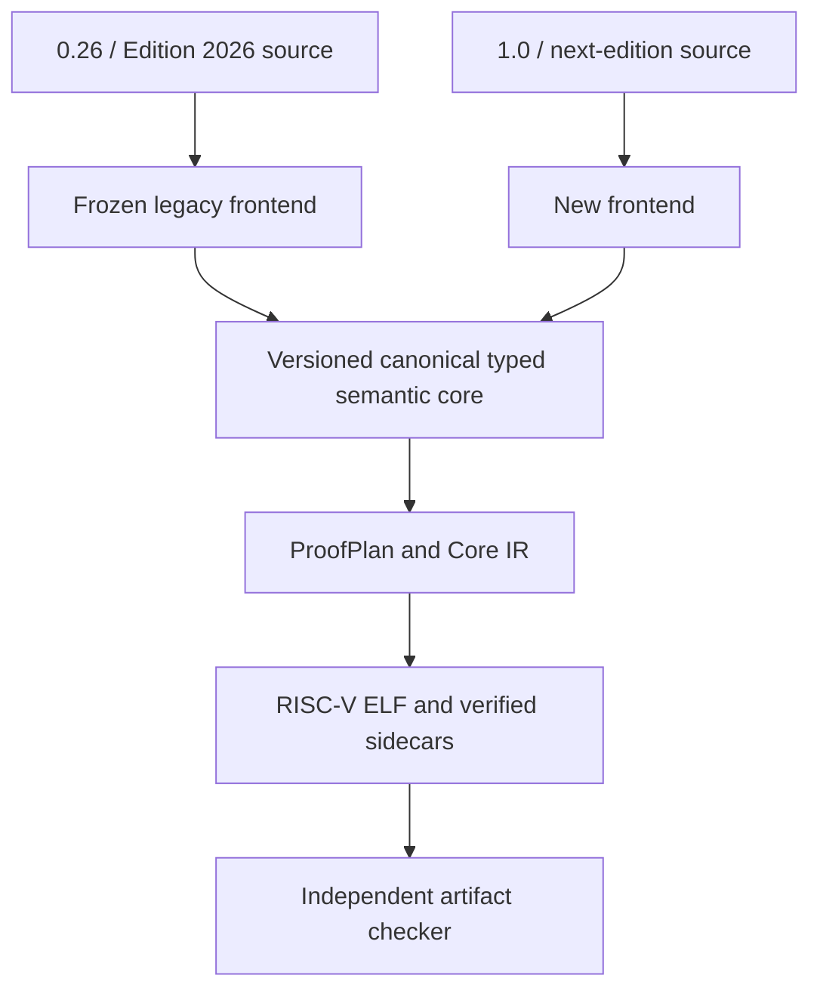
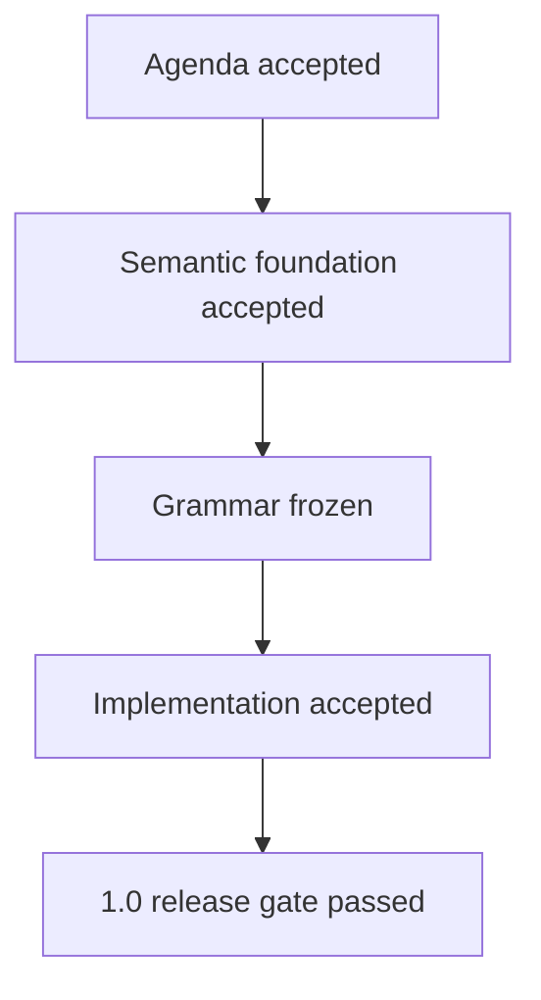

# RFC: CellScript 1.0 Semantic Foundation and Surface Redesign

## Status

**Draft design agenda. Not accepted grammar, implementation scope, or release
commitment.**

**Authoring decision, 2026-09-05:** adopt the
[CellScript authoring target](CELLSCRIPT_AUTHORING_TARGET.md): retain the
Edition 2026 vocabulary and verification model, concentrate successor rules,
and support multiple actions under one persistent deployed policy. Its A1-A6
contracts govern the next authoring iteration. Preview4 remains the implemented
experimental reference; accepting this direction does not freeze its text or
mark the implementation and release gates below as passed.

**Implementation branch:** `0.26b`, based on `origin/nightly-0.26` at
`415554bb9ed65001cec03468e92e407306c662c8`.

**Issue snapshot:** 2026-09-02, covering every issue currently listed in
`CellScript-Labs/CellScript` (#1 and #7-#22).

**Repository-contract baseline:** the implemented but still non-production 0.26
development contract at the commit above. It includes bounded Type Script-group
input consumption and bounded output-plan correspondence. This reconciliation
must still be refreshed against the exact 0.26 release tag before 1.0 acceptance.

This RFC proposes the semantic foundation for a future major-version and
source-edition transition. The `0.26b` branch may implement the versioned
semantic records, expansion tooling, and an experimental frontend, but it does
not retroactively redefine what 0.26 ships or make the new grammar stable.

The strategic direction is strong, but the grammar is not ready to freeze.
The design should be evaluated as a 1.0 agenda rather than a final syntax
contract:

> **Strategic direction: 9/10. Current readiness as frozen grammar: 6.5-7/10.**

The next iteration must define the semantics needed by each authoring change
and test its readability on representative contracts. Existing-meaning
shorthand can be evaluated without freezing every future semantic subsystem.

## `0.26b` Implementation Snapshot

The branch implements the semantic-schema experiment needed to evaluate this
agenda; it does not mark any acceptance checkbox below as project-approved.

Implemented:

- `cellscript-typed-semantics-v8` embeds
  `cellscript-semantic-foundation-v3` and a bounded,
  hash-consed `cellscript-value-provenance-dag-v1`;
- canonical transaction roles, complete Cell-envelope disposition records,
  enforcement-classified claims, legacy ambiguity nodes, and distinct core,
  entry, artifact-contract, deployable-artifact, verified-bundle, source, and
  source-map identities;
- a separate `trusted-external` verifier record binds an exact CellDep data
  hash and ordered delegation sequence without claiming that the compiler
  proves third-party code internals;
- executable source-condition claims that bind canonical `require`/`enforce`
  statements to condition provenance, typed success/failure control flow, and
  the exact fail-closed runtime error; supporting ProofPlan obligations remain
  separate claims;
- a parser/codegen-independent checker for those records, including both
  `SingleEntry` and `ExplicitVersionedDispatch`, executable-claim linkage, and
  negative mutation tests;
- a bounded persistent Type-group `PolicyWitnessV1` entry contract with explicit
  tags, full Script-hash keyed witness records, fixed role counts and ordered
  common checks. Compiler/VM and typed-projection checks exist; independent
  machine dispatch dataflow and complete authoring/product closure remain
  requirements, not claims supplied by this record;
- source-map v2 semantic-node-to-span mappings outside semantic hashes;
- exact originating condition or generated-sugar source-map ranges for
  executable claim nodes, while broader semantic records retain entry-level
  diagnostic ranges;
- deterministic `cellc expand` human output and canonical JSON output;
- bounded, non-mutating `cellc migrate --to 2027` candidate generation for
  the already-proven legacy Type/Lock subset, gated by core-semantic identity
  and byte-identical RISC-V ELF differential checks;
- a separate Edition 2027 preview route selected by `Cell.toml`, while Edition
  2026 remains frozen and default;
- a bounded native `type_script` / `entry` / `verify` / `effects` slice with
  exhaustive `replace`, fixed-role `pool`, `retire`, `fresh`, and metadata-only
  external-policy audits, including exact `type-group<T>` entry triggers,
  canonical formatting, and differential lowering evidence; see the
  [implemented preview grammar](CELLSCRIPT_2027_PREVIEW_GRAMMAR.md);
- formatter, LSP diagnostic/completion, manifest, example, and cross-edition
  semantic-identity coverage, plus WASM explicit-edition compilation and
  virtual-document language-service entry points.

Intentionally deferred:

- the complete and frozen grammar beyond the bounded native preview, including
  additional artifact containers, selectors, disposition variants, and claim
  forms;
- automatic migration or source rewriting—ambiguous `consume` and
  `consume_each` stop with source-linked diagnostics;
- compiler emission of multi-entry dispatch, foreign/cross-Script roles,
  `.celltx` choreography, or any new wire ABI;
- acceptance of the RFC gates, production promotion, or a CellScript 1.0
  release claim.

## Executive Decision

The post-0.26 redesign should:

1. preserve and pin the existing source, runtime, artifact, and evidence
   contracts required by each change;
2. retain `resource`, `action`, `lock`, and `require` in a separately routed
   authoring frontend, using a new edition for intentional source-meaning changes;
3. lower both frontends into one versioned canonical typed semantic core;
4. make value provenance, transaction-role binding, Cell disposition,
   enforcement location, and artifact entry selection explicit;
5. preserve the independent compatibility axes for source edition, runtime
   ABI, metadata, target profile, and compiler release;
6. keep transaction construction and multi-artifact choreography outside the
   consensus-facing core language; and
7. support declared multi-action dispatch for one persistent deployed policy;
   scoped action ELFs remain useful independent compilation products; and
8. derive layered semantic, entry-contract, artifact-contract, and bundle
   identities from canonical records, never from a rendered expansion or
   formatted source text.

The redesign should not freeze the provisional keywords in this document until
the underlying semantic records, issue conflicts, migration behavior, and
negative test matrix are accepted.

## Language Constitution

Four rules should govern every new-edition feature:

> **Every value has provenance.**
>
> **Every Cell role has explicit accounting and verification responsibility.**
>
> **Every claim states whether and where it is enforced.**
>
> **Every artifact has one explicit entry-selection contract.**

These rules are stronger and more durable than any particular spelling such as
`verify`, `effects`, `replace`, or `retire`.

Unique lifecycle accounting and independent identity, value, capacity, and
authorization obligations must compose. Complete responsibility records may
state that a dimension is outside this verifier's scope; claiming another
mechanism guarantees it requires authenticated identity and applicability.

## Goals

- Improve the readability of the existing candidate-transaction verification
  model, with concise roles and concentrated successor relations.
- Preserve Script Group, WitnessArgs, CellDep, HeaderDep, Lock Script, Type
  Script, capacity, and output-correspondence boundaries.
- Prevent schema evolution from silently changing preservation behavior.
- Separate on-chain enforcement from static checks, builder obligations,
  audit-only statements, and chain evidence.
- Make source migration reviewable through canonical typed expansion and
  differential lowering.
- Retain the existing verified-artifact and independent-checker architecture.
- Absorb Argent's useful concentration of role and successor relations while
  keeping actor routing and source choreography outside this authoring scope.

## Non-Goals

- Expanding the 0.26 release scope.
- Treating a CKB Script as an actor that owns or mutates a Cell.
- Adding implicit action dispatch to a multi-entry binary.
- Adding an ELF linker or runtime calls between independent CKB Scripts.
- Making Registry metadata a consensus authority.
- Adding a transaction builder to the consensus-facing source language.
- Treating a complete AST or typed record as proof that the compiler is
  trustworthy.
- Renaming syntax while simultaneously redesigning the backend and artifact
  trust boundary.

## Existing Contracts That Must Remain Visible

The redesign starts from existing contracts rather than an imagined blank
slate:

- [Edition 2026](CELLSCRIPT_EDITION_POLICY.md) is the current source-semantics
  epoch. A change to the meaning of existing source requires a new edition;
  compiler SemVer and runtime ABI versions remain separate axes.
- The current canonical grammar uses `action`, `lock`, `verification`, repeated
  action-level `transition`, and explicit lifecycle operations, as specified by
  [grammar governance](CELLSCRIPT_GRAMMAR_GOVERNANCE_RFC.md).
- Public entry arguments already have a runtime source. The production entry
  wrapper reads the Script Group-relative `WitnessArgs.input_type` placement
  and the `CSARGv1` payload, while `lock_args` comes from `Script.args`; see the
  [entry witness ABI](CELLSCRIPT_ENTRY_WITNESS_ABI.md).
- Named output roles already produce index bindings consumed by metadata and
  builders; see [output bindings](CELLSCRIPT_OUTPUT_BINDINGS.md). What remains
  open is whether a future source surface must spell those bindings explicitly.
- Capacity has both source/compiler policy and transaction-specific builder or
  chain evidence; see the
  [capacity and builder contract](CELLSCRIPT_CAPACITY_AND_BUILDER_CONTRACT.md).
- Cell-backed values are linear and may not disappear silently; see
  [linear ownership](CELLSCRIPT_LINEAR_OWNERSHIP.md).
- Package interfaces already separate source API, serialized layout, runtime
  ABI, effects/capabilities, builder, and deployment compatibility; see
  [public interfaces](CELLSCRIPT_PUBLIC_INTERFACES.md).
- ProofPlan already distinguishes checked-static, checked-runtime,
  runtime-helper-required, builder-evidence-required, metadata-only, and
  chain-evidence-required obligations.

The 1.0 design may replace source spellings, but it must not erase these CKB
facts or collapse their independently versioned identities.

## Proposed Compiler Architecture



This must be a genuine two-frontend architecture. A growing collection of
edition conditionals inside one parser and one desugaring path would make the
old contract difficult to freeze and the new contract difficult to audit.

The authoring frontend elaborates directly into structured semantic records.
It must not depend permanently on generating verbose preview4 source and
parsing it again. `cellc expand` renders the record for review. Equal semantic
IDs alone do not establish correct elaboration or machine-code generation.

The common core does not require every legacy construct to become valid
next-edition syntax. When 0.26 contains a construct whose meaning cannot be
translated safely, the core may retain an explicitly tagged legacy node. The
new frontend must not emit that node. Migration must stop with a diagnostic
rather than invent a new disposition.

Differential comparison applies to the semantically equivalent subset and must
compare at least:

- value provenance;
- role source, scope, cardinality, and index selection;
- linear discharge and Cell disposition;
- input/output correspondence;
- ProofPlan obligations and evidence tiers;
- runtime error behavior;
- public interface dimensions;
- generated builder obligations; and
- CKB-VM acceptance and rejection behavior.

## Canonical Typed Semantic Core

The names below are explanatory, not proposed Rust APIs.

### Value Provenance

Every externally observable value must retain a closed, typed source record.
A minimum model is:

```text
ValueProvenance =
    EntryWitness {
        placement_abi,
        payload_abi,
        group_witness_source,
        field_path
    }
  | ScriptArgs { script_role, byte_range, codec }
  | GroupInput { role, ordinal, field_path }
  | GroupOutput { role, ordinal, field_path }
  | TransactionInput { selector, field_path }
  | TransactionOutput { selector, field_path }
  | CellDep { identity_policy, selector, field_path }
  | HeaderDep { selector, field_path }
  | TransactionField { field }
  | Constant { declaration }
  | Derived { operation, inputs: ProvenanceNodeId[] }
```

Provenance is a bounded, hash-consed DAG. A derived node references canonical
node IDs rather than recursively embedding complete provenance trees. This
keeps serialization, hashing, equality, traversal budgets, and diagnostics
bounded and deterministic.

Provenance may be declared once for a typed port and inherited by field
projections. The language should not require repetitive `from witness...`
clauses on every scalar, but it must not admit a bare symbolic `arg` with no
recoverable CKB source.

An `Address` remains identity-like data. It is not a Lock Script, signer, or
authorization proof. Lock relations must preserve, construct, or verify the
exact identity of a complete Lock Script under a defined type contract. An
`Address` value alone implies neither address conversion nor authorization;
see authoring contract A2.

### Artifact Entry Contract

Script Group trigger and entry selection are separate questions:

```text
ArtifactEntryContract {
    script_role: Lock | Type,
    trigger: LockGroup | TypeGroup,
    entry: ExactEntry,
    dispatch: SingleEntry | ExplicitVersionedDispatch,
    entry_payload_abi,
    witness_placement_abi
}
```

The canonical core must support both `SingleEntry` and
`ExplicitVersionedDispatch`. The initial new-frontend implementation may emit
only `SingleEntry`; that is a Phase 2 scope restriction, not a permanent
language principle.

The syntax must not imply that CKB natively invokes an action name. The adopted
authoring target requires an explicit artifact action set and versioned dispatch
for several operations under one persistent deployed Script policy. Independent
action ELFs alone do not provide that lifecycle. Selector source, unknown-tag
behavior, exhaustiveness, ambiguity rules, and witness ABI must be specified
and checked before the compiler admits this surface. No implementation may
infer dispatch from action names or transaction shape. See authoring contract A1.

### Transaction Role Binding

Every role must define:

```text
RoleBinding {
    role_id,
    direction: Input | Output | ReadOnlyDependency,
    locality: Local | ClosedForeign | OpenForeign | Dependency,
    source: GroupRelative | TransactionRelative | CellDep | HeaderDep,
    selector,
    cardinality,
    lock_or_type_role,
    script_identity_policy,
    schema_identity,
    correspondence_policy
}
```

Source spans belong in the source-map sidecar, keyed by stable semantic node
IDs. They are diagnostic provenance, not semantic fields.

Local fixed-arity roles come first. Cross-Script closed/open roles build on the
same model only after the artifact-only composition boundary is stable.

A source declaration may use a canonical default ordinal if that default is a
normative language rule, appears in typed expansion, and is verified on chain.
Non-positional matching requires an explicit selector such as an identity,
script, index, or checked role witness.

### Cell Disposition Algebra

CKB consumes every transaction input at the ledger level. CellScript therefore
must not use `consume` as an unexplained business-level terminal state.

The implemented preview begins with this algebra:

```text
InputDisposition =
    Successor { output_role }
  | Pooled { pool_id, accounting_obligation }
  | Retired { absence_policy }
  | AuthorizationOnly { disposition_owner }

OutputOrigin =
    SuccessorOf { input_role }
  | Fresh { identity_policy }
  | PoolResult { pool_id, accounting_obligation }
```

The authoring target retains explicit lifecycle accounting while requiring
independent, composable identity, asset-quantity, capacity, and authorization
obligations. The same successor may participate in additional accounting
relations without being linearly discharged twice. The preview's mutually
exclusive labels are not a final classification of every business relation;
see authoring contracts A4 and A5.

Candidate surface verbs are:

- `replace` for a declared successor;
- `pool` or `use` for participation in explicitly checked pooled accounting;
- `retire` for logical-identity termination under an absence or burn policy;
  and
- `create` for a fresh output with an explicit identity policy.

The next edition should reject ambiguous bare `consume`. Legacy Edition 2026
meaning may remain supported only through the frozen frontend and an explicit
legacy core node until a safe migration is selected.

`AuthorizationOnly` is the bounded Lock Script case. It states that the
artifact authorizes spending a protected input but does not claim to own the
business-level successor, retirement, data, identity, Type Script, or capacity
policy. `disposition_owner` must name the layer that supplies those rules, such
as the Type Script or an explicit transaction policy. This variant must never
be interpreted as implicit retirement.

That layer label does not establish that a particular external verifier
guarantees a condition. Likewise, a Lock equality fixture is not evidence of
credential control. Authorization requires the actual enforced policy.

### Exhaustive Cell Envelope Disposition

Exhaustive data-field treatment is necessary but insufficient. Every role must
account for the complete Cell envelope, including dimensions outside the
current verifier's responsibility. The following is a design sketch, not a
frozen or exhaustive type definition; authoring contracts A2 and A4 require
exact Script-hash identity checks and scoped verification responsibility:

```text
CellEnvelopeDisposition {
    data_fields: ExhaustiveFieldPlan,
    logical_identity: Preserve | Create(policy) | Retire(policy) | Pool(pool_id),
    lock_script: Preserve | Set(Script),
    type_script: Preserve | Set(Script) | Remove(policy),
    capacity: Preserve | Equal(expr) | AtLeast(expr) | BuilderComputed(policy),
    cardinality,
    correspondence
}
```

Source syntax may use concise constructors whose meanings are total and
versioned. The canonical typed expansion must still enumerate every data field
and envelope dimension. A new schema field must either appear in that expansion
under a declared total rule or make the old transition fail compilation.

The 2026-09-05 authoring decision admits `same except` under a concrete schema
identity, exhaustive field expansion, and focused migration acknowledgement
when schema changes affect that expansion. This replaces the earlier blanket
objection to blacklist preservation. A new semantic hash does not demonstrate
review of an automatically preserved field. The acknowledgement mechanism is
still a design contract; see authoring contract A3.

Capacity relations checked by the current artifact must remain separate from
occupied-capacity computation and chain admission. The latter continue to be
builder or chain evidence where appropriate.

### Claims and Enforcement Location

The next edition should retain the existing evidence-tier taxonomy rather than
inventing a second truth system.

The authoring target keeps `require`; preview4 retains `enforce` as its current
experimental spelling. The semantic distinction is:

- executable condition: the selected artifact must discharge the claim as checked-static
  or checked-runtime evidence; production compilation fails otherwise;
- `audit`: an optional structured declaration that is type-checked and recorded
  as metadata-only, is not evaluated by the generated artifact, cannot
  authorize an accepting path, and is visibly labelled as non-consensus; and
- typed builder or chain requirements emitted from roles and dispositions,
  never disguised as artifact-local executable conditions.

The language must not promote an assertion merely because its name sounds
strong. ProofPlan and lowering evidence remain authoritative.

The canonical record must distinguish the source condition from supporting
obligations. An executable condition uses an `entry-condition` claim whose
`evidence_reference` selects one typed-entry `branch-condition`, with an
execution binding to the condition provenance node, ordered success and
failure blocks, and the failure runtime-error code. A ProofPlan-derived claim
instead references its `proof-plan:<name>` record and has no execution binding.
Both forms enter `CoreSemanticId`.

This binding is structural translation evidence, not a source-equivalence
proof: the independent checker validates the typed branch, provenance node,
and fail-closed exit without loading or reconstructing the source AST. Source
spans remain diagnostic source-map data and never enter the claim hash.

### Declarative Effects, Not Imperative Commit

`commit` should not be adopted as the top-level transition keyword. A CKB
Script does not apply or commit a mutation; it accepts or rejects transaction
facts that already exist.

The typed core uses `DispositionPlan` for declarative relations over a candidate
transaction. Preview4 places them in a structurally final `effects` section;
this is its implemented grammar restriction. The authoring target does not
require separate `verify` and `effects` blocks. Conditions and successor
relations should compose in ordinary branches, with complete role accounting
on each accepting path. Final section spelling remains subject to the corpus
comparison; there is no imperative "commit instruction."

The word `commit` should remain available for cryptographic commitments, where
it already has a precise meaning in digest-backed substate designs.

### Orthogonal Type Properties

The new type system must not infer Cell ownership from representation width.
These axes remain distinct:

```text
representation: fixed | dynamic | opaque-bounded
storage binding: ordinary | cell-backed | transaction-view
value abilities: copy | drop | store | serializable
lifecycle capabilities: replace | pool | retire | create | relock | ...
```

A persistent Cell-backed value may have a fixed-width encoding. Conversely, a
fixed-width handle need not carry Cell lifecycle authority.

## Implemented Bounded Preview Surface

The following spelling is an implementation reference, not the adopted authoring
target. It was introduced by
`cellscript-source-semantics-2027-preview4`, was recorded under
`cellscript-source-semantics-2027-authoring1`, and remains accepted by the
`cellscript-source-semantics-2027-0.30-dev1` development route. It remains
experimental and does not freeze the complete grammar or select a new payload
ABI. The exact bounded contract and EBNF are specified in the
[Edition 2027 preview grammar](CELLSCRIPT_2027_PREVIEW_GRAMMAR.md).

```cellscript
type_script TokenTransfer on type_group<Token> {
    entry transfer(
        input token: Token from group_input[0],
        witness recipient: Address from group_witness.input_type,
        output next: Token from group_output[0],
    ) {
        verify {
            enforce token.amount > 0
        }

        effects {
            replace token -> next {
                data {
                    owner = same
                    amount = same
                }

                identity = same
                type_script = same
                lock_script = exact_hash(recipient)
                capacity = same
                cardinality = one_to_one
            }
        }
    }
}
```

The disposition's `owner = same` and `amount = same` clauses generate their
own verifier obligations. Repeating them in `verify` would create two sources
of truth. Preview4 also implements the bounded `pool`, `retire`, and `fresh`
variants of the disposition algebra. Pools bind non-empty explicit local role
sets and generate an overflow-checked `u128` numeric field-sum equality for every
`field = conserve`; non-conserved output fields and output locks are checked
exactly. Retirement requires a field, CKB Type ID, or singleton absence policy,
and fresh output creation requires an explicit identity policy and exhaustive
output plan.

Preview4 selects one deliberately narrow `audit` contract:
`expected_evidence = external_policy(subject)`. Its subject is pure and
type-checked, cannot directly capture a Cell-backed linear value, and enters
`CoreSemanticId` as metadata-only, off-chain evidence with no execution
binding. It is never an ignored runtime assertion or an accepting condition.

The canonical typed expansion must additionally identify the exact entry and
placement ABI, group-relative indexes, output correspondence, capacity evidence
split, runtime errors, ProofPlan records, and complete Script identities. A
companion source-map view may display the source spans associated with each
stable semantic node ID.

The current `recipient: Address` port uses the existing positional `CSARGv1`
encoding. A future structured call or Script-valued lock constructor that
changes those bytes requires a new payload ABI identity. A source-edition
change must never silently change entry bytes.

The same preview now implements one native `lock_script ... on lock_group`
container with one exact `lock:...` entry, one Cell-backed protected role at
`group_input[0]`, explicit `current_script.args` and
`group_witness.input_type` provenance, a verify body, and optional metadata-only
audits. It lowers through
the existing checked Lock path and emits `AuthorizationOnly`; it does not
invent Type Script lifecycle policy. See the preview grammar for the canonical
spelling, differential identity and ELF evidence, and deliberately deferred
Lock surface.

## Canonical Expansion and Layered Identity

`cellc expand` should render a deterministic human-readable view of the typed
normal form. The renderer is not the identity boundary.

The canonical expansion should display the following layers together, but it
must not collapse them into one hash:

- resolved names and types;
- all value provenance;
- artifact entry and trigger contracts;
- role selectors, cardinality, and correspondence;
- exhaustive Cell envelope dispositions;
- claim evidence tiers;
- executable-claim evidence references and typed branch/error bindings;
- builder and chain obligations;
- effect and lifecycle authority; and
- the independently versioned entry, runtime ABI, target, and artifact
  contracts.

The identity model should be layered conceptually as follows. Exact schema and
hash names remain an implementation RFC decision:

```text
CoreSemanticId = H(
    types,
    claims,
    local roles,
    dispositions,
    enforcement classes
)

EntryContractId = H(
    CoreSemanticId,
    trigger,
    dispatch,
    provenance roots,
    payload ABI,
    placement ABI
)

ArtifactContractId = H(
    EntryContractId,
    target profile,
    lowering contract
)

DeployableArtifactId = H(ELF bytes)

VerifiedBundleId = H(
    DeployableArtifactId,
    metadata identity,
    lowering-record identity,
    source-map identity
)

SourceDigest = H(canonical source-unit identities and bytes)
```

`CoreSemanticId` contains no source paths, byte offsets, line numbers, or
spans. Two frontends may therefore express the same core meaning while using
different entry ABIs. Their `CoreSemanticId` may match while their
`EntryContractId` intentionally differs.

Changing a checked condition changes its canonical claim node and therefore
`CoreSemanticId`. Equivalent Edition 2026 `require` and Edition 2027 `enforce`
forms should still project to the same claim and identity when their typed
meaning and entry contract are otherwise equal.

Diagnostic provenance is carried separately:

```text
SourceMapSidecar {
    source_digest: SourceDigest,
    mappings: SemanticNodeId -> SourceSpan[]
}
```

The source-map sidecar remains part of the verified artifact bundle, but its
moving spans do not alter `CoreSemanticId`. Source identity, semantic identity,
entry-contract identity, and diagnostic provenance must never be presented as
one interchangeable hash.

Whitespace, comments, formatter choices, and equivalent display ordering must
not change semantic identity.

Canonical expansion improves semantic self-containment. It does not by itself
make the compiler trusted. Trust continues to depend on translation validation,
independent structural checking, mutation tests, negative CKB-VM fixtures,
reproducible artifacts, deployment identity, and chain evidence.

## Transaction Choreography Boundary

Transaction construction should remain separately versioned and off chain.
A future `.celltx` syntax is acceptable only as a frontend or authoring view
over the canonical `ProtocolBundle` and builder schemas defined by issue #9.
It must not introduce a second role graph, index resolver, witness owner, or
evidence model.

Recommended sequencing:

1. stabilize the artifact-only ProtocolBundle schema without new source syntax;
2. integrate local and cross-Script role metadata;
3. prove deterministic conflict detection and byte-identical multi-group
   dry-runs; and
4. only then evaluate a separately versioned `.celltx` authoring language.

The `.cell` language remains a verifier description. The `.celltx` layer, if
accepted, describes builder intent and must never be presented as consensus
authority.

## Migration and Compatibility Policy

### Source Edition and Major Version Are Separate

This redesign requires a new source edition because existing source spellings
and lifecycle meanings change. The edition identifier is an RFC decision; it
must not be inferred automatically from the package major version.

CellScript 1.0, the next source edition, the entry payload ABI, witness
placement ABI, metadata schema, and target profile remain independent axes.

### Freeze Before Migration

Each migration must identify and preserve its exact input contract:

- frozen grammar and formatter behavior;
- frozen typed semantics and lifecycle interpretation;
- exact entry and placement ABIs;
- canonical interface and artifact identities;
- output binding and bounded-runtime semantics; and
- complete positive and negative evidence for admitted shapes.

This RFC must not retroactively redefine 0.26 behavior.

Prototyping a faithful shorthand does not require a blanket freeze of every
0.26 subsystem. Record the exact source baseline and dependencies for that
slice. Broad release compatibility still needs a pinned, reviewed release
baseline and its evidence.

### Migration Behavior

A migration tool should operate as a reviewable transformation:

1. compile old source with the frozen frontend;
2. emit the old typed normal form;
3. translate only constructs with a total new-edition meaning;
4. stop on ambiguous `consume`, output correspondence, provenance, or envelope
   disposition;
5. emit candidate new source and its typed expansion;
6. compare all interface dimensions and runtime ABI identities;
7. compile and differentially execute positive and negative fixtures; and
8. leave package-lock, deployment, publication, signing, and on-chain mutation
   to explicit workflows.

Source migration must not silently run `cellc update`, rewrite `Cell.lock`,
change `Deployed.toml`, deploy code, or submit a transaction. Graph-wide impact
belongs to the transactional upgrade plan in issue #20.

The `0.26b` branch implements only the first bounded local slice of this
sequence. `cellc migrate --to 2027` preserves every byte outside one final
legacy entry and accepts only the self-contained Type/Lock forms with an exact
native preview mapping. It emits no candidate until `CoreSemanticId` and
RISC-V ELF bytes match. It deliberately stops on imports, multiple entries,
custom assertion messages, implicit sources, ambiguous lifecycle operations,
or incomplete Cell dispositions. It does not yet satisfy public-interface,
package-graph, builder, scenario, CKB-VM, deployment, or issue #20 impact
requirements.

### Mixed-Ecosystem Migration

Before 1.0 stabilizes, the project must decide whether one package graph may
contain dependencies authored under both Edition 2026 and the next edition.
The compiler requirement, edition, resolved package instance, public interface,
and exact compiler evidence must all remain explicit.

The decision must be compatible with issue #16's package-instance model. A
big-bang language release must not accidentally require two versions of the
same package coordinate when the resolver permits only one.

## Non-Normative Programme Appendix: GitHub Issue Reconciliation

This appendix is a refreshable project-management snapshot. It does not define
language semantics, and edits, closure, renumbering, or reprioritization of a
GitHub issue cannot change the normative meaning of this RFC. Refresh this
appendix at each semantic-foundation, grammar-freeze, implementation, and
release gate.

Issues #15-#20 are primarily ecosystem and release prerequisites. They are not
blockers to accepting the design agenda or the abstract semantic foundation
unless a gate below explicitly says otherwise.

### Marker Legend

- **[ALIGNED]**: the issue and this RFC reinforce the same contract.
- **[PREREQUISITE]**: the issue must be decided or implemented before the
  affected 1.0 boundary can stabilize.
- **[CONFLICT]**: wording or semantics disagree and require an explicit
  resolution before either contract is frozen.
- **[OVERLAP]**: both designs cover the same responsibility and must share one
  schema or implementation path.
- **[SCOPE]**: related work must remain outside the 1.0 core or outside the
  first implementation phase.
- **[ORTHOGONAL]**: no design conflict; only shared infrastructure or evidence
  needs coordination.

### Issue-by-Issue Matrix

| Issue | Markers | Reconciliation and required action |
|---|---|---|
| [#1 Internal assembler branch relaxation](https://github.com/CellScript-Labs/CellScript/issues/1) | **[ORTHOGONAL]**, closed | No language-design conflict. Preserve the fixed assembler behavior and existing regression evidence. |
| [#7 Executable bounded Cell-group consumption](https://github.com/CellScript-Labs/CellScript/issues/7) | **[ALIGNED] [CONFLICT] [PREREQUISITE]**, bounded runtime implemented in 0.26; fixed-role preview implemented on `0.26b` | Source selection, runtime cardinality, exact decode, and per-element linear coverage exist for the bounded 0.26 collection shape. Preview4 separately implements explicit fixed local-role `Pooled`/`PoolResult` accounting and `Retired` absence policies. `consume_each` remains a legacy terminal discharge, so migration to variable-cardinality native pools is still non-mechanical and must diagnose rather than guess. |
| [#8 Executable bounded output-plan correspondence](https://github.com/CellScript-Labs/CellScript/issues/8) | **[ALIGNED] [CONFLICT] [PREREQUISITE]**, bounded runtime implemented in 0.26; explicit fixed ordinals implemented on `0.26b` | The 0.26 implementation resolves the immediate witness-ownership ambiguity: `CSBPLv1` is the inner byte value of one length-prefixed `BoundedList` argument inside the surrounding `CSARGv1` payload placed in `WitnessArgs.input_type`. Preview4 requires explicit group-relative ordinals for every fixed native role. One conflict remains for variable-cardinality native roles: whether canonical plan-relative order is itself the source selector or an additional selector declaration is mandatory. Source, typed expansion, builder schema, and runtime lowering must use the same decision. |
| [#9 Artifact-only multi-Script ProtocolBundle](https://github.com/CellScript-Labs/CellScript/issues/9) | **[ALIGNED] [OVERLAP] [PREREQUISITE]** | This issue is the correct owner of off-chain composition. A future `.celltx` file must be a frontend over `cellscript-protocol-bundle-v1` or its accepted successor, not a competing transaction graph. Follow #9's phase order: artifact-only format and conflict handling before source choreography. |
| [#10 Typed cross-Script transaction roles](https://github.com/CellScript-Labs/CellScript/issues/10) | **[ALIGNED] [PREREQUISITE] [SCOPE]** | The proposed `RoleBinding` should be shared with #10. Stabilize local roles first. Closed and open foreign roles remain later phases built on #9 and #11; they must not be smuggled into ordinary entry parameters or imply runtime linkage. |
| [#11 Interface-bound runtime Script handles](https://github.com/CellScript-Labs/CellScript/issues/11) | **[ALIGNED] [PREREQUISITE]** | Exact `ScriptHandle`/`VerifierHandle` identity is the correct basis for open roles and dependency provenance. Preserve the distinction among raw Script, artifact, interface, and deployment identity. Its fixed-width handle must remain an ordinary non-linear value; `fixed` itself must not imply non-Cell or grant lifecycle authority. |
| [#12 Typed CKB temporal and Since domains](https://github.com/CellScript-Labs/CellScript/issues/12) | **[ALIGNED] [PREREQUISITE]** | This is a concrete example of a safe new-edition semantic break. Do not change `current_timepoint()` or raw-`u64` meaning inside Edition 2026. The next-edition inventory and migration must include the typed temporal APIs, exact wire compatibility, and explicit old-edition interoperation. |
| [#13 Typed openings for digest-committed substate](https://github.com/CellScript-Labs/CellScript/issues/13) | **[ALIGNED] [CONFLICT]** | Its explicit witness provenance, authenticated opening, and successor correspondence align. It also gives `commit` a precise cryptographic meaning, strengthening the decision not to use `commit` as a general Cell-disposition section. Reserve `commit` for commitment construction and use `DispositionPlan` for transaction relations. `effects` is the preview4 reference spelling; the adopted authoring target permits relations within ordinary branches. Its opening witness must also compose inside the entry envelope rather than independently claiming `WitnessArgs.input_type`. |
| [#14 Executable-surface versus capability completeness](https://github.com/CellScript-Labs/CellScript/issues/14) | **[ALIGNED] [PREREQUISITE]** | Preview4 supplies compiler, artifact, checker, LSP, WASM-source, and syntax-matrix evidence only for its enumerated fixed-role slice. It is not builder, variable-cardinality, website-product, ecosystem-migration, or production closure. Every use of "complete" must name its universe. |
| [#15 Canonical workspace graph](https://github.com/CellScript-Labs/CellScript/issues/15) | **[PREREQUISITE]** | Not a grammar blocker, but required before graph-wide mixed-edition builds or migrations are reliable. Do not let a 1.0 migration rely on synthetic workspace locks or declaration-order member builds. |
| [#16 Package instance and unification semantics](https://github.com/CellScript-Labs/CellScript/issues/16) | **[PREREQUISITE] [CONFLICT]** | The proposed conservative single-version-per-coordinate model may conflict with an incremental ecosystem migration that needs both old and new major versions of one dependency. Decide whether mixed editions work within one selected package version or whether package-qualified multi-version identity is required. Do not discover this conflict after 1.0 publication. |
| [#17 Chain-identity-safe dependency selection](https://github.com/CellScript-Labs/CellScript/issues/17) | **[PREREQUISITE]** | This P0 correctness issue must be closed before migration, ProtocolBundle resolution, or next-edition build evidence can make chain-specific claims. Environment labels must never substitute for chain identity. |
| [#18 Enforce package compiler requirements](https://github.com/CellScript-Labs/CellScript/issues/18) | **[PREREQUISITE]** | Required before publishing packages that need the next frontend or typed core. The manifest must distinguish compiler requirement, source edition, schema support, and exact reproducible compiler identity. An old compiler must reject a next-edition package before source loading. |
| [#19 Resolve graph and build-unit introspection](https://github.com/CellScript-Labs/CellScript/issues/19) | **[ALIGNED] [PREREQUISITE]** | `cellc expand` describes typed semantics, while #19 describes package resolution and build units; they must remain separate commands/schemas. Migration and upgrade reports should link the two identities rather than overload either output. |
| [#20 Transactional package/interface/deployment upgrade plan](https://github.com/CellScript-Labs/CellScript/issues/20) | **[ALIGNED] [PREREQUISITE] [OVERLAP]** | This is the owner of graph-wide migration impact. Source conversion may propose files, but #20 must handle candidate resolution, reverse dependents, six-dimensional interface changes, builder regeneration, and deployment policy before apply. Neither workflow may mutate locks, deployments, or chain state as an implicit side effect of the other. |
| [#21 Generated assembly diagnostic provenance](https://github.com/CellScript-Labs/CellScript/issues/21) | **[ALIGNED] [ORTHOGONAL]** | Not a semantic dependency, but valuable for differential-lowering diagnostics. Generated assembly provenance must remain distinct from source and typed-normal-form provenance. |
| [#22 Typed zero-knowledge verifier contracts](https://github.com/CellScript-Labs/CellScript/issues/22) | **[ALIGNED] [CONFLICT] [SCOPE]** | Its exact value sources, verifier identity, statement binding, and enforcement-location rules should consume the same provenance and role model. Its open witness-placement question must be resolved through the shared entry envelope; proof bytes cannot compete with action arguments, plans, or openings for `WitnessArgs.input_type`. ZK verification remains research and must not expand the 1.0 core. It depends on #9-#11 and must not bypass #7/#8 lifecycle or correspondence authority. |

## Normative Conflicts That Must Be Resolved Before Grammar Freeze

### C1: Meaning of Legacy `consume`

**Related issue:** #7.

The next edition cannot treat “input was used” as a complete disposition. The
accepted design must choose among successor, pool membership with conservation,
and logical retirement. Migration is non-mechanical when the old source does
not contain enough information.

**Required resolution:** specify the 0.26 semantic record, the next-edition
algebra, and the exact legacy-to-new mapping or diagnostic.

### C2: Default Versus Explicit Output Ordering

**Related issue:** #8.

Current action topology and metadata already produce output indexes. #8 rejects
implicit ordering. The design must decide whether a language-defined
declaration-order rule is explicit enough or whether selectors must be present
in source.

**Recommended resolution:** allow a canonical positional default for
fixed-arity local roles only, display it in `cellc expand`, and require explicit
selectors for bounded, foreign, identity-matched, or non-positional roles. The
accepted #8 RFC must confirm or reject this recommendation.

### C3: `.celltx` Versus ProtocolBundle

**Related issue:** #9.

Two builder composition schemas would create incompatible role, index, witness,
capacity, and evidence contracts.

**Required resolution:** make `.celltx`, if accepted, a separately versioned
surface frontend over ProtocolBundle. Do not implement it before the
artifact-only schema and conflict model stabilize.

### C4: Source Edition Versus Runtime ABI

**Related issues:** #12, #18, and #20.

Changing parameter grouping, entry dispatch, or witness codecs is not merely a
syntax migration. It may change the runtime ABI, generated builder contract,
interface hash, artifact identity, and deployment requirements.

**Required resolution:** every migration report must classify source, layout,
runtime ABI, effects, builder, and deployment changes independently. A new
source edition must not silently advance any other axis.

### C5: Incremental Ecosystem Migration Versus Single-Version Resolution

**Related issue:** #16.

If one graph permits only one resolved version of a package coordinate, a 1.0
application cannot depend on two libraries that require incompatible old and
new versions of the same package.

**Required resolution:** either prove that mixed-edition packages can migrate
under one selected package version, or complete package-qualified multi-version
identity before promising gradual ecosystem migration.

### C6: `commit` Terminology Collision

**Related issue:** #13.

Using `commit` for both a declarative transaction disposition and a
cryptographic commitment would be misleading.

**Required resolution:** reserve `commit` for digest commitment operations.
Preview4's final `effects` block remains a reference; authoring syntax may
compose declarative relations in branches with per-path accounting.

### C7: Witness Payload Multiplexing

**Related issues:** #8, #13, and #22.

The current placement ABI assigns one Script Group-relative
`WitnessArgs.input_type` field to the `CSARGv1` entry payload. The 0.26
`BoundedList` contract demonstrates the required composition rule: its
`CSBPLv1` bytes are one typed, length-prefixed argument inside that envelope.
A committed-state opening, ZK proof, and ordinary action arguments likewise
cannot claim the placement field as independent top-level codecs.

**Resolution:** retain one versioned entry envelope with typed, bounded,
non-overlapping ports, following the 0.26 nested-plan precedent. Any feature
that cannot fit this contract must advance the payload and placement ABI
explicitly. Preserve `WitnessArgs.lock` for the Lock Script and do not move
protocol payloads after signing. Every nested value retains its exact field
path in `ValueProvenance`.

The current wrapper already falls back from `GroupInput#0` to `GroupOutput#0`
for an input-free group. The new authoring target treats witness placement as
an invocation-context ABI contract and requires creation, Lock, multi-action,
and shared-witness cases to be specified together. It does not redefine the
existing placement version; see authoring contract A6.

## Non-Normative Recommended Issue Actions

Before implementation begins:

1. Open one umbrella issue for the next-edition semantic foundation and link
   this RFC.
2. Add explicit disposition-algebra coordination to #7.
3. Resolve the positional-default question in #8's accepted RFC.
4. Resolve the shared witness-envelope ownership across #8, #13, and #22.
5. State in #9 that any `.celltx` syntax is a frontend over ProtocolBundle.
6. Make #10 consume the shared `RoleBinding` schema rather than defining a
   parallel role representation.
7. Record `commit` terminology ownership in #13.
8. Add this capability to the #14 ledger as research, not implemented.
9. Define the release dependency on #18 and the migration/impact dependency on
   #20.
10. Decide the #16 mixed-version/mixed-edition policy before announcing a
   gradual migration story.

Issue edits are not part of this RFC change and require their own review.

## Implementation Sequence

The authoring target's A1-A6 contracts and acceptance corpus refine the stages
below. Their adoption does not imply that the current preview implements them.

### Phase 0: Baseline and Inventory

- pin the exact existing contracts required by each proposed change;
- inventory every value source, lifecycle operation, output-binding rule,
  evidence tier, entry path, and runtime ABI;
- classify which legacy semantics are total, ambiguous, or intentionally
  unsupported in the next edition;
- resolve conflicts C1-C7; and
- register the work through #14's capability ledger.

### Phase 1: Semantic Records, No New Grammar

- specify `ValueProvenance`;
- specify `ArtifactEntryContract`;
- specify `RoleBinding` and correspondence;
- specify `InputDisposition`, `OutputOrigin`, and complete envelope treatment;
- reuse the existing evidence-tier taxonomy;
- define a canonical typed-normal-form schema and hash; and
- extend checker and mutation contracts without changing accepted source.

### Phase 2: Second Frontend and Expansion

- implement the concise authoring parser, formatter, and direct semantic
  lowering path while preserving Edition 2026 behavior;
- add `cellc expand` over the canonical typed record;
- retain preview4's `SingleEntry` implementation as bounded evidence; implement
  declared dispatch before claiming the shared-policy multi-action target;
- implement next-edition provenance, role, disposition, and claim syntax;
- evaluate successor shorthand and schema acknowledgement against the adopted
  authoring corpus rather than freezing preview4's textual structure;
- keep unresolved legacy mappings as diagnostics; and
- close parser, type checker, formatter, metadata, LSP, editor, Playground,
  docs, and syntax-combination coverage together.

### Phase 3: Migration and Differential Evidence

The bounded local source-candidate and compiler-differential subset is
implemented on `0.26b`; the remaining bullets are still required before Phase
3 acceptance.

- generate reviewable candidate source without unrelated mutations;
- connect source migration to #18 compiler requirements and #20 impact plans;
- compare public interfaces across all six dimensions;
- compare typed semantics, ProofPlan, runtime errors, builders, and artifacts;
- execute positive and negative CKB-VM differential fixtures; and
- retain exact old/new source and artifact identities in migration evidence.

### Phase 4: Stabilization

- stabilize the new edition only after independent review;
- keep Edition 2026 compilation available according to an explicit support
  policy;
- publish mechanical migrations only for total mappings;
- require explicit review for ABI, deployment, or disposition changes; and
- make every claim of completeness name its evidence universe.

### Phase 5: Optional Choreography

- complete #9's ProtocolBundle contract;
- integrate #10/#11 roles and handles;
- evaluate `.celltx` as a separate frontend and schema version; and
- keep RPC, signing, submission, and live-cell resolution in the runtime
  adapter rather than the compiler core.

## Decision Gates

Acceptance is staged. Passing one gate does not imply that a later gate has
passed, and accepting this design agenda does not approve semantic schemas,
freeze grammar, accept an implementation, or authorize a 1.0 release.



### Gate A: Design Agenda Acceptance

This gate accepts the direction and programme boundary only.

- [ ] The four language-constitution rules are accepted.
- [ ] The frozen-old-frontend plus new-frontend architecture is accepted in
      principle.
- [ ] Core verifier semantics, builder choreography, package management, and
      evidence remain separate trust boundaries.
- [ ] The project agrees that the semantic algebra precedes keyword selection.
- [ ] No concrete grammar, edition label, ABI change, implementation schedule,
      or 1.0 release date is approved by this gate.

Issues #15-#20 are not blockers to Gate A.

### Gate B: Semantic-Foundation Acceptance

This gate accepts versioned abstract schemas, not surface grammar.

- [ ] Normative conflicts C1-C7 are resolved.
- [ ] `ValueProvenance` is a bounded canonical DAG with stable node IDs.
- [ ] `ArtifactEntryContract` represents both `SingleEntry` and
      `ExplicitVersionedDispatch`.
- [ ] Every local role has source, selector, cardinality, Script identity,
      correspondence, and disposition semantics.
- [ ] Every Cell disposition covers data, logical identity, Lock Script, Type
      Script, capacity policy, cardinality, and correspondence.
- [ ] Ambiguous ledger-level use is represented separately from successor,
      pooled accounting, and logical retirement.
- [ ] Enforcement classes reuse the existing ProofPlan evidence tiers.
- [ ] Every executable source condition binds its canonical claim to condition
      provenance, ordered typed success/failure blocks, and an exact fail-closed
      runtime error; supporting ProofPlan obligations remain distinct.
- [ ] `CoreSemanticId`, `EntryContractId`, `ArtifactContractId`, deployable ELF
      identity, verified-bundle identity, `SourceDigest`, and source-map
      provenance are distinct.
- [ ] Source spans and paths are excluded from `CoreSemanticId`.
- [ ] Legacy-only semantic nodes and the semantically equivalent migration
      subset are defined.

Issues #7, #8, #10, #11, #13, and #14 must be reconciled where they own part of
these schemas. Issues #15-#20 still do not block acceptance of the abstract
foundation unless the accepted schema directly depends on an unresolved
package or environment identity.

### Gate C: Grammar Freeze

This gate accepts a concrete next-edition source contract.

- [ ] The next source-edition identifier and complete EBNF are accepted.
- [ ] Keywords, reserved words, artifact containers, role declarations,
      disposition syntax, and claim syntax have one canonical formatter form.
- [ ] The fixed-arity positional default versus explicit-selector decision is
      resolved with #8.
- [ ] Multi-entry syntax remains rejected unless its explicit dispatch ABI is
      accepted.
- [ ] The authoring contract supports a declared action set under one persistent
      Script policy; independent action ELFs are not counted as that support.
- [ ] Lock authorization, Script-hash types, schema acknowledgement, constructor
      defaults, and context-specific witness placement satisfy A1-A6.
- [ ] `audit` is either precisely defined or omitted from the frozen grammar.
- [ ] Disposition clauses generate their own obligations without duplicate
      `verify` assertions.
- [ ] `cellc expand` has a deterministic rendering contract that does not
      define semantic identity.
- [ ] Every Edition 2026 construct has a total migration mapping or a required
      source-linked diagnostic.
- [ ] No source-edition rule silently changes payload, placement, target,
      metadata, builder, or deployment identity.
- [ ] Parser, formatter, type-checker, metadata, LSP, editor, examples, docs,
      and syntax-combination specifications agree on the frozen surface.

### Gate D: Implementation Acceptance

This gate accepts the implemented compiler and migration boundary.

- [ ] Edition 2026 and next-edition frontends are separate, frozen, and
      independently testable.
- [ ] Both frontends lower to the accepted versioned semantic schemas.
- [ ] Shared-policy multi-action dispatch executes the required Token lifecycle
      with its real Type Script; `SingleEntry` preview evidence alone is insufficient.
- [ ] Schema evolution triggers focused acknowledgement, and the new field-reset
      obligation has positive and negative execution evidence.
- [ ] Canonical typed expansion, layered hashes, and the source-map sidecar are
      implemented and mutation-tested.
- [ ] The public interface, ProofPlan, typed semantics, lowering record, source
      map, and independent checker agree.
- [ ] Differential tests cover role binding, disposition, correspondence,
      obligations, failures, builders, and CKB-VM behavior for the equivalent
      migration subset.
- [ ] Ambiguous migration cases stop before writing source or package state.
- [ ] Source migration does not implicitly mutate locks, deployments,
      publication state, signing state, or chain state.
- [ ] Runtime ABI changes receive separate identities, builder updates,
      backend coverage, and negative CKB-VM evidence.
- [ ] Complete frontend, editor, Playground, documentation, and gate closure is
      demonstrated.

### Gate E: CellScript 1.0 Release

This gate accepts a releasable ecosystem boundary, not merely a compiler
feature.

- [ ] The 0.26 compatibility baseline is frozen and referenced by exact source,
      interface, ABI, artifact, and evidence identities.
- [ ] The new source edition is supported without conflating it with compiler
      SemVer or any runtime ABI.
- [ ] Package compiler requirements reject unsupported editions and schemas
      before source loading, as required by #18.
- [ ] Release-relevant workspace, resolver, environment, introspection, and
      transactional-upgrade contracts from #15-#20 are accepted and complete.
- [ ] Mixed-edition and package-version coexistence behavior is documented and
      tested.
- [ ] Edition 2026 support duration and migration policy are published.
- [ ] Generated builders, ProtocolBundle inputs, interface diffs, deployment
      impact, capacity, cycles, and transaction evidence are version-bound.
- [ ] Independent review covers provenance, dispatch, correspondence,
      disposition, witness multiplexing, migration, and identity layering.
- [ ] `dev`, `ci`, `backend`, and the applicable full `release` evidence gate
      pass before a 1.0 release-readiness claim.

## Final Position

CellScript should make the major-version jump only after it can state the
semantic contract without relying on attractive but ambiguous keywords.

The durable design is not `verify + commit`. It is:

```text
provenance
+ explicit artifact entry
+ typed role binding
+ exhaustive Cell disposition
+ declared enforcement location
+ canonical typed identity
```

Once those foundations are accepted, surface syntax becomes a usability and
audit-legibility decision rather than a source of hidden consensus semantics.
