# CellScript Example Business Flows

This document explains the business flow for each bundled `.cell` example.

## On-Chain Acceptance Boundary

The latest CKB production acceptance run exercises the seven production bundled
examples on a local CKB chain:

- `amm_pool.cell`
- `launch.cell`
- `multisig.cell`
- `nft.cell`
- `timelock.cell`
- `token.cell`
- `vesting.cell`

For those examples, all 43 business actions are strict-compiled, deployed, dry-
run, committed, and measured with builder-generated CKB transactions. The report
also records cycles, consensus transaction size, occupied capacity, malformed
transaction rejection, and output-capacity sufficiency.

Lock coverage is different: all 16 bundled locks strict-compile under the CKB
profile, but they are not yet covered by builder-backed on-chain spend and deny-
spend matrices. The production report keeps that remaining work explicit in
`lock_acceptance_scope.pending_onchain_lock_spend_matrix`.

`registry.cell` is not part of the seven-example CKB production action matrix.
It is a 0.13 language/tooling example for bounded local `Vec<Address>` and
`Vec<Hash>` helper behavior.

## `token.cell`

Business purpose: a simple fungible token with mint authority, transfer, burn,
and same-symbol merge flows.

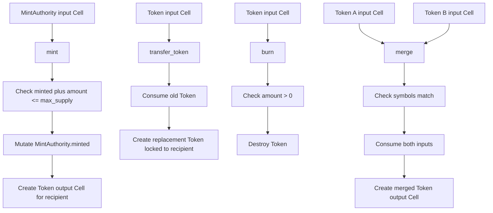

CKB acceptance status: all four actions are builder-backed and run on-chain.
There are no lock entries in this example.

## `amm_pool.cell`

Business purpose: a constant-product AMM pool with LP receipts and mutable pool
state.

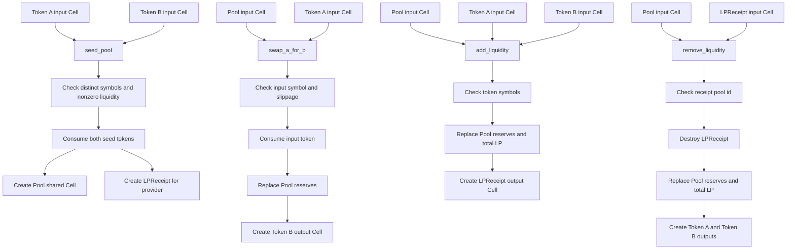

CKB acceptance status: all six actions are builder-backed and run on-chain,
including the helper actions `isqrt` and `min` as scoped entries. There are no
lock entries in this example.

## `launch.cell`

Business purpose: token launch composition, optionally seeding an AMM pool.

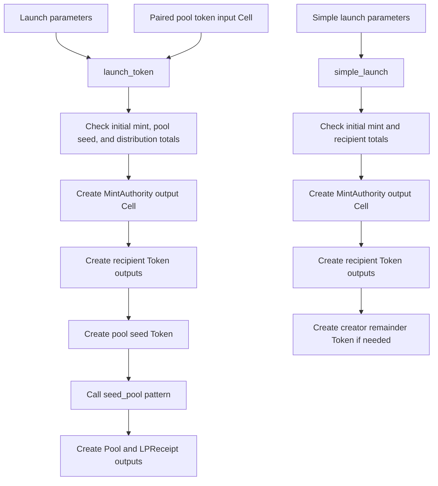

CKB acceptance status: both actions are builder-backed and run on-chain. There
are no lock entries in this example.

## `multisig.cell`

Business purpose: threshold wallet creation, proposal lifecycle, signature
collection, execution, cancellation, and signer/threshold governance proposals.

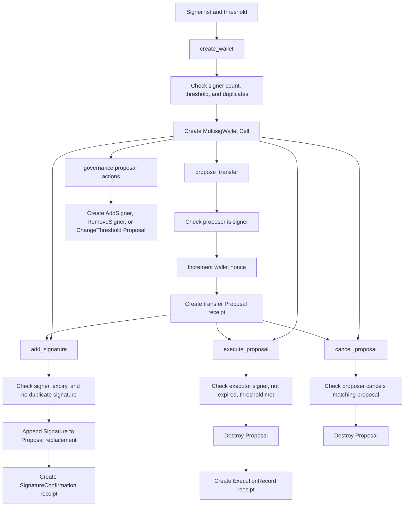

Strict-compiled locks:

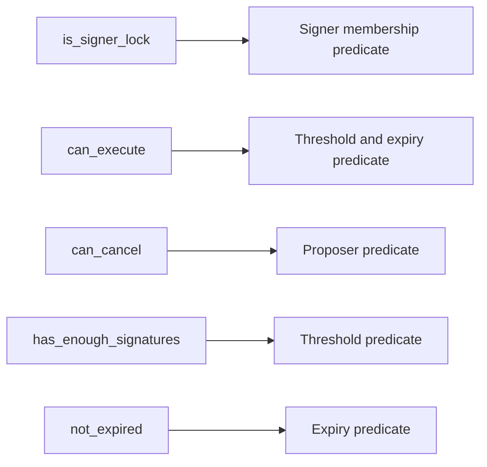

CKB acceptance status: all eight actions are builder-backed and run on-chain.
The five locks strict-compile, but still need on-chain valid-spend and invalid-
spend cases.

## `nft.cell`

Business purpose: NFT minting, transfer, listing, offer, royalty payout, burn,
and batch mint flows.

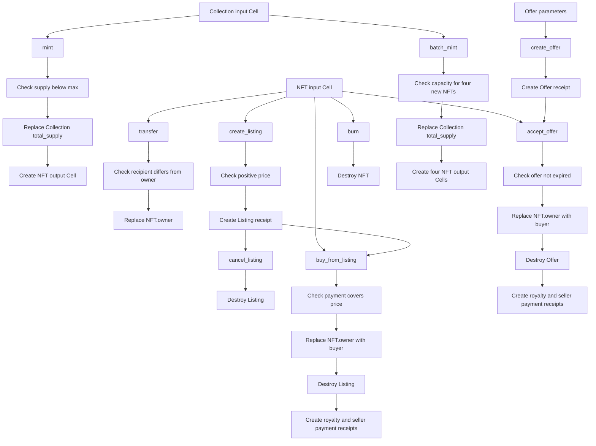

Strict-compiled locks:

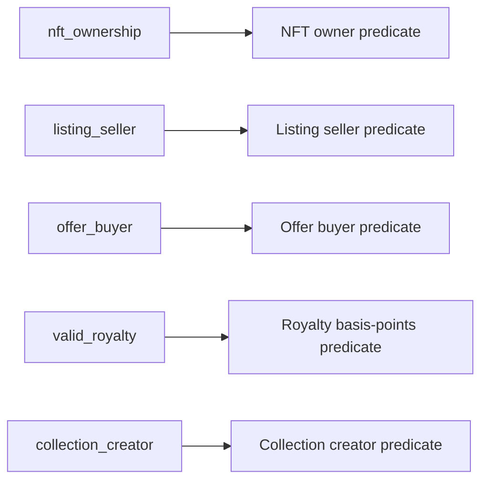

CKB acceptance status: all nine actions are builder-backed and run on-chain. The
five locks strict-compile, but still need on-chain valid-spend and invalid-spend
cases.

## `timelock.cell`

Business purpose: absolute and relative time locks, locked assets, normal
release, emergency release, extension, and batch lock creation.

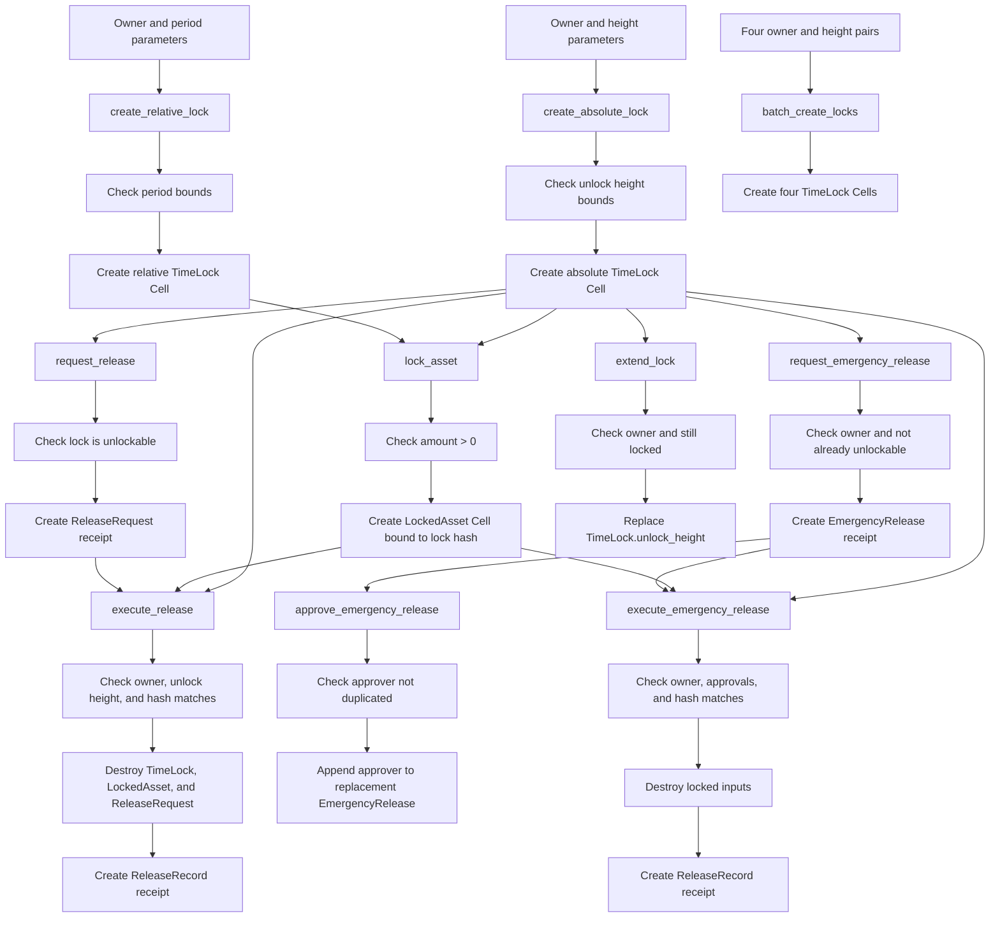

Strict-compiled locks:

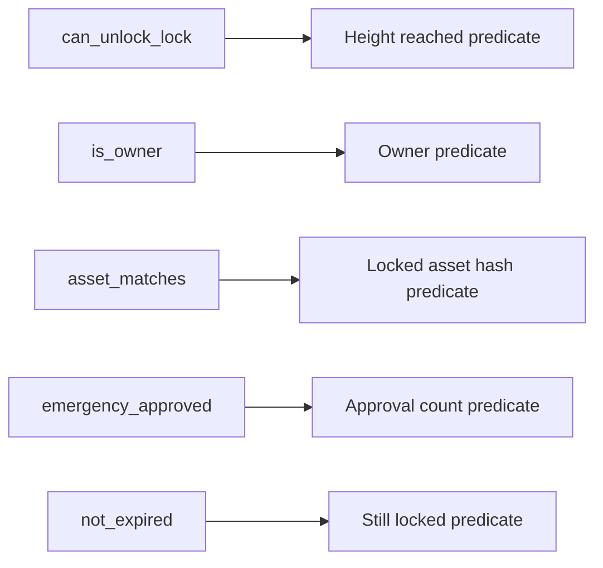

CKB acceptance status: all ten actions are builder-backed and run on-chain. The
five locks strict-compile, but still need on-chain valid-spend and invalid-spend
cases.

## `vesting.cell`

Business purpose: vesting configuration, grant creation, vested claims, and
revocation with explicit admin predicate visibility.

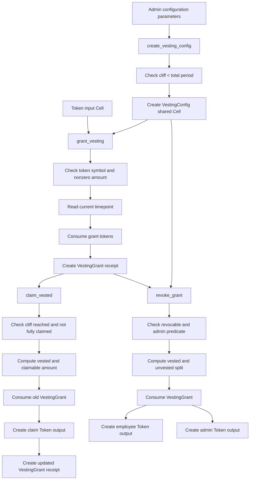

Strict-compiled lock:

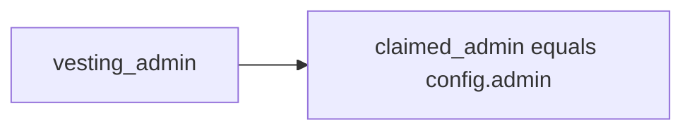

CKB acceptance status: all four actions are builder-backed and run on-chain. The
`vesting_admin` lock strict-compiles, but still needs on-chain valid-spend and
invalid-spend cases. The `claimed_admin` action parameter is not, by itself, a
signature authorization proof.

## `registry.cell`

Business purpose: bounded local collection helper coverage for `Vec<Address>`
and `Vec<Hash>`.

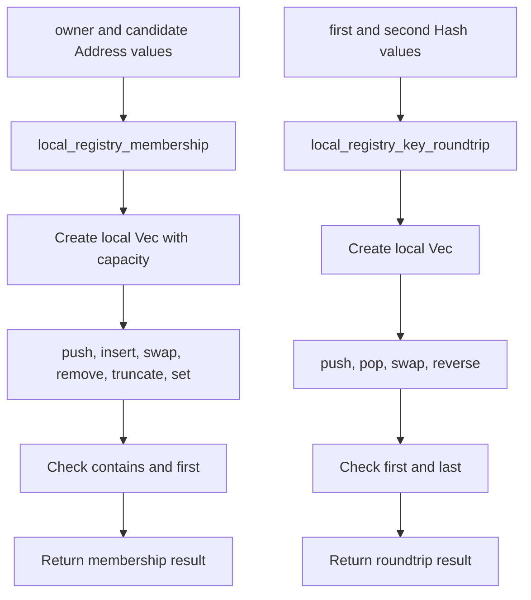

CKB acceptance status: this example is intentionally outside the production CKB
action matrix. It is covered by compiler and tooling tests for bounded local
collection behavior.
