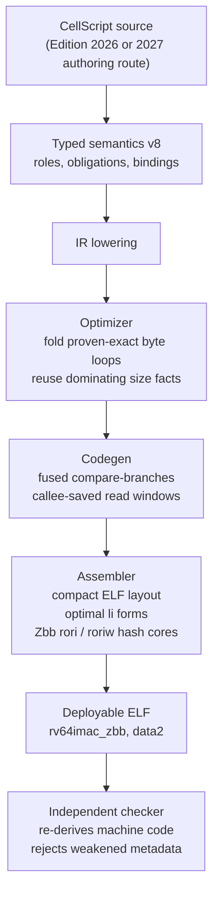
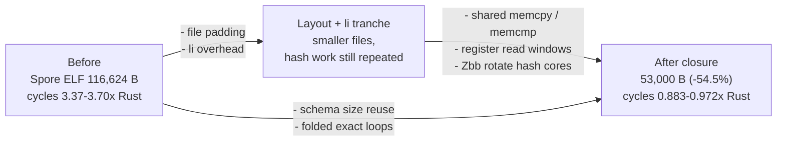
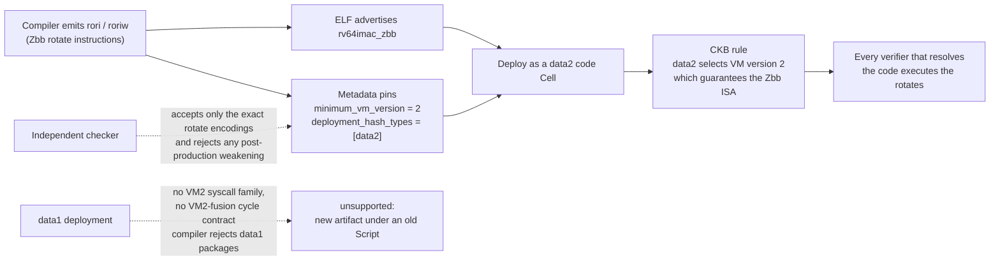
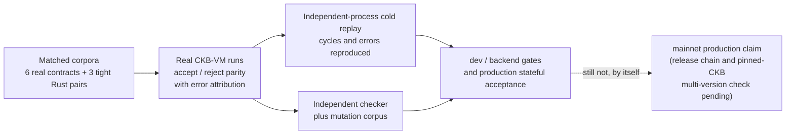

# CellScript 0.26 Release Notes

**Status**: unreleased 0.26 implementation record. The bounded-runtime baseline
comes from `nightly-0.26`; the economic-backend closure below is implemented
on `0.26b`. This document does
not claim that the experimental branch is a stable or production-ready release.
The project may fold this evidence into the proposed 0.30 capability release
without publishing a stable 0.26 artifact; see the
[0.30 capability closure RFC](../CELLSCRIPT_0_30_CAPABILITY_CLOSURE_RFC.md).

0.26 turns the narrow fixed-width bounded Cell lifecycle shape from a 0.25
fail-closed placeholder into an executable CKB Type Script contract. This is
not generic Cell collection support: source selection, encoding, ordering,
identity, and resource bounds are deliberately closed.

On `0.26b`, the shared backend makes deployed contracts substantially smaller
and cheaper to execute without requiring source rewrites or a new witness ABI.
The first layout change shrank the audited transfer relation from **7,824 to
3,392 bytes (-56.65%)**; the completed tranche also closes the three original
matched Rust byte counterexamples and the real Spore transaction-cycle
counterexample described below.

The branch also adds a bounded `trusted-external` boundary for real CKB
verifiers reached through EXEC or SPAWN/WAIT. This is an experimental branch
capability, not a claim that every third-party verifier is safe or that 0.26 is
already production-ready.

## Bounded Real-Contract Interoperability Primitives

The Spore and Fiber comparison work required exact access to CKB bytes rather
than schema-shaped approximations. `0.26b` therefore adds a low-level, bounded
set of primitives shared by both source editions:

| Area | Implemented surface |
| --- | --- |
| Witnesses | complete witness count; exact byte/u32/u64/32-byte reads; exact-span and selected-chunk BLAKE2b |
| Cells and Inputs | Cell count/type presence; exact data, serialized Lock, and serialized Type sizes/bytes; full consensus data-hash field; selected Input `since` |
| Transaction | exact packed u32 reads; RawTransaction-with-empty-CellDeps hash; bounded gathered BLAKE2b spans |
| Delegation | bounded u8 arguments, four hexadecimal arguments, EXEC process replacement, and SPAWN/WAIT with checked child status |

All source intervals and local vectors are bounds-checked before reads or
encoding. Streaming hashes use fixed working memory rather than allocating the
source length. Short reads, invalid SourceViews, arithmetic overflow, malformed
transaction layouts, syscall errors, and failed children terminate fail closed.
The simulator reports these transaction-dependent operations as unsupported; it
does not fabricate consensus evidence.

These primitives are compiler/runtime building blocks, not a new high-level
business grammar. Raw EXEC and SPAWN adapters deliberately retain unresolved
external-verifier ProofPlan obligations. Only the exact trusted-external path
below can discharge the target-identity/delegation portion of that obligation.

## Trusted External Verifiers

CKB contracts commonly compose with separately deployed code whose identity is
the hash of its bytes. CellScript now represents that dependency explicitly
without relabelling it as compiler-proved semantics.

A trusted call has three inseparable parts:

1. source uses a `trusted_*` intrinsic with a compile-time 32-byte verifier
   data hash;
2. `Cell.toml` supplies an exact, versioned declaration for the semantic scope,
   operation, exact argument adapter, source identity, applicability, trust
   basis, and required guarantees; and
3. emitted code loads the selected CellDep's complete `DATA_HASH`, compares it
   with the source constant, and delegates only after equality succeeds.

The implemented operations are bounded u8/hex EXEC and hex SPAWN/WAIT. EXEC
uses CKB process replacement. SPAWN waits and accepts only a zero child status.
Any syscall, argument-materialization, hash, or child-status failure terminates
through the existing fail-closed runtime contract.

The evidence tier is exactly `trusted-external`. It establishes target identity
and the delegation adapter, not the verifier's internal parser, authorization,
cryptography, or protocol semantics. Metadata records this as
`compiler_proves_internal_semantics = false`. Raw EXEC/SPAWN remains rejected by
production policy; a declaration cannot bless a raw call, unused declarations
are errors, and trusted and undeclared calls cannot be mixed in one scope.

The independent checker verifies more than record equality. It requires the
typed source-CellDep load, data-hash check, and delegation call to be one ordered
three-operation sequence; the loaded CellDep local and delegation operand must
refer to the same selection, and the exact constant hash must match the
declaration. It then binds that sequence to `trusted-external` ProofPlan evidence
and the existing typed-to-machine record. Mutations of the hash, declaration,
evidence tier, sequence, or sidecar copies fail closed.

Trusted-external support advanced compile metadata from schema 65 to 66 and
typed semantics from v7 to **v8**. The later VM2 deployment contract advances
compile metadata again to **67** and constraints metadata to **4**. See
[Trusted External Verifiers](../CELLSCRIPT_TRUSTED_EXTERNAL_VERIFIERS.md) for the
source calls, manifest schema, exact boundary, and deployment checklist.

### Real-contract evidence and cost boundary

The mechanism was motivated by the separate Spore/Fiber comparison work, where
the delegated verifier is real external CKB code rather than a CellScript
rewrite. The Spore Agent reconstruction produced a 52,960-byte ELF whose CKB
data hash is
`cf79590446a6a526fe7ee2e64a0c5f216ae6755f79fb966fd03cd0e718157f69`;
two independent historical-toolchain builds matched byte for byte. In that
audit corpus, the CellScript and frozen Rust Spore implementations both executed
the same Agent bytes and agreed on 131 added transactions (11 accepted, 120
rejected), including per-byte mutations of immutable Agent state.

That corpus remains finite comparison evidence, not a proof of the Agent's
internals or a production release certificate. It first exposed a serious cost
counterexample: before the complete backend work, CellScript Spore plus the
shared Agent was 41.6% larger and the positive transactions used 3.372-3.703x
the cycles of the fastest measured Rust variant. Keeping that negative result
made it possible to optimize the actual bottlenecks instead of generalizing
from the small transfer sample.

After the complete tranche, the CellScript Spore ELF is **53,000 bytes** versus
**66,840 bytes** for the matched Rust `z-fat` ELF; both execute the same
52,960-byte Agent dependency. Across the same 131 paired cases, all outcomes
remain equal. Each of the 11 accepting paths now uses fewer transaction cycles
than Rust: ratios range from 0.883 to 0.972, with **2,976,826 versus 3,163,715
cycles in aggregate (5.9% less)**. Rejected cases still require attribution to
the real Agent code hash where the mutation is intended for Agent enforcement.
This reverses the recorded Spore cost counterexample for the exact matched
variant; it is not a universal language theorem.

## Major Backend Optimization

This is an assembler-layer improvement shared by Edition 2026 and the
experimental authoring route. It removes file padding and unnecessary
constant-materialization instructions; it does not remove verification checks,
weaken policy, or depend on 16-bit compressed instructions.

### How the optimizations compose

Read this section as the theory of the whole tranche: what was actually
charging bytes and cycles, which layer owns each fix, and why the result is
still a verified artifact rather than an unsafe speedup. Four pictures, then
the sections below give the per-topic detail and the measurements.

**1. Where each change lives.** Every optimization is an assembler, optimizer
or runtime concern shared by both source editions; no source rewrite, no new
witness ABI, no removed check.



**2. What the bytes were made of.** The old artifact carried three distinct
sinks. The fixed tax (file padding) went first and helped every contract
equally; the per-instruction tax halved small-constant materialization; the
repeated-work tax — the real code — needed the layered closure below. The
Spore path shows all three compounding:



**3. Why Zbb is safe to use: the deployment contract.** The rotates are only
sound if the executing VM is guaranteed to decode them. CKB provides that
guarantee through the Script `hash_type`, and the compiler now binds the whole
chain explicitly instead of assuming it:



Existing Data1 code Cells are never silently upgraded: a new artifact must be
rebuilt with its sidecars and deployed under Data2, and every code-hash
reference updated. That is a compatibility change, documented below.

**4. How the claims are backed.** Each economic statement in this document is
a measured corpus result, and the measurement path itself is checked:



### Economic Backend Closure and VM2 Deployment Contract

The compact ELF change removed a fixed file-format tax. It was necessary but
not sufficient: tightly written Rust still won the byte comparison in the
pool-merge, schema-roll and ownership-Lock corpus, and the original Spore port
remained much slower. The completed tranche attacks repeated machine work at
the layer that owns it:

| Layer | Optimization | Preserved safety condition |
| --- | --- | --- |
| IR | Fold exact source/source, source/memory and source/zero byte loops only when their structured operands and complete bounds are proven | No source-text or action-name matching; unrecognized loops keep the general lowering |
| Schema | Reuse dominating exact-size facts and native aligned u64 loads | Unknown alignment or a reused size slot keeps the checked bytewise path |
| Calls | Eliminate immediate stack reloads and fuse branch-only comparisons | No optimization crosses a label, call, branch or mutable memory boundary |
| Runtime | Share memcpy/memcmp/memzero and exact-read windows; keep the last profitable window in callee-saved registers | Cache key includes complete SourceView and byte kind; every hit rechecks start, length and requested width |
| CKB source ABI | Decode the two u32 SourceView halves with shifts instead of wide division/remainder | Invalid tags and indexes at or above 2^32 still terminate fail closed |
| Hashes | Keep BLAKE2b/SHA-256 state in registers and use Zbb `rori`/`roriw` | The independent checker accepts only the exact rotate encodings; neighboring reserved encodings reject |
| Failure path | Scalar syscall helpers terminate internally after invalid source or syscall failure | Callers cannot mistake an error code for a valid scalar value |

The register read-window optimization is profitability gated. The ordinary
four-way source-bound cache is always used when exact reads are present; the
larger `s10..s5` hot window is enabled only for modules with enough static
exact-read sites to amortize its prologue, epilogue and code-size cost. This
keeps the Spore win without charging the smaller Fiber verifier for an
unprofitable fixed setup.

#### Matched measurements after closure

All sizes below are complete stripped ELF sizes and all cycles are real CKB-VM
positive executions. Each row compares the same accepted/rejected behavior;
Rust uses `no_std`, `ckb-std`, size optimization and LTO as recorded by its
fixture.

| Workload | CellScript / Rust bytes | CellScript / Rust cycles | Result |
| --- | ---: | ---: | --- |
| Pool merge | 2,512 / 2,816 | 6,000 / 9,232 | CS -10.8% bytes, -35.0% cycles |
| Schema roll | 2,272 / 2,760 | 8,661 / 10,350 | CS -17.7% bytes, -16.3% cycles |
| Ownership Lock | 2,232 / 2,304 | 5,583 / 6,333 | CS -3.1% bytes, -11.8% cycles |
| Spore, excluding the same shared Agent | 53,000 / 66,840 | 2,976,826 / 3,163,715 across 11 accepted transactions | CS -20.7% bytes, -5.9% aggregate cycles |
| Fiber commitment | 63,336 / 69,176 | 591,187,239 / 597,093,558 across the 256-path sample | CS -8.4% bytes, lower transaction aggregate |

Fiber's whole-transaction rows include an external signature verifier. Merely
changing the principal ELF changes the raw transaction hash and signature;
the same logical path varied by roughly 40,000 cycles across byte-identical
semantics, which is larger than the remaining per-row deltas. Therefore the
aggregate is reported as transaction-level evidence, while individual Fiber
rows are not mislabelled as isolated principal-Script measurements. The Spore
corpus uses one frozen real Agent on both sides and all 11 accepting rows win
individually after closure.

These measurements support a bounded conclusion: across the checked small,
medium, real-Spore and large-Fiber workload spectrum, the current CellScript
artifacts are smaller and the measured positive aggregate is no worse than the
qualified Rust references. They do not prove that every future CellScript
program beats every Rust implementation. A new workload remains capable of
finding a new counterexample, and `tests/cost_corpus.rs` keeps the existing
ones as executable budgets.

#### Why Data2 is now mandatory

`rori` and `roriw` are RISC-V Zbb instructions. In CKB, the Script `hash_type`
selects the CKB-VM version for data-hash deployments. VM1 (selected by
`data1`) already includes the B extension, so Zbb alone would decode there;
the binding requirement is the rest of the VM2 surface: the bounded
EXEC/SPAWN delegation uses the VM2-only process/pipe syscall family
(`ExecV2`, `Spawn`, `Wait`, `Pipe`, fd operations), and the recorded cycle
budgets are measured under VM2's decoder-fusion rules. The compiler therefore
binds one explicit, uniformly tested VM2 contract instead of splitting
requirements across VM1 and VM2:

```text
minimum_vm_version = 2
riscv_isa = "rv64imac_zbb"
deployment_hash_types = ["data2"]
```

The same values appear in `target_profile` and the CKB constraints profile.
The compiler default changes from `data1` to `data2`; a package declaring
`deploy.ckb.hash_type = "data"` or `"data1"` is rejected. External CellDeps
retain their own declared hash types because their bytes, not the generated
CellScript ELF, determine their VM requirement. The independent artifact
checker rejects a bundle whose metadata weakens VM2, Zbb or Data2 after the
artifact and sidecars are produced.

This is a deployment compatibility change. Existing Data1 code Cells are not
silently upgraded: rebuild the ELF and all sidecars, deploy the new bytes under
Data2, and update every code hash, dependency and acceptance fixture. Running a
new Zbb artifact through an old Data1 Script is unsupported and is deliberately
blocked before deployment metadata is accepted.

### Compact ELF layout: save 3,968 bytes before the first instruction

The ELF header is 64 bytes and its one program header is 56 bytes, so the
headers end at byte 120. Previously the assembler rounded the `.text` payload
start up to a 4,096-byte boundary:

```text
Before: align_up(64 + 56, 4096) = 4096 -> 3976 zero-padding bytes
After:  align_up(64 + 56,  128) =  128 ->    8 zero-padding bytes
Saved: 3976 - 8 = 3968 bytes per generated ELF
```

Those zero bytes were part of both the deployed file and the file-backed LOAD
range. They were not business data, metadata, or useful instructions. In the
7,824-byte relation sample, this padding alone occupied 50.82% of the file.

The payload offset must not be confused with the program header's `p_offset`:
the LOAD segment starts at file offset **0 before and after** this change. The
assembler adjusts the mapped segment base while preserving the entry address:

| ELF layout property | Before | After |
| --- | ---: | ---: |
| `.text` file offset | 4,096 | 128 |
| LOAD `p_offset` | 0 | 0 |
| LOAD `p_vaddr` | `0xf000` | `0xff80` |
| LOAD `p_align` | 4,096 | 128 |
| Entry / `.text` virtual address | `0x10000` | `0x10000` |

The mapping remains consistent: `p_vaddr + text_file_offset = 0x10000`, and
`p_vaddr % p_align = p_offset % p_align`. Section offsets and LOAD sizes are
rebuilt from the new layout, rather than deleting bytes from an existing ELF.
The compact artifact executes in the real CKB-VM fixtures.

### Shorter `li` encoding: save another 464 bytes in the relation sample

`li` remains the same assembler pseudo-instruction. One shared `LiForm`
classifier chooses the first matching form below for both its layout size and
its emitted machine encoding:

| Immediate shape | Encoding | Bytes |
| --- | --- | ---: |
| Signed 12-bit value (`-2048..=2047`) | `addi rd, zero, imm` | 4 |
| Low 12 bits zero, with a signed 20-bit upper value | `lui rd, imm >> 12` | 4 |
| Other value representable by the existing RV64 two-instruction form | `lui` + `addi` | 8 |
| Wider supported value | Existing byte-by-byte construction | 60 |

For example, `li a0, 5` no longer needs a LUI followed by ADDI; one
`addi a0, zero, 5` produces the value. Similarly, `li a0, 4096` can use one
`lui a0, 1`. The upper-value range check matters: not every multiple of 4,096
is representable by one RV64 LUI.

The audited relation contains 114 signed-12-bit literals and two additional
LUI-only literals. Removing one four-byte instruction at each site saves
`(114 + 2) * 4 = 464` bytes. Its `.text` falls from 3,412 to 2,948 bytes,
or 853 to 737 instructions, all still 32-bit.

Sharing the classifier matters because label addresses, branch offsets, and
machine evidence depend on the encoded size. A shorter encoder with the old
size model would make those addresses inconsistent. The startup trampoline is
an explicit exception: its size is an existing **20-byte entry ABI contract**,
so its immediate loads retain their fixed two-instruction encoding.

### Measured deployment benefit

The 2026-09-06 audit replay at the compiler commit above measured these complete
ELFs. The primary samples have the same sizes at O0, O1, O2, and O3.

| Sample | Before | After | Reduction |
| --- | ---: | ---: | ---: |
| Transfer relation / explicit consume-create expansion | 7,824 B | 3,392 B | 56.65% |
| Legacy `std::lifecycle::transfer` comparison | 8,176 B | 3,720 B | 54.50% |
| Note update: non-empty `same except` / exhaustive fields | 8,224 B | 3,744 B | 54.47% |
| Repository `transfer_token` example | 6,856 B | 2,576 B | 62.43% |
| Shared policy: mint | 8,712 B | 4,240 B | 51.33% |
| Shared policy: mint + transfer | 10,856 B | 6,128 B | 43.55% |
| Shared policy: mint + transfer + merge + burn | 15,880 B | 10,640 B | 33.00% |

For the relation, the complete 4,432-byte reduction is exactly 3,968 bytes of
layout savings plus 464 instruction bytes. Headers, its 20-byte runtime
descriptor, inter-section alignment, and the 292 bytes after LOAD do not
shrink. LOAD bytes fall from 7,532 to 3,100; LOAD size is not instruction size.

The corresponding relation and explicit expansion are whole-file
byte-identical at every tested optimization level. The empty `same except`
spelling and the non-empty Note expansion likewise add no ELF bytes over their
explicit counterparts. The legacy helper is a different lowering and remains
328 bytes larger; equality of obligation sets is not a machine-byte claim.

The matched Rust reference remains **5,840 stripped bytes**, making the
3,392-byte CellScript relation **41.92% smaller in this comparison**. Both
check a positive unchanged eight-byte amount, input/output 0, destination Lock
hash, Type hash, capacity, and the current canonical witness envelope. They
allow extra outputs and do not implement owner signatures or issuance policy.
The reference uses Rust 1.97.1, `ckb-std` 1.1.0, the
`riscv64imac-unknown-none-elf` target, size optimization, thin LTO, one codegen
unit, and `llvm-strip`; its rebuilt SHA-256 is unchanged:
`3f1bde5a2a32f2f733dcca3c3e7d4c0540463cb88efaf46837cb52a595212910`.
This is a measured implementation comparison, not a Rust lower bound or a
claim that every CellScript contract is smaller than Rust.

The separate historical Rust fixture used by `artifact_size` is 2,624 stripped
bytes. The repository example is now 48 whole-file bytes smaller, but that
fixture uses a different witness/source-selection contract. It must not be
substituted for the matched reference above. The size test now imposes a
3,072-byte absolute CellScript budget instead of requiring Rust to win; it
does not assert that CellScript must beat the actual Rust measurement.

### Runtime measurements and evidence limits

The audit's valid-transfer transaction falls from 10,772 to **8,573 cycles**.
Its unchanged Rust ELF's transaction also falls from 14,938 to **13,939**,
because both fixtures recompile and execute a shared auxiliary Lock. The
observed common 999-cycle reduction must not be attributed to the principal
CellScript contract. Subtracting it leaves a 1,200-cycle additional improvement
for the relation; this is not a direct isolated Script-group measurement.
The combined change does not separately attribute ELF-loading and instruction
execution costs. All 17 matched VM cases retain their outcomes: three accept
and fourteen reject. Failed-case zero cycles are unavailable-accounting
placeholders, not measured zero-cost rejection.

The committed iCKB matrix at benchmark pin `10f0914` was regenerated by 187
single-process differential replays and then rerun read-only. All **187 rows**
(37 accepting, 150 rejecting) retain their acceptance, result and failure-mode
labels. Every accepting row is faster: **805,060 CellScript cycles versus
1,952,526 original-contract cycles**, a 1,147,466-cycle transaction aggregate
difference. Auxiliary Scripts are part of both sides, so this is not an
isolated principal-Script attribution. The **218-test suite** and the 187-row
differential matrix are distinct counts. These are bounded runtime results,
not a universal cost theorem or a substitute for the release gate.

The production CKB acceptance transaction recipe is also rebound as one
closed set: all **60 scoped action/Lock artifacts** now name their final VM2
data hashes, with **417 exact code-hash references** updated across the stored
transactions, CellDeps and case records. All **253 Script selectors** that use
those generated hashes are upgraded from Data1 to Data2; external dependencies
retain their own hash types. The recipe also recomputes **143 embedded full
Script-hash payload occurrences across 30 generated identities**. These values
appear inside witnesses and Cell data, so they must change when either the code
hash or hash type changes even though the surrounding transaction shape does
not. Stateful acceptance refuses to replay if any compiled artifact differs
from that audited recipe, and fixture tests reject a generated VM2 hash paired
with any selector other than Data2. The clean production replay passes all
**43 action cases, 17 Lock cases and 26 stateful scenarios / 46 committed
steps**, including seven end-to-end lifecycles and 19 action-branch scenarios.

Multi-action economics also change after removing per-file padding: the four
scoped action ELFs now sum to **9,568 bytes**, versus **10,640** for the shared
policy. Sharing is no longer a size win in this sample. Separate action Scripts
and one persistent policy do not provide interchangeable identity/dispatch
semantics, so this is not a recommendation to replace the policy deployment.

This optimization does not change witness encoding: the measured 32-byte
recipient still occupies 60 bytes in single-entry WitnessArgs versus 137 in
policy WitnessArgs, a 77-byte protocol increment. Compile metadata remains a
sidecar; the measured ELF artifacts have no ABI trailer. This work does not
introduce compressed instructions, shared-policy adapters, or a WASM compiler
bundle reduction.

### Compatibility, validation, and rebuild requirements

No source migration or witness-ABI change is required. Artifact bytes, code
hashes, internal instruction addresses, and machine-range evidence do change.
Rebuild the ELF, metadata, lowering record, and source map together; refresh
dependent deployment bindings and acceptance recipes against that exact
artifact. Old sidecars and code hashes must not be reused with the new ELF.
Unchanged source semantics do not make deployment identities interchangeable.

The implementation keeps the fixed trampoline and checker contracts. The
checker mutation fixture now targets the shorter failure sequence correctly:
an invalid failure constant still rejects as V2414, while a damaged ECALL can
reject earlier through the instruction allowlist as V2413.

Implementation and in-tree evidence:

- [Assembler layout, immediate classifier, and regression tests](../../src/codegen/assembler.rs)
- [Artifact byte-budget regression](../../tests/artifact_size.rs)
- [Independent checker mutation tests](../../tests/artifact_checker.rs)
- [Successor-relation semantic and VM tests](../../tests/authoring_replace.rs)
- [Committed iCKB matrix](../../tests/benchmarks/ickb_diff/matrix.json)
- [Authoring implementation and release blockers](../CELLSCRIPT_AUTHORING_IMPLEMENTATION.md)

The separate cost replay passed three audit tests and `artifact_size`;
its 17 VM cases and byte comparisons are sample evidence, not added claims
about the in-tree relation test's obligation-set checks. The matrix figures
above were cross-checked from committed records, not freshly executed by the
cost replay. The replay used the existing local SDK checkout with pre-existing
edits; it is not clean-tag release provenance. Focused repository checks are:

```bash
cargo test --locked -p cellscript --test artifact_size -- --nocapture
cargo test --locked -p cellscript --test artifact_checker --test authoring_replace
```

These checks do not replace the `backend`, `dev`, `ci`, or `release` gates.
The WASM release blocker remains separate; smaller on-chain ELF files do not
close it.

## Dynamic Group Input Consumption

`input cells: BoundedCellSet<Resource, N>` plus `consume_each` is executable
when `Resource` has a fixed encoded width of 1–512 bytes and
`1 <= N <= 1024`. The generated Script:

- scans relative `GroupInput` indexes for the current Type Script;
- accepts only `CKB_INDEX_OUT_OF_BOUND` as the end of the group;
- probes index `N`, rejecting an `N + 1` member with runtime error 21;
- requires exact Cell data size and the current Type Script hash;
- rejects Lock-Script role confusion;
- executes every predicate exactly once for every decoded element; and
- permits only mutable outer numeric `+=` accumulators as loop state.

The runtime and metadata contract name is
`bounded-type-group-inputs-v1`. Zero cardinality is valid only when another
member, normally a group output, causes the Type Script to execute.

## Versioned Output Plans

`witness plans: BoundedList<Plan, N>` plus `create_each` is executable when the
plan and output resource are fixed-width, the complete create template and
output lock are explicit, the resource declares a non-zero capacity floor, and
the output uses no custom identity policy. The inner plan encoding is:

```text
"CSBPLv1\0" || u32_count_le || fixed_width_plan_elements
```

The maximum inner payload is 4084 bytes, leaving room for the eight-byte
`CSARGv1\0` header and four-byte dynamic argument length in the 4096-byte entry
buffer. Plan element `i` verifies relative `GroupOutput[i]`. The Script checks
complete data, exact lock, Type-only role, capacity floor, per-element
predicates, and a final out-of-bounds probe proving output count equals plan
count. The public `encode_bounded_output_plan_v1` helper constructs the inner
payload; normal entry-witness and CKB-adapter placement APIs wrap it in
`WitnessArgs.input_type` before signing.

The runtime and metadata contract name is `bounded-output-plan-v1`.

## Checked Business Examples

The language example suite includes four production-policy-closed contracts:

- `batches/batch_claim.cell`: non-zero variable-cardinality claims with count and
  amount conservation;
- `batches/atomic_order_settlement.cell`: one through sixteen orders settled in
  one transaction;
- `batches/cell_merge.cell`: two through 128 fragmented Cells merged into exactly
  one amount-conserving output; and
- `batches/bridge_rollup_batch.cell`: bounded messages and receipts with
  canonical consecutive nonces, count equality, and amount conservation.

The examples themselves run in CKB-VM. Adversarial vectors reject claim amount
mismatches, a seventeenth order, merge inflation, and non-consecutive bridge
nonces. Shared runtime vectors additionally cover zero/one/N/N+1 cardinality,
malformed plan magic/length/trailing bytes, exact data size, predicate failure,
missing and extra outputs, lock substitution, and capacity underflow.

## Deliberate Fail-Closed Boundary

0.26 does not promote dynamic or recursive plan/resource layouts,
transaction-wide or Lock Script scans, custom output identities, incomplete
create templates, implicit locks or capacity policy, or arbitrary body
mutation. Those shapes keep the registered runtime error 24 fallback and are
rejected before ASM/ELF generation with E2105 under `--production` or
`--deny-fail-closed`.

## Versioned Evidence

The inherited `nightly-0.26` bounded-runtime baseline advances compile metadata
to schema 62 and constraints metadata to schema 3. Its independently checked
boundary is
`cellscript-verified-lowering-record-v4` with
`cellscript-typed-semantics-v3`, including dedicated bounded Cell load, plan
load, output verification, and output-end operations.

The experimental `0.26b` branch separately advances metadata to schema 67,
lowering records to v6, typed semantics to v8, and source maps to v2; see the
[branch evidence policy](../CELLSCRIPT_GATE_POLICY.md#026b-semantic-foundation-evidence).
The trusted-external record introduced the v8/schema-66 step; the economic
backend's VM2/Zbb/Data2 deployment contract advances the outer metadata schema
to 67 and constraints metadata to schema 4.

Merge readiness requires:

```bash
./scripts/cellscript_gate.sh backend
./scripts/cellscript_gate.sh dev
./scripts/cellscript_gate.sh ci
```
