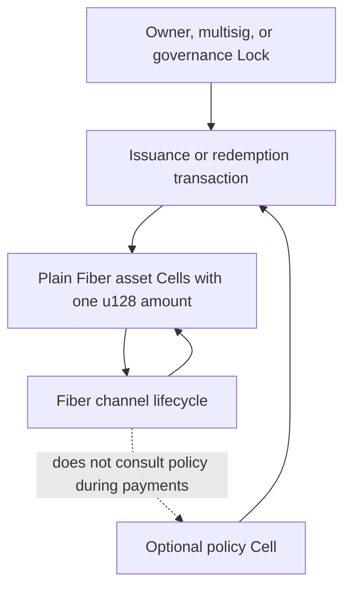
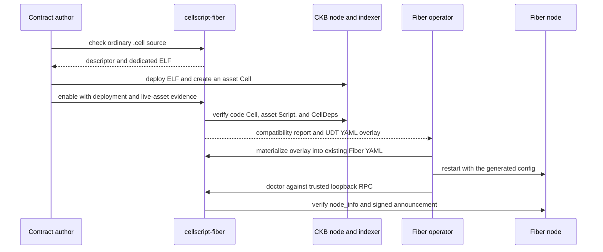

# Use CellScript Fungible Assets in Fiber

This folder contains practical CellScript contracts that can be used as
fungible assets in native Fiber channels. You write an ordinary `.cell`
contract; the `cellscript-fiber` adapter derives the dedicated CKB artifact and
Fiber UDT configuration. No Fiber-specific source annotation, hand-written
compatibility profile, or Fiber fork is required.

> [!IMPORTANT]
> This integration supports a deliberately narrow fungible-asset boundary. It
> does not make every CellScript contract compatible with Fiber.

## Start Here

If you only want to see whether a contract is compatible, build the adapter and
run `check`:

```bash
cargo build --locked -p cellscript-fiber-adapter --bin cellscript-fiber

./target/debug/cellscript-fiber check \
  examples/fiber/ordinary_fungible.cell
```

A successful check means the compiler found exactly one eligible asset with:

- exactly one `u128` amount in Cell data;
- checked conservation across the complete CKB Type Script group;
- no required CellScript action payload;
- no dynamic oracle, HeaderDep, or custom Fiber transaction shape;
- a supply-authority format understood by this integration.

`check` is offline. It does not deploy a Script, edit Fiber configuration, or
restart a node.

## How It Fits Together

```mermaid
flowchart LR
    Source["Normal .cell contract"] --> Check["cellscript-fiber check"]
    Check --> Artifact["Dedicated RISC-V ELF and typed descriptor"]
    Artifact --> Deploy["Ordinary CKB deployment"]
    Deploy --> Enable["cellscript-fiber enable"]
    Enable --> Config["Native ckb.udt_whitelist entry"]
    Config --> Restart["Operator installs config and restarts Fiber"]
    Restart --> Channels["Open, route, close, and settle UDT channels"]
```



Fiber never reads CellScript source or compiler metadata. At runtime it sees a
normal CKB Type Script, CellDeps, and Cells whose data is one 16-byte
little-endian `u128`.

Rich issuance policy stays outside the ordinary channel lifecycle:



This separation keeps an old commitment transaction spendable even if an
external reserve, governance process, or bridge service later changes.

## End-to-End Operator Flow

The full flow intentionally separates source compatibility, CKB deployment,
and operator-controlled Fiber configuration.



### 1. Check the source and optionally save the artifact

```bash
./target/debug/cellscript-fiber check \
  examples/fiber/ordinary_fungible.cell \
  --output target/fiber-check/descriptor.json \
  --artifact-output target/fiber-check/fungible-type-group-v1.elf
```

### 2. Deploy through the ordinary CKB workflow

Deploy the exact generated ELF and create or identify a live Cell carrying the
concrete asset Type Script. Keep these two ordinary CKB evidence locators:

- the CellScript `DeploymentManifest` for the code Cell;
- either a materialized `ActionPlan` or a live asset Cell OutPoint.

They identify deployed CKB objects; they are not Fiber profiles.

### 3. Generate the Fiber-native configuration

Run `enable` after deployment:

```bash
./target/debug/cellscript-fiber enable \
  examples/fiber/ordinary_fungible.cell \
  --auto-accept 100000000 \
  --ckb-revision 0x<CKB_GENESIS_HASH> \
  --deployment-manifest path/to/deployment.json \
  --asset-cell 0x<ASSET_CELL_TX_HASH>:0
```

`enable` verifies the live code Cell, artifact hash, concrete asset Script, and
CellDeps before writing an evidence directory under
`target/cellscript-fiber/`. Its main outputs are:

| File | Purpose |
| --- | --- |
| `fungible-type-group-v1.elf` | Exact dedicated asset artifact. |
| `compatibility.json` | Bound compiler, deployment, asset, environment, and config evidence. |
| `deployment.json` | Verified live code identity and dependency evidence. |
| `asset-script.json` | Concrete asset Type Script; this is separate from code identity. |
| `fiber-udt-overlay.yml` | Native Fiber `ckb.udt_whitelist` fragment. |
| `udt-config.json` | Structured config plus exact-matcher evidence. |
| `registration.json` | Restart-required state until the running node is verified. |

The generated Fiber entry is equivalent to:

```yaml
ckb:
  udt_whitelist:
    - name: "FiberToken"
      script:
        code_hash: "0x<DEPLOYED_CELLSCRIPT_DATA_HASH>"
        hash_type: "data2"
        args: "^0x<EXACT_ASSET_ARGS>$"
      auto_accept_amount: 100000000
      cell_deps:
        - cell_dep:
            out_point:
              tx_hash: "0x<CODE_CELL_TX_HASH>"
              index: "0x0"
            dep_type: "code"
```

The `^...$` anchors are important: they stop one whitelist entry from silently
matching another asset with a shared prefix.

### 4. Merge into an existing Fiber config

Preserve the user's networking, storage, keys, RPC, and channel policy while
replacing only `ckb.udt_whitelist`:

```bash
./target/debug/cellscript-fiber materialize-config \
  path/to/fnn.yml \
  target/cellscript-fiber/ckb-dev/FiberToken-<ARTIFACT_PREFIX>/compatibility.json \
  --output path/to/fnn.with-cellscript.yml
```

Review the generated YAML, install it through the operator's normal process,
and restart Fiber. The audited Fiber baseline does not provide a generic UDT
hot-load RPC.

### 5. Verify the restarted local node

Run `doctor` only against a trusted loopback Fiber RPC endpoint:

```bash
./target/debug/cellscript-fiber doctor \
  target/cellscript-fiber/ckb-dev/FiberToken-<ARTIFACT_PREFIX>/compatibility.json \
  --fiber-rpc http://127.0.0.1:8227
```

`doctor` verifies that the running node reports the exact config and observes
the corresponding signed graph announcement. It then advances the report from
`LocalNodeConfiguredRestartRequired` to `LocalNodeAdvertised`.

## Choose an Example

| Example | Use it when you need | What remains outside Fiber |
| --- | --- | --- |
| [`ordinary_fungible.cell`](ordinary_fungible.cell) | A straightforward owner-authorized token. Start here. | Issuance authorization is provided by the matching input Lock. |
| [`fixed_supply.cell`](fixed_supply.cell) | One initial issuance followed by permanently conserved supply. | Live-chain evidence must show that the one-shot authority cannot be recreated. |
| [`governed_supply_cap.cell`](governed_supply_cap.cell) | A capped stablecoin controlled by a policy Cell. | Governance Lock security and policy-state transitions. |
| [`reserve_compliance.cell`](reserve_compliance.cell) | Reserve and compliance state that gates issuance. | Reserve attestations and compliance updates are not checked during channel payments. |
| [`wrapped_bridge.cell`](wrapped_bridge.cell) | Deposit and redemption accounting for a wrapped asset. | External-chain event verification and bridge security. |
| [`multi_asset.cell`](multi_asset.cell) | Multiple compatible assets in one package. | Each selected asset needs its own deployment/config/evidence binding. |
| [`type_id_upgradeable.cell`](type_id_upgradeable.cell) | Code resolved through a Type ID CellDep. | Every upgrade requires artifact review and compatibility re-audit. |

For a multi-asset package, selection is explicit and fail-closed:

```bash
./target/debug/cellscript-fiber check \
  examples/fiber/multi_asset.cell \
  --asset FiberUsd
```

Omitting `--asset` is accepted only when exactly one structural candidate
exists.

## Supply Authority Modes

The dedicated entry accepts two closed Script-args formats:

| Args | Meaning | Typical use |
| --- | --- | --- |
| Exactly 32 bytes | Hash of an absolute input Lock Script. | Owner, multisig, or governance-authorized issuance and destruction. |
| `0x01` plus 32 bytes | Hash of an absolute input Type Script. | One-shot issuance, supply cap, reserve/compliance, or bridge policy Cell. |

Even when a matching authority input is present, the entry still checks the
16-byte data shape and checked-`u128` arithmetic. Without an authority input,
both sides of the Type Script group must be non-empty and the total amount must
be conserved exactly.

## Supported and Unsupported Shapes

Supported by this boundary:

- ordinary and fixed-supply fungible tokens;
- owner, multisig, governance, or policy-Type-authorized supply changes;
- external supply-cap, reserve, compliance, and bridge policy Cells;
- multi-asset packages with explicit selection;
- direct or Type ID code dependencies;
- Fiber multi-hop payment, cooperative shutdown initiation, force close, and
  watchtower settlement using the ordinary Fiber lifecycle.

Not directly supported:

- NFTs or assets where each unit has an independent identity;
- trailing state beyond the 16-byte amount;
- rebasing or implicit-interest balances;
- payment-time dynamic oracles;
- a required KYC witness for every off-chain update;
- fixed global output indexes or mandatory companion Cells;
- per-transfer callbacks;
- confidential amounts.

Those shapes need Fiber protocol or transaction-builder capabilities. Adding a
CellScript annotation or profile would not make existing Fiber funding,
commitment, shutdown, or watchtower builders preserve them safely.

## Validation Status

The exact dedicated artifact has passed bounded local-devnet tests against the
audited Fiber `f9232d52254a5aa52195ecae296c896de7078887` baseline:

- direct UDT workflow: 15/15 requests;
- routed UDT payment: 16/16 requests;
- pending-TLC force close and watchtower settlement: 28/28 requests.

All three observed Bruno's terminal summary, returned zero, did not time out,
and exited naturally. The exact source, artifact, runtime and toolchain binding
is recorded in the
[0.26b business end-to-end regression report](../../docs/releases/CELLSCRIPT_0_26_BUSINESS_E2E_REPORT.md).

Run the local compiler/CKB-VM boundary yourself:

```bash
./scripts/cellscript_fiber_acceptance.sh --static
```

These are bounded integration results, not a mainnet-readiness certificate or
a complete Fiber lifecycle certification. See the
[gate policy](../../docs/CELLSCRIPT_GATE_POLICY.md) for the exact evidence
levels and remaining work.

## Common Errors

| Error | Meaning | Fix |
| --- | --- | --- |
| More than one eligible invariant | The package is ambiguous. | Pass `--asset <TypeName>`. |
| No eligible invariant | The selected resource is not exactly one `u128`, has extra rules, or lacks complete-group conservation. | Compare it with `ordinary_fungible.cell`. |
| Invalid UDT Type Script | The running node does not have the exact code hash, hash type, and anchored args entry. | Install the generated YAML and restart the node. |
| Deployment or artifact mismatch | The live code Cell is not the artifact produced by this source/evidence binding. | Deploy the exact ELF or select the correct deployment manifest entry. |
| Restart still required | Configuration was generated but has not been observed in the running node. | Restart Fiber and run `doctor`. |

## Security Model in One Sentence

Fiber moves and settles a plain conserved amount; CellScript proves that amount
shape and conservation; optional policy Cells authorize supply changes outside
the channel lifecycle.
